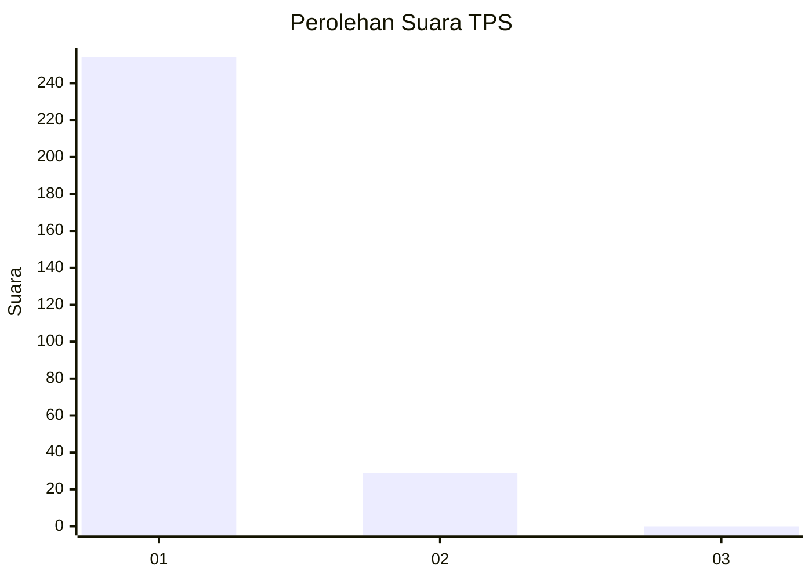
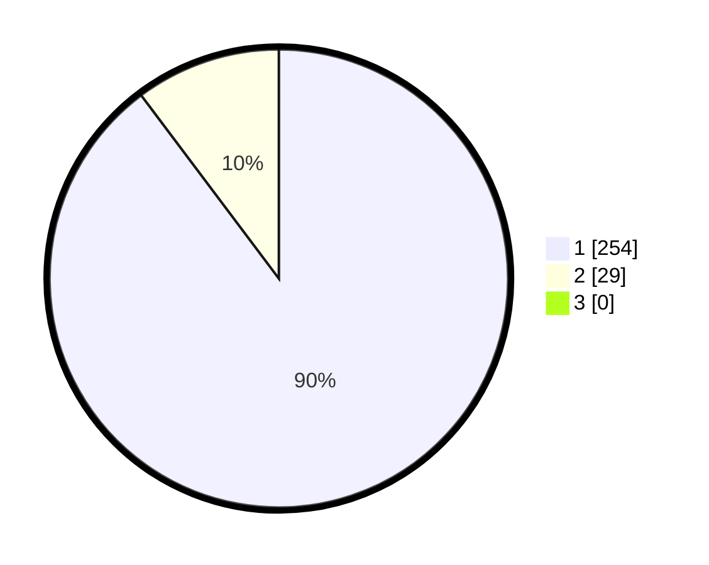

# Hasil

## Grafik

## Tabel

| No. | Nama Paslon    | Suara | Suara (raw) | Persentase |
|:--- |:-------------- | -----:| -----------:| ----------:|
| 1   | ANIES MUHAIMIN | 254   | [254][p-1]  | 89,75      |
| 2   | PRABOWO GIBRAN | 29    | [29][p-2]   | 10,25      |
| 3   | GANJAR MAHFUD  | 0     | [0][p-3]    | 0,00       |

[p-1]: https://github.com/gigit-pemilu/pemilu-2024-11-aceh/blob/main/pilpres/hitung-suara/sub/11-aceh/sub/18-pidie-jaya/sub/01-meureudu/sub/2016-dayah-timu/sub/001-tps/sub/paslon-1.txt
[p-2]: https://github.com/gigit-pemilu/pemilu-2024-11-aceh/blob/main/pilpres/hitung-suara/sub/11-aceh/sub/18-pidie-jaya/sub/01-meureudu/sub/2016-dayah-timu/sub/001-tps/sub/paslon-2.txt
[p-3]: https://github.com/gigit-pemilu/pemilu-2024-11-aceh/blob/main/pilpres/hitung-suara/sub/11-aceh/sub/18-pidie-jaya/sub/01-meureudu/sub/2016-dayah-timu/sub/001-tps/sub/paslon-3.txt

## Foto C Plano

https://sirekap-obj-formc.kpu.go.id/d31f/pemilu/ppwp/11/18/01/20/16/1118012016001-20240215-064358--9aa815e7-ae89-4269-a5e5-92434a28282e.jpg

https://sirekap-obj-formc.kpu.go.id/d31f/pemilu/ppwp/11/18/01/20/16/1118012016001-20240215-085330--074b045e-ea46-47e1-bb82-ff43615ba37d.jpg

https://sirekap-obj-formc.kpu.go.id/d31f/pemilu/ppwp/11/18/01/20/16/1118012016001-20240215-065237--5495cf1d-8d91-41d6-851d-fc640ef3435c.jpg

## Metadata

| Key        | Value               |
| ---------- | ------------------- |
| Time Stamp | 2024-02-19 06:16:00 |

