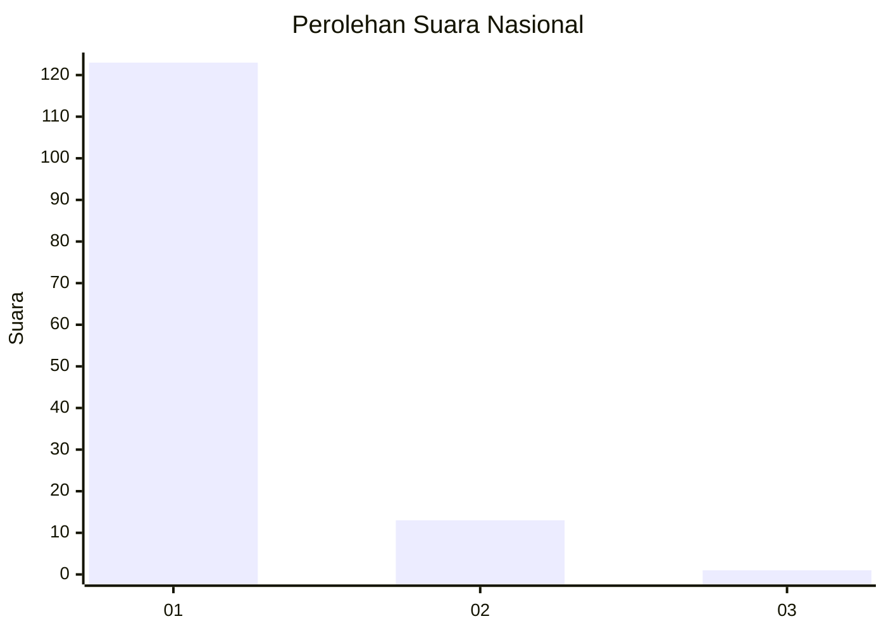
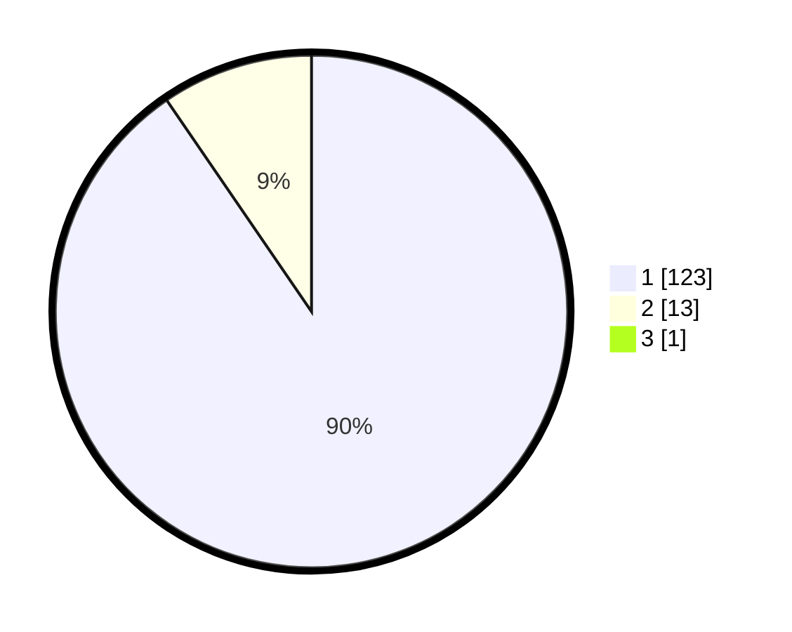

# Hasil

## Grafik

## Tabel

| No. | Nama Paslon    | Suara | Suara (raw) | Persentase |
|:--- |:-------------- | -----:| -----------:| ----------:|
| 1   | ANIES MUHAIMIN | 123   | [123][p-1]  | 89,78      |
| 2   | PRABOWO GIBRAN | 13    | [13][p-2]   | 9,49       |
| 3   | GANJAR MAHFUD  | 1     | [1][p-3]    | 0,73       |

[p-1]: https://github.com/gigit-pemilu/pemilu-2024/blob/main/pilpres/hitung-suara/sub/11-aceh/sub/18-pidie-jaya/sub/01-meureudu/sub/2017-bunot/sub/002-tps/sub/paslon-1.txt
[p-2]: https://github.com/gigit-pemilu/pemilu-2024/blob/main/pilpres/hitung-suara/sub/11-aceh/sub/18-pidie-jaya/sub/01-meureudu/sub/2017-bunot/sub/002-tps/sub/paslon-2.txt
[p-3]: https://github.com/gigit-pemilu/pemilu-2024/blob/main/pilpres/hitung-suara/sub/11-aceh/sub/18-pidie-jaya/sub/01-meureudu/sub/2017-bunot/sub/002-tps/sub/paslon-3.txt

## Foto C Plano

https://sirekap-obj-formc.kpu.go.id/d137/pemilu/ppwp/11/18/01/20/17/1118012017002-20240215-104516--cfd2dd2f-331e-43f7-88c4-34bbca1ee1be.jpg

https://sirekap-obj-formc.kpu.go.id/d137/pemilu/ppwp/11/18/01/20/17/1118012017002-20240215-104157--a88f901a-dedb-4690-b3f8-967862587226.jpg

https://sirekap-obj-formc.kpu.go.id/d137/pemilu/ppwp/11/18/01/20/17/1118012017002-20240215-104343--4a09e01d-2c33-4da7-b2e0-e0f044512176.jpg

## Metadata

| Key        | Value               |
| ---------- | ------------------- |
| Time Stamp | 2024-02-15 21:30:27 |

