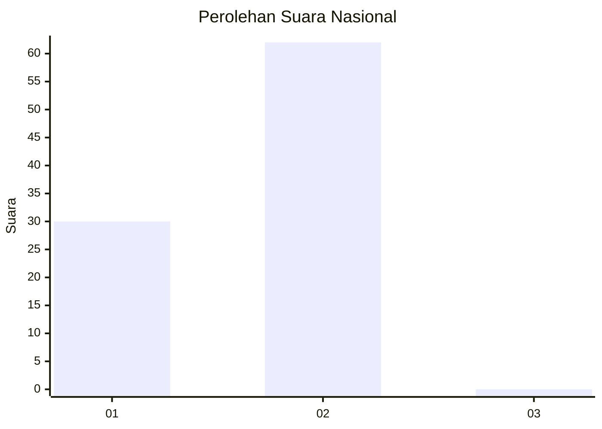
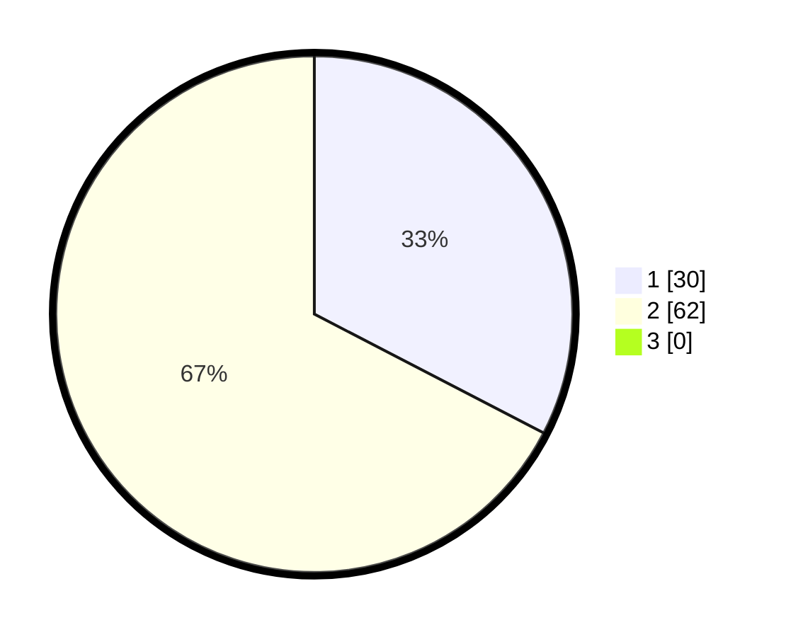

# Hasil

## Grafik

## Tabel

| No. | Nama Paslon    | Suara | Suara (raw) | Persentase |
|:--- |:-------------- | -----:| -----------:| ----------:|
| 1   | ANIES MUHAIMIN | 30    | [30][p-1]   | 32,61      |
| 2   | PRABOWO GIBRAN | 62    | [62][p-2]   | 67,39      |
| 3   | GANJAR MAHFUD  | 0     | [0][p-3]    | 0,00       |

[p-1]: https://github.com/gigit-pemilu/pemilu-2024/blob/main/pilpres/hitung-suara/sub/11-aceh/sub/18-pidie-jaya/sub/01-meureudu/sub/2019-meunasah-hagu/sub/001-tps/sub/paslon-1.txt
[p-2]: https://github.com/gigit-pemilu/pemilu-2024/blob/main/pilpres/hitung-suara/sub/11-aceh/sub/18-pidie-jaya/sub/01-meureudu/sub/2019-meunasah-hagu/sub/001-tps/sub/paslon-2.txt
[p-3]: https://github.com/gigit-pemilu/pemilu-2024/blob/main/pilpres/hitung-suara/sub/11-aceh/sub/18-pidie-jaya/sub/01-meureudu/sub/2019-meunasah-hagu/sub/001-tps/sub/paslon-3.txt

## Foto C Plano

https://sirekap-obj-formc.kpu.go.id/b92b/pemilu/ppwp/11/18/01/20/19/1118012019001-20240215-003606--03597bbb-368d-46d8-baf8-56f9c1688b4b.jpg

https://sirekap-obj-formc.kpu.go.id/b92b/pemilu/ppwp/11/18/01/20/19/1118012019001-20240214-214652--0bd4a96e-bed3-46a8-8132-2bd1fe2b4451.jpg

https://sirekap-obj-formc.kpu.go.id/b92b/pemilu/ppwp/11/18/01/20/19/1118012019001-20240214-220326--c497b66b-a6a3-4ec9-bbc9-d036658961c6.jpg

## Metadata

| Key        | Value               |
| ---------- | ------------------- |
| Time Stamp | 2024-02-15 12:00:28 |

