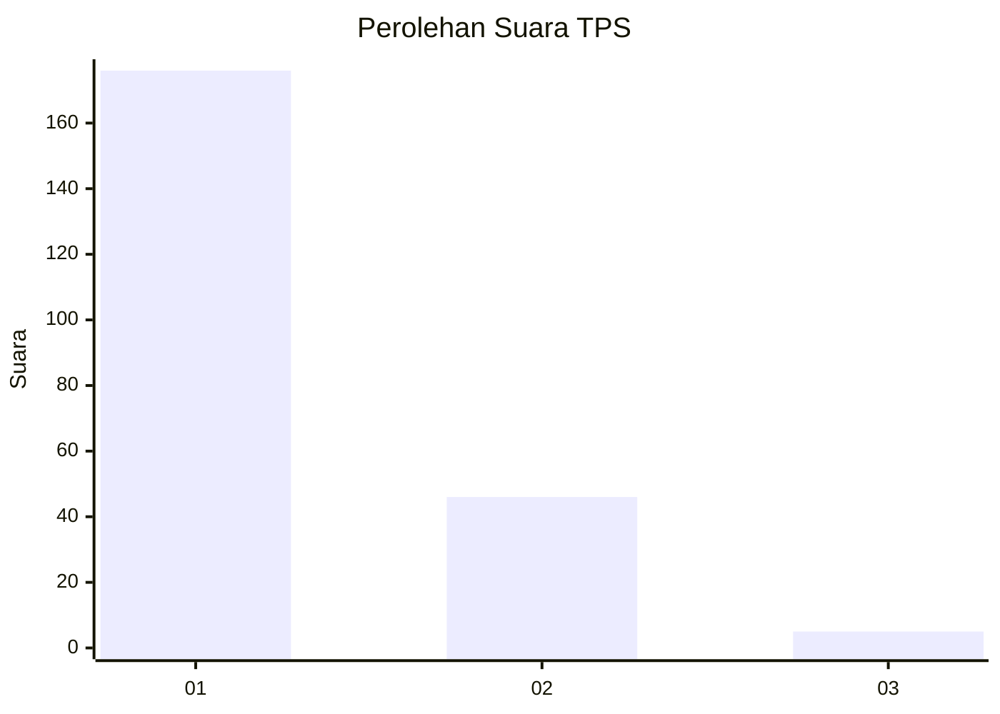
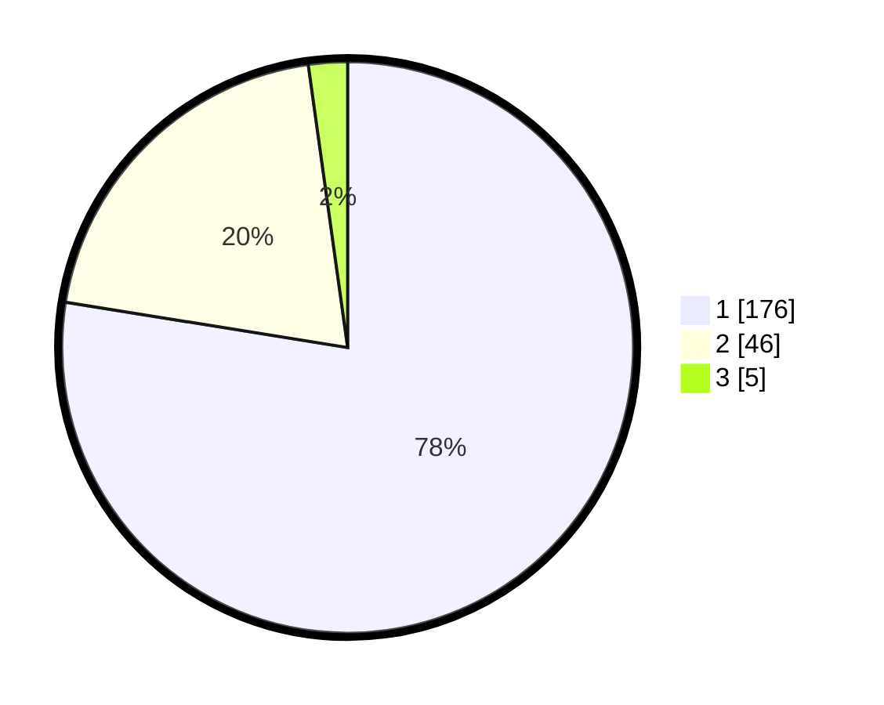

# Hasil

## Grafik

## Tabel

| No. | Nama Paslon    | Suara | Suara (raw) | Persentase |
|:--- |:-------------- | -----:| -----------:| ----------:|
| 1   | ANIES MUHAIMIN | 176   | [176][p-1]  | 77,53      |
| 2   | PRABOWO GIBRAN | 46    | [46][p-2]   | 20,26      |
| 3   | GANJAR MAHFUD  | 5     | [5][p-3]    | 2,20       |

[p-1]: https://github.com/gigit-pemilu/pemilu-2024-11-aceh/blob/main/pilpres/hitung-suara/sub/11-aceh/sub/18-pidie-jaya/sub/01-meureudu/sub/2021-kudrang/sub/001-tps/sub/paslon-1.txt
[p-2]: https://github.com/gigit-pemilu/pemilu-2024-11-aceh/blob/main/pilpres/hitung-suara/sub/11-aceh/sub/18-pidie-jaya/sub/01-meureudu/sub/2021-kudrang/sub/001-tps/sub/paslon-2.txt
[p-3]: https://github.com/gigit-pemilu/pemilu-2024-11-aceh/blob/main/pilpres/hitung-suara/sub/11-aceh/sub/18-pidie-jaya/sub/01-meureudu/sub/2021-kudrang/sub/001-tps/sub/paslon-3.txt

## Foto C Plano

https://sirekap-obj-formc.kpu.go.id/056f/pemilu/ppwp/11/18/01/20/21/1118012021001-20240215-021921--c0445b6e-d215-4141-aa15-e2a1c76c6184.jpg

https://sirekap-obj-formc.kpu.go.id/056f/pemilu/ppwp/11/18/01/20/21/1118012021001-20240215-110458--4df3891e-49e4-49ef-afdd-e22573189ea1.jpg

https://sirekap-obj-formc.kpu.go.id/056f/pemilu/ppwp/11/18/01/20/21/1118012021001-20240215-110250--7cef56cb-48a5-4082-9a4f-530423206e89.jpg

## Metadata

| Key        | Value               |
| ---------- | ------------------- |
| Time Stamp | 2024-02-15 23:29:50 |

