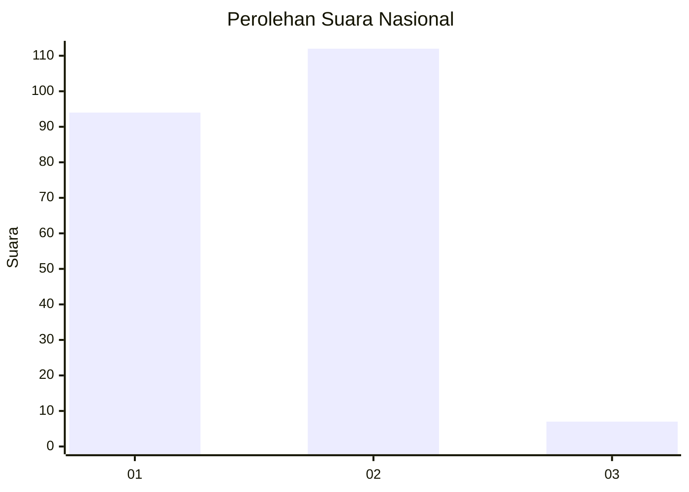
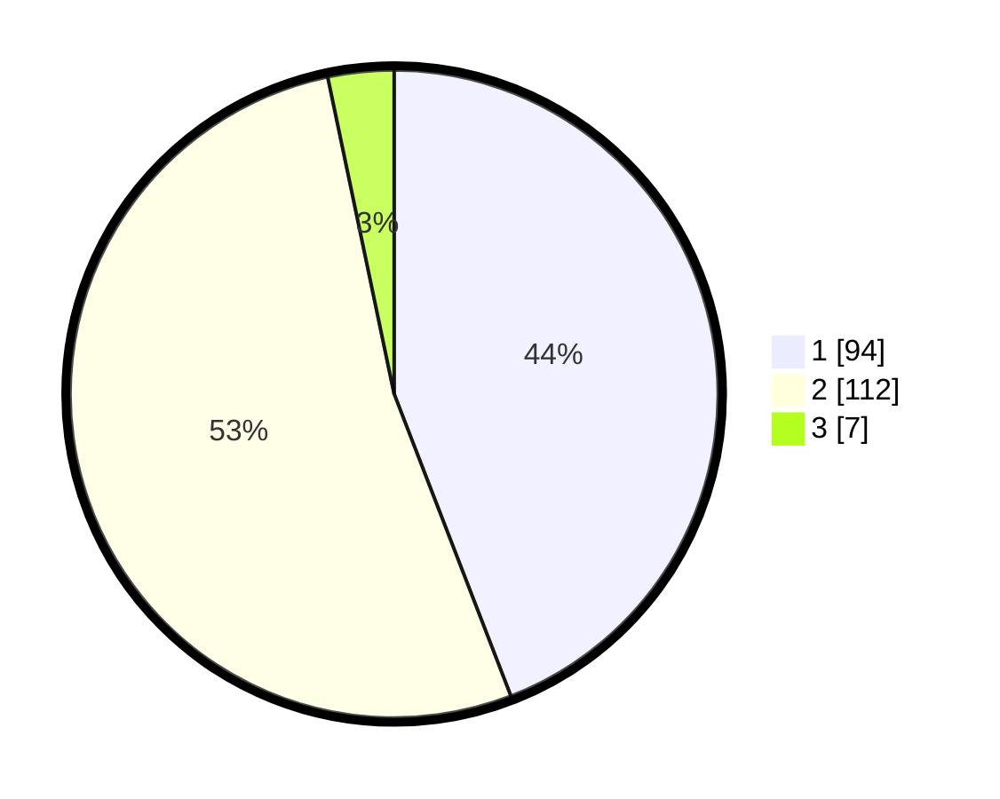

# Hasil

## Grafik

## Tabel

| No. | Nama Paslon    | Suara | Suara (raw) | Persentase |
|:--- |:-------------- | -----:| -----------:| ----------:|
| 1   | ANIES MUHAIMIN | 94    | [94][p-1]   | 44,13      |
| 2   | PRABOWO GIBRAN | 112   | [112][p-2]  | 52,58      |
| 3   | GANJAR MAHFUD  | 7     | [7][p-3]    | 3,29       |

[p-1]: https://github.com/gigit-pemilu/pemilu-2024/blob/main/pilpres/hitung-suara/sub/11-aceh/sub/18-pidie-jaya/sub/01-meureudu/sub/2023-mulieng/sub/001-tps/sub/paslon-1.txt
[p-2]: https://github.com/gigit-pemilu/pemilu-2024/blob/main/pilpres/hitung-suara/sub/11-aceh/sub/18-pidie-jaya/sub/01-meureudu/sub/2023-mulieng/sub/001-tps/sub/paslon-2.txt
[p-3]: https://github.com/gigit-pemilu/pemilu-2024/blob/main/pilpres/hitung-suara/sub/11-aceh/sub/18-pidie-jaya/sub/01-meureudu/sub/2023-mulieng/sub/001-tps/sub/paslon-3.txt

## Foto C Plano

https://sirekap-obj-formc.kpu.go.id/9d04/pemilu/ppwp/11/18/01/20/23/1118012023001-20240215-115354--8f208dbb-61d5-45d0-b58b-b4602afc7191.jpg

https://sirekap-obj-formc.kpu.go.id/9d04/pemilu/ppwp/11/18/01/20/23/1118012023001-20240214-214104--b0cdb790-27ca-4a17-b31c-89a8a5c42cd3.jpg

https://sirekap-obj-formc.kpu.go.id/9d04/pemilu/ppwp/11/18/01/20/23/1118012023001-20240214-214332--83c43b8a-5838-4907-aaa3-9eed096e00f1.jpg

## Metadata

| Key        | Value               |
| ---------- | ------------------- |
| Time Stamp | 2024-02-15 23:29:50 |

