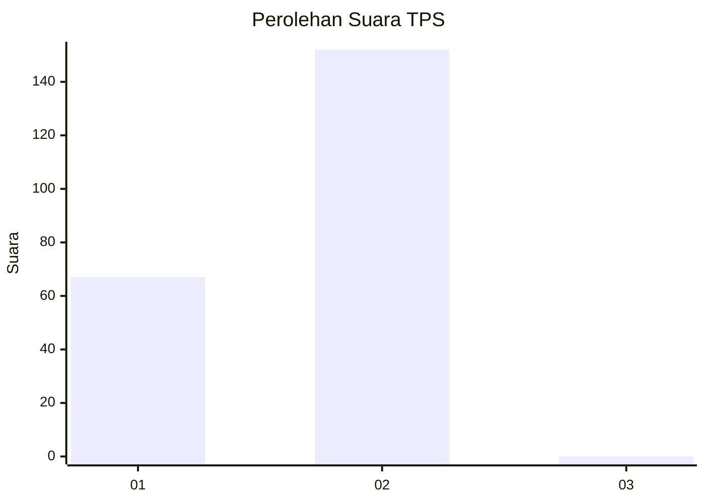
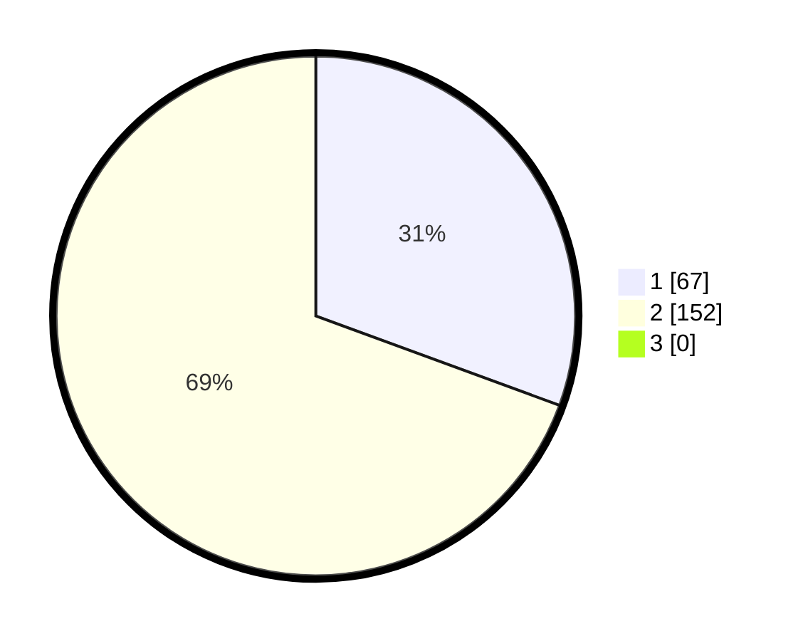

# Hasil

## Grafik

## Tabel

| No. | Nama Paslon    | Suara | Suara (raw) | Persentase |
|:--- |:-------------- | -----:| -----------:| ----------:|
| 1   | ANIES MUHAIMIN | 67    | [67][p-1]   | 30,59      |
| 2   | PRABOWO GIBRAN | 152   | [152][p-2]  | 69,41      |
| 3   | GANJAR MAHFUD  | 0     | [0][p-3]    | 0,00       |

[p-1]: https://github.com/gigit-pemilu/pemilu-2024-11-aceh/blob/main/pilpres/hitung-suara/sub/11-aceh/sub/18-pidie-jaya/sub/01-meureudu/sub/2025-rumpuen/sub/001-tps/sub/paslon-1.txt
[p-2]: https://github.com/gigit-pemilu/pemilu-2024-11-aceh/blob/main/pilpres/hitung-suara/sub/11-aceh/sub/18-pidie-jaya/sub/01-meureudu/sub/2025-rumpuen/sub/001-tps/sub/paslon-2.txt
[p-3]: https://github.com/gigit-pemilu/pemilu-2024-11-aceh/blob/main/pilpres/hitung-suara/sub/11-aceh/sub/18-pidie-jaya/sub/01-meureudu/sub/2025-rumpuen/sub/001-tps/sub/paslon-3.txt

## Foto C Plano

https://sirekap-obj-formc.kpu.go.id/3699/pemilu/ppwp/11/18/01/20/25/1118012025001-20240214-233158--24a7104d-27a5-4cc8-b8d8-f09b6876d8bb.jpg

https://sirekap-obj-formc.kpu.go.id/3699/pemilu/ppwp/11/18/01/20/25/1118012025001-20240214-233447--9fca4d5e-ab33-43db-9f78-f85d46897878.jpg

https://sirekap-obj-formc.kpu.go.id/3699/pemilu/ppwp/11/18/01/20/25/1118012025001-20240214-233709--6df7176c-c583-4850-ac9f-d6e911e90855.jpg

## Metadata

| Key        | Value               |
| ---------- | ------------------- |
| Time Stamp | 2024-02-24 22:31:28 |

