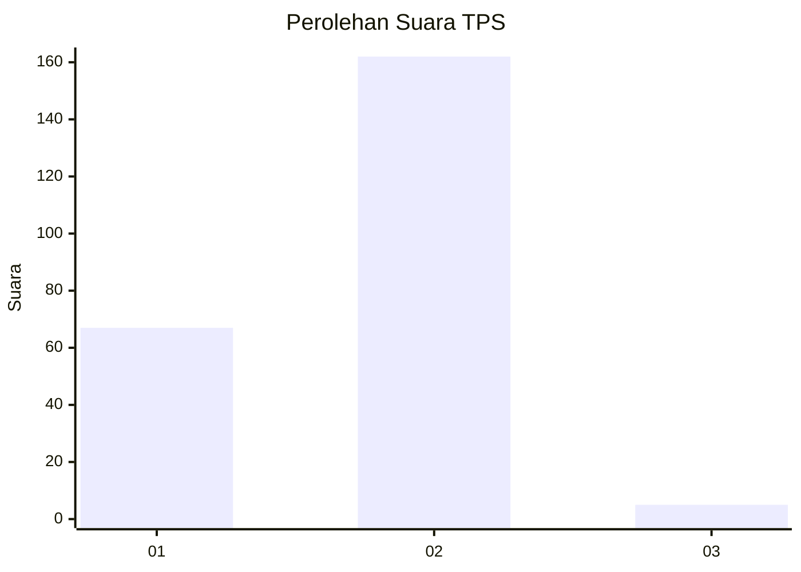
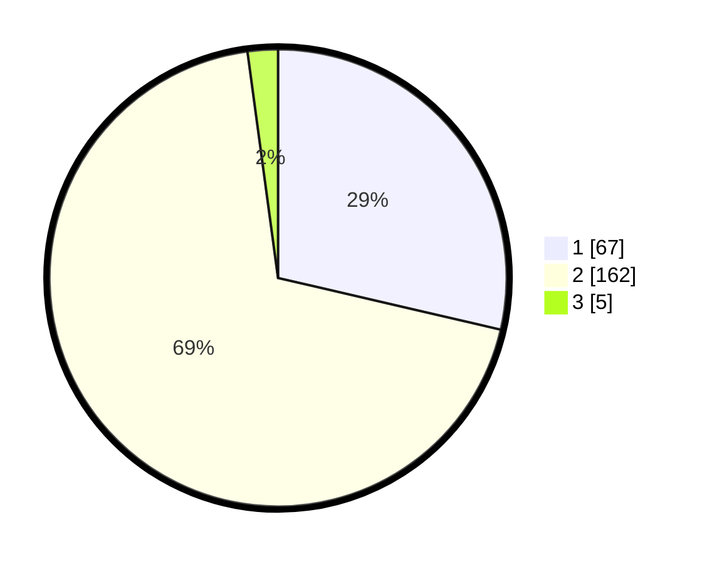

# Hasil

## Grafik

## Tabel

| No. | Nama Paslon    | Suara | Suara (raw) | Persentase |
|:--- |:-------------- | -----:| -----------:| ----------:|
| 1   | ANIES MUHAIMIN | 67    | [67][p-1]   | 28,63      |
| 2   | PRABOWO GIBRAN | 162   | [162][p-2]  | 69,23      |
| 3   | GANJAR MAHFUD  | 5     | [5][p-3]    | 2,14       |

[p-1]: https://github.com/gigit-pemilu/pemilu-2024-11-aceh/blob/main/pilpres/hitung-suara/sub/11-aceh/sub/18-pidie-jaya/sub/01-meureudu/sub/2025-rumpuen/sub/002-tps/sub/paslon-1.txt
[p-2]: https://github.com/gigit-pemilu/pemilu-2024-11-aceh/blob/main/pilpres/hitung-suara/sub/11-aceh/sub/18-pidie-jaya/sub/01-meureudu/sub/2025-rumpuen/sub/002-tps/sub/paslon-2.txt
[p-3]: https://github.com/gigit-pemilu/pemilu-2024-11-aceh/blob/main/pilpres/hitung-suara/sub/11-aceh/sub/18-pidie-jaya/sub/01-meureudu/sub/2025-rumpuen/sub/002-tps/sub/paslon-3.txt

## Foto C Plano

https://sirekap-obj-formc.kpu.go.id/3074/pemilu/ppwp/11/18/01/20/25/1118012025002-20240214-230322--34c85c92-e678-40f6-b9ec-00be730b6452.jpg

https://sirekap-obj-formc.kpu.go.id/3074/pemilu/ppwp/11/18/01/20/25/1118012025002-20240214-230222--ccde1899-953a-4aa0-aa67-6e02bcadfc7f.jpg

https://sirekap-obj-formc.kpu.go.id/3074/pemilu/ppwp/11/18/01/20/25/1118012025002-20240214-230015--db9bee70-3512-46a9-8ac4-b0b1a61a6cab.jpg

## Metadata

| Key        | Value               |
| ---------- | ------------------- |
| Time Stamp | 2024-02-15 23:29:50 |

