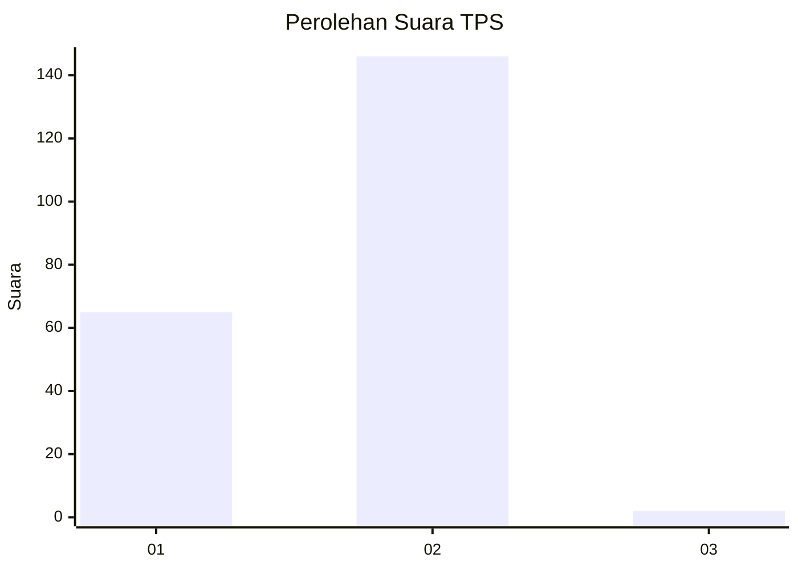
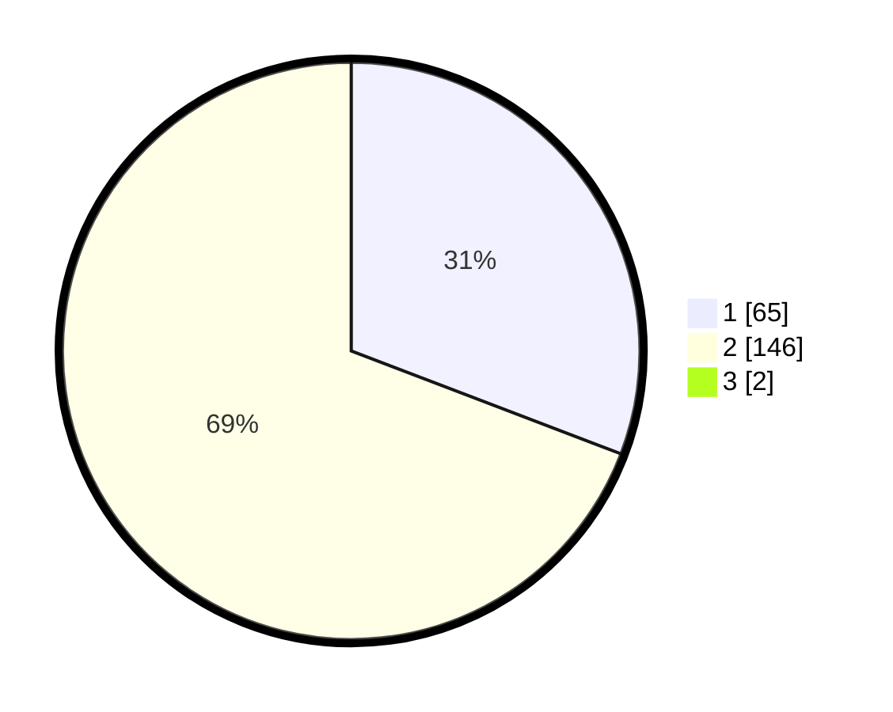

# Hasil

## Grafik

## Tabel

| No. | Nama Paslon    | Suara | Suara (raw) | Persentase |
|:--- |:-------------- | -----:| -----------:| ----------:|
| 1   | ANIES MUHAIMIN | 65    | [65][p-1]   | 30,52      |
| 2   | PRABOWO GIBRAN | 146   | [146][p-2]  | 68,54      |
| 3   | GANJAR MAHFUD  | 2     | [2][p-3]    | 0,94       |

[p-1]: https://github.com/gigit-pemilu/pemilu-2024-11-aceh/blob/main/pilpres/hitung-suara/sub/11-aceh/sub/18-pidie-jaya/sub/01-meureudu/sub/2026-rambong/sub/001-tps/sub/paslon-1.txt
[p-2]: https://github.com/gigit-pemilu/pemilu-2024-11-aceh/blob/main/pilpres/hitung-suara/sub/11-aceh/sub/18-pidie-jaya/sub/01-meureudu/sub/2026-rambong/sub/001-tps/sub/paslon-2.txt
[p-3]: https://github.com/gigit-pemilu/pemilu-2024-11-aceh/blob/main/pilpres/hitung-suara/sub/11-aceh/sub/18-pidie-jaya/sub/01-meureudu/sub/2026-rambong/sub/001-tps/sub/paslon-3.txt

## Foto C Plano

https://sirekap-obj-formc.kpu.go.id/ed6c/pemilu/ppwp/11/18/01/20/26/1118012026001-20240215-001801--ad2355d8-8c7c-4786-b5c5-3a5cb29a379e.jpg

https://sirekap-obj-formc.kpu.go.id/ed6c/pemilu/ppwp/11/18/01/20/26/1118012026001-20240215-001833--89aa98cb-446d-4cb3-9a27-167bc89c05d2.jpg

https://sirekap-obj-formc.kpu.go.id/ed6c/pemilu/ppwp/11/18/01/20/26/1118012026001-20240215-001849--6e1f4b98-9d2d-44d1-b8bb-b5cf9ce3ff65.jpg

## Metadata

| Key        | Value               |
| ---------- | ------------------- |
| Time Stamp | 2024-02-15 23:29:50 |

