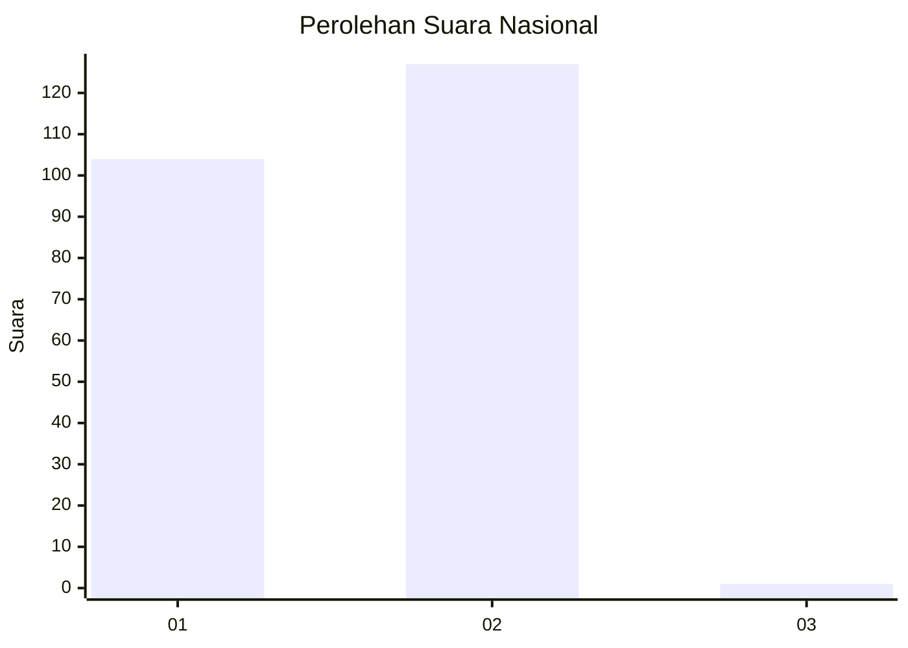
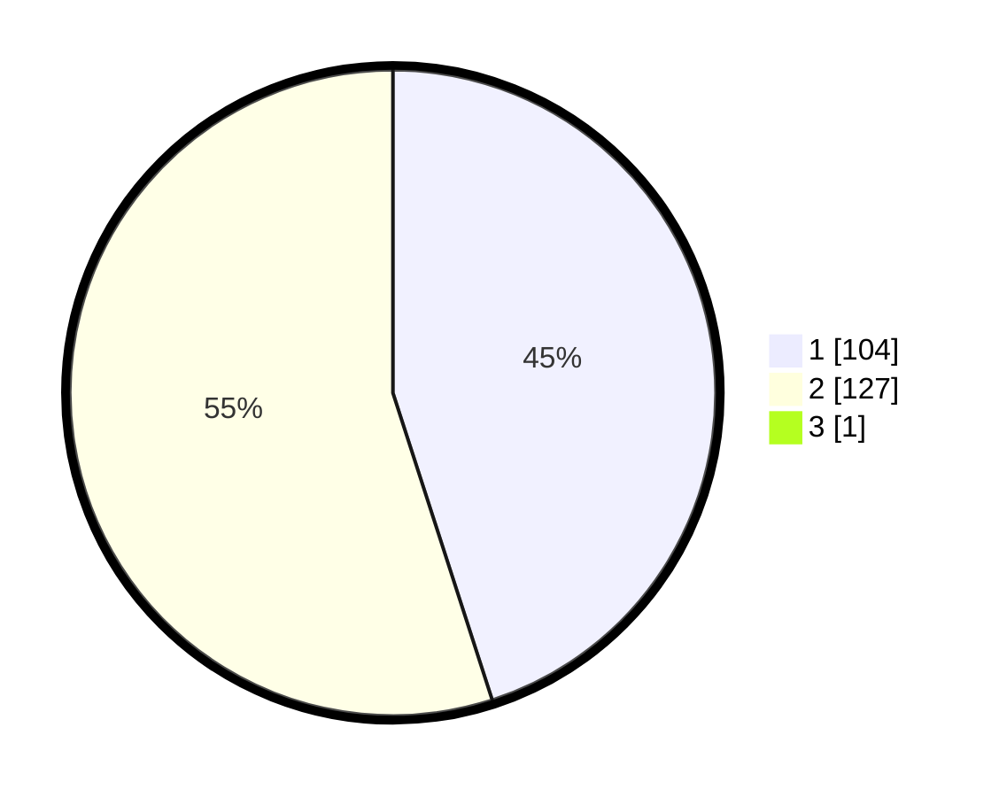

# Hasil

## Grafik

## Tabel

| No. | Nama Paslon    | Suara | Suara (raw) | Persentase |
|:--- |:-------------- | -----:| -----------:| ----------:|
| 1   | ANIES MUHAIMIN | 104   | [104][p-1]  | 44,83      |
| 2   | PRABOWO GIBRAN | 127   | [127][p-2]  | 54,74      |
| 3   | GANJAR MAHFUD  | 1     | [1][p-3]    | 0,43       |

[p-1]: https://github.com/gigit-pemilu/pemilu-2024/blob/main/pilpres/hitung-suara/sub/11-aceh/sub/18-pidie-jaya/sub/01-meureudu/sub/2026-rambong/sub/002-tps/sub/paslon-1.txt
[p-2]: https://github.com/gigit-pemilu/pemilu-2024/blob/main/pilpres/hitung-suara/sub/11-aceh/sub/18-pidie-jaya/sub/01-meureudu/sub/2026-rambong/sub/002-tps/sub/paslon-2.txt
[p-3]: https://github.com/gigit-pemilu/pemilu-2024/blob/main/pilpres/hitung-suara/sub/11-aceh/sub/18-pidie-jaya/sub/01-meureudu/sub/2026-rambong/sub/002-tps/sub/paslon-3.txt

## Foto C Plano

https://sirekap-obj-formc.kpu.go.id/579b/pemilu/ppwp/11/18/01/20/26/1118012026002-20240215-074349--546758d4-a514-46bd-ae25-27c25fdde98c.jpg

https://sirekap-obj-formc.kpu.go.id/579b/pemilu/ppwp/11/18/01/20/26/1118012026002-20240215-074532--9907638d-afc3-45e7-9bbb-756932160aca.jpg

https://sirekap-obj-formc.kpu.go.id/579b/pemilu/ppwp/11/18/01/20/26/1118012026002-20240215-074708--e7258bcc-4f65-463f-b389-be0f9e2decad.jpg

## Metadata

| Key        | Value               |
| ---------- | ------------------- |
| Time Stamp | 2024-02-15 23:29:50 |

