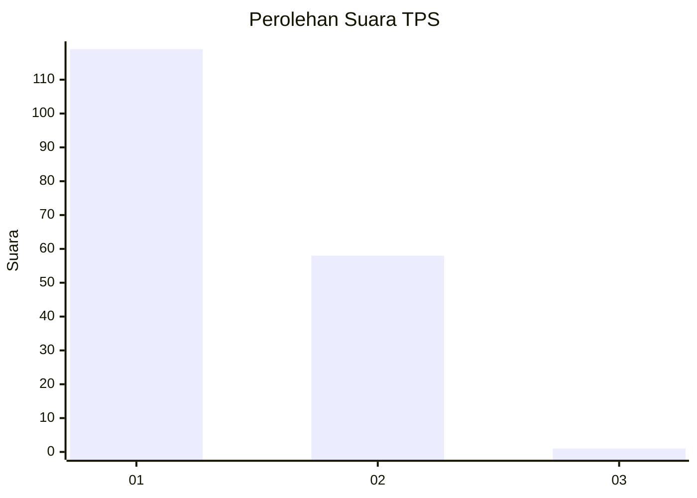
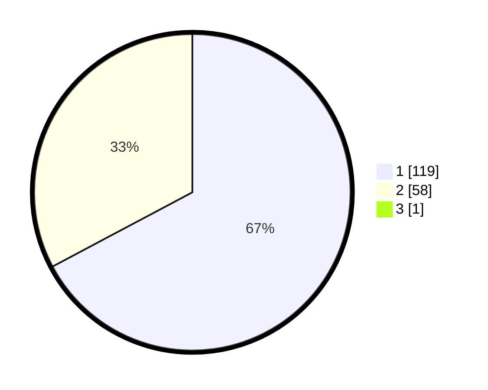

# Hasil

## Grafik

## Tabel

| No. | Nama Paslon    | Suara | Suara (raw) | Persentase |
|:--- |:-------------- | -----:| -----------:| ----------:|
| 1   | ANIES MUHAIMIN | 119   | [119][p-1]  | 66,85      |
| 2   | PRABOWO GIBRAN | 58    | [58][p-2]   | 32,58      |
| 3   | GANJAR MAHFUD  | 1     | [1][p-3]    | 0,56       |

[p-1]: https://github.com/gigit-pemilu/pemilu-2024-11-aceh/blob/main/pilpres/hitung-suara/sub/11-aceh/sub/18-pidie-jaya/sub/01-meureudu/sub/2027-meunasah-kulam/sub/001-tps/sub/paslon-1.txt
[p-2]: https://github.com/gigit-pemilu/pemilu-2024-11-aceh/blob/main/pilpres/hitung-suara/sub/11-aceh/sub/18-pidie-jaya/sub/01-meureudu/sub/2027-meunasah-kulam/sub/001-tps/sub/paslon-2.txt
[p-3]: https://github.com/gigit-pemilu/pemilu-2024-11-aceh/blob/main/pilpres/hitung-suara/sub/11-aceh/sub/18-pidie-jaya/sub/01-meureudu/sub/2027-meunasah-kulam/sub/001-tps/sub/paslon-3.txt

## Foto C Plano

https://sirekap-obj-formc.kpu.go.id/65ba/pemilu/ppwp/11/18/01/20/27/1118012027001-20240215-133345--e1df88a7-6e01-4c1c-91e8-1bb02ad399e7.jpg

https://sirekap-obj-formc.kpu.go.id/65ba/pemilu/ppwp/11/18/01/20/27/1118012027001-20240215-133439--b2b6acbc-248d-4e6d-bef1-34d6684b4fd9.jpg

https://sirekap-obj-formc.kpu.go.id/65ba/pemilu/ppwp/11/18/01/20/27/1118012027001-20240215-133524--37f61c72-36a7-44a7-8760-3c2dc50b162c.jpg

## Metadata

| Key        | Value               |
| ---------- | ------------------- |
| Time Stamp | 2024-02-15 23:29:50 |

