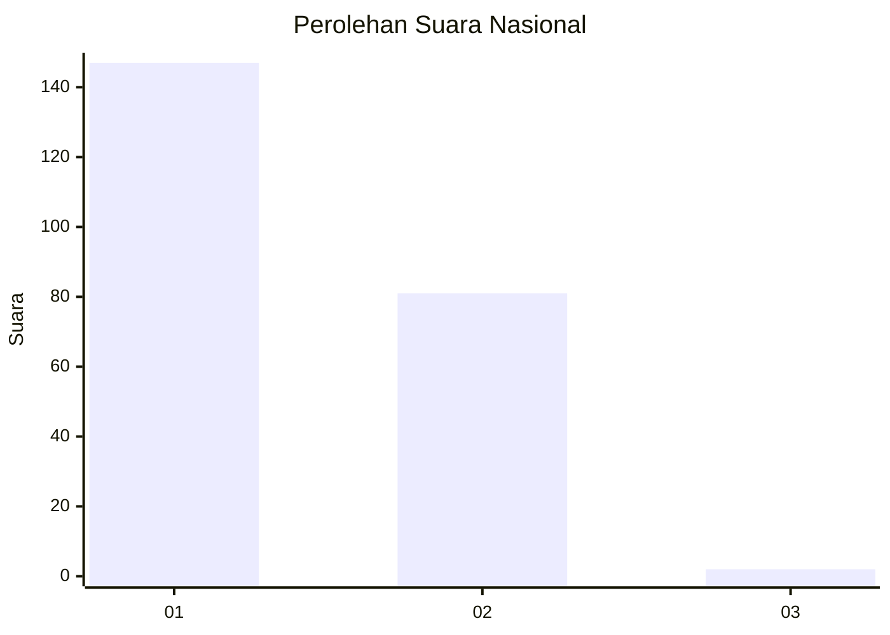
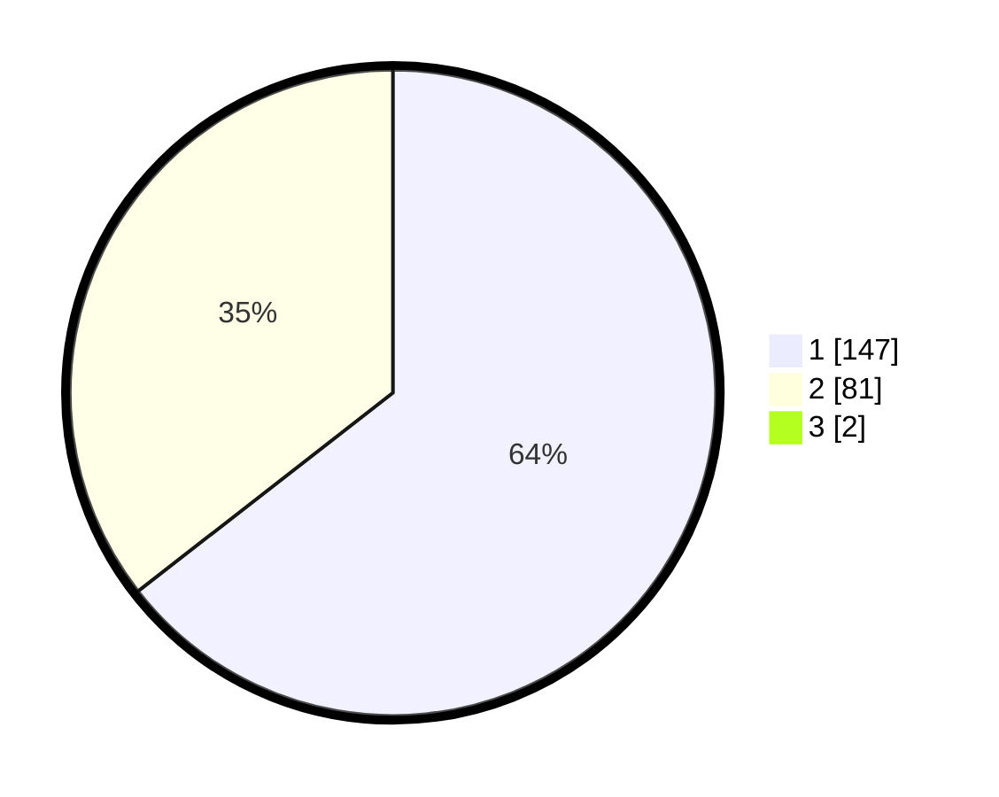

# Hasil

## Grafik

## Tabel

| No. | Nama Paslon    | Suara | Suara (raw) | Persentase |
|:--- |:-------------- | -----:| -----------:| ----------:|
| 1   | ANIES MUHAIMIN | 147   | [147][p-1]  | 63,91      |
| 2   | PRABOWO GIBRAN | 81    | [81][p-2]   | 35,22      |
| 3   | GANJAR MAHFUD  | 2     | [2][p-3]    | 0,87       |

[p-1]: https://github.com/gigit-pemilu/pemilu-2024/blob/main/pilpres/hitung-suara/sub/11-aceh/sub/18-pidie-jaya/sub/01-meureudu/sub/2029-kuta-trieng/sub/002-tps/sub/paslon-1.txt
[p-2]: https://github.com/gigit-pemilu/pemilu-2024/blob/main/pilpres/hitung-suara/sub/11-aceh/sub/18-pidie-jaya/sub/01-meureudu/sub/2029-kuta-trieng/sub/002-tps/sub/paslon-2.txt
[p-3]: https://github.com/gigit-pemilu/pemilu-2024/blob/main/pilpres/hitung-suara/sub/11-aceh/sub/18-pidie-jaya/sub/01-meureudu/sub/2029-kuta-trieng/sub/002-tps/sub/paslon-3.txt

## Foto C Plano

https://sirekap-obj-formc.kpu.go.id/7283/pemilu/ppwp/11/18/01/20/29/1118012029002-20240215-092023--c55c500d-ac85-443d-8c3e-63733f73aa2f.jpg

https://sirekap-obj-formc.kpu.go.id/7283/pemilu/ppwp/11/18/01/20/29/1118012029002-20240215-092223--3fc636c8-ce4c-4d11-9f76-089cec0df315.jpg

https://sirekap-obj-formc.kpu.go.id/7283/pemilu/ppwp/11/18/01/20/29/1118012029002-20240215-092339--7bfabef1-60c1-4f50-a112-008bf3f1fae9.jpg

## Metadata

| Key        | Value               |
| ---------- | ------------------- |
| Time Stamp | 2024-02-15 23:29:50 |

