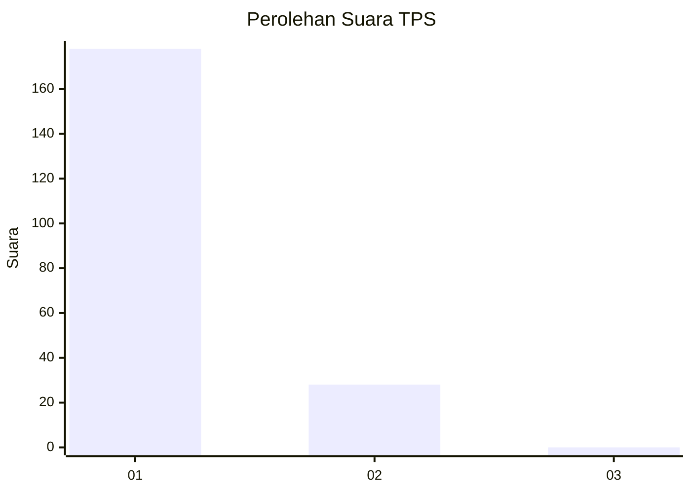
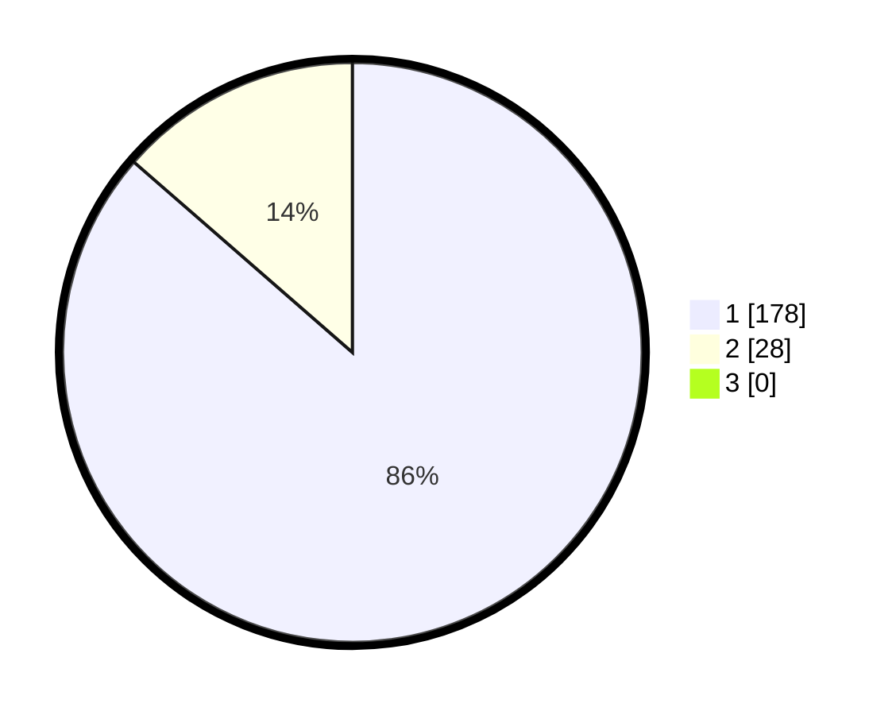

# Hasil

## Grafik

## Tabel

| No. | Nama Paslon    | Suara | Suara (raw) | Persentase |
|:--- |:-------------- | -----:| -----------:| ----------:|
| 1   | ANIES MUHAIMIN | 178   | [178][p-1]  | 86,41      |
| 2   | PRABOWO GIBRAN | 28    | [28][p-2]   | 13,59      |
| 3   | GANJAR MAHFUD  | 0     | [0][p-3]    | 0,00       |

[p-1]: https://github.com/gigit-pemilu/pemilu-2024-11-aceh/blob/main/pilpres/hitung-suara/sub/11-aceh/sub/18-pidie-jaya/sub/01-meureudu/sub/2030-teupin-peuraho/sub/001-tps/sub/paslon-1.txt
[p-2]: https://github.com/gigit-pemilu/pemilu-2024-11-aceh/blob/main/pilpres/hitung-suara/sub/11-aceh/sub/18-pidie-jaya/sub/01-meureudu/sub/2030-teupin-peuraho/sub/001-tps/sub/paslon-2.txt
[p-3]: https://github.com/gigit-pemilu/pemilu-2024-11-aceh/blob/main/pilpres/hitung-suara/sub/11-aceh/sub/18-pidie-jaya/sub/01-meureudu/sub/2030-teupin-peuraho/sub/001-tps/sub/paslon-3.txt

## Foto C Plano

https://sirekap-obj-formc.kpu.go.id/59e5/pemilu/ppwp/11/18/01/20/30/1118012030001-20240215-051104--13c64e97-b87d-4592-a11d-936cbd5e0698.jpg

https://sirekap-obj-formc.kpu.go.id/59e5/pemilu/ppwp/11/18/01/20/30/1118012030001-20240215-051317--e5d4e4d9-1777-4acf-9a61-4456eba294ee.jpg

https://sirekap-obj-formc.kpu.go.id/59e5/pemilu/ppwp/11/18/01/20/30/1118012030001-20240215-051423--bade0226-b524-4463-a270-b584837f6145.jpg

## Metadata

| Key        | Value               |
| ---------- | ------------------- |
| Time Stamp | 2024-02-15 23:29:50 |

