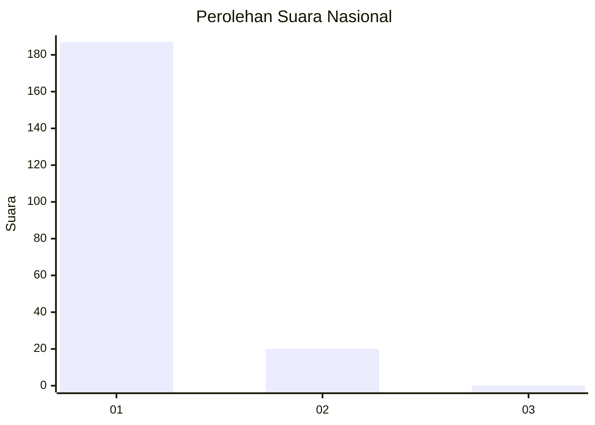
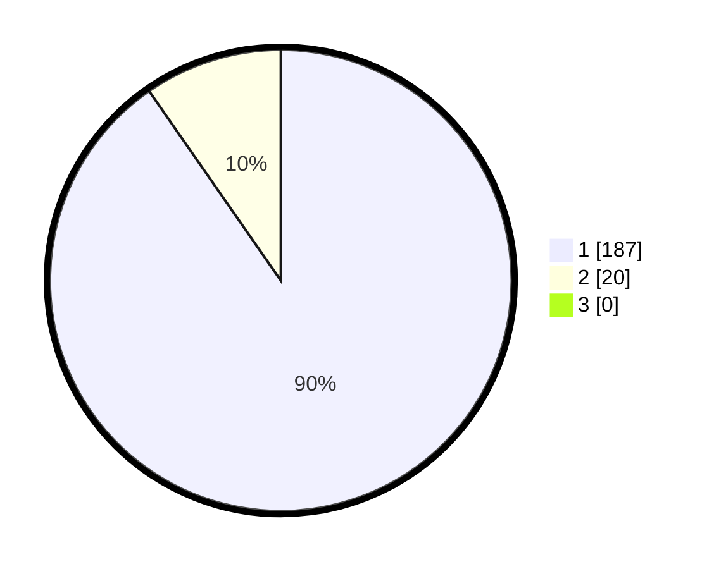

# Hasil

## Grafik

## Tabel

| No. | Nama Paslon    | Suara | Suara (raw) | Persentase |
|:--- |:-------------- | -----:| -----------:| ----------:|
| 1   | ANIES MUHAIMIN | 187   | [187][p-1]  | 90,34      |
| 2   | PRABOWO GIBRAN | 20    | [20][p-2]   | 9,66       |
| 3   | GANJAR MAHFUD  | 0     | [0][p-3]    | 0,00       |

[p-1]: https://github.com/gigit-pemilu/pemilu-2024/blob/main/pilpres/hitung-suara/sub/11-aceh/sub/18-pidie-jaya/sub/02-ulim/sub/2002-reuleut/sub/001-tps/sub/paslon-1.txt
[p-2]: https://github.com/gigit-pemilu/pemilu-2024/blob/main/pilpres/hitung-suara/sub/11-aceh/sub/18-pidie-jaya/sub/02-ulim/sub/2002-reuleut/sub/001-tps/sub/paslon-2.txt
[p-3]: https://github.com/gigit-pemilu/pemilu-2024/blob/main/pilpres/hitung-suara/sub/11-aceh/sub/18-pidie-jaya/sub/02-ulim/sub/2002-reuleut/sub/001-tps/sub/paslon-3.txt

## Foto C Plano

https://sirekap-obj-formc.kpu.go.id/c330/pemilu/ppwp/11/18/02/20/02/1118022002001-20240215-081120--5bac6404-1f53-4854-adf4-2cb3c4b2daa3.jpg

https://sirekap-obj-formc.kpu.go.id/c330/pemilu/ppwp/11/18/02/20/02/1118022002001-20240215-081304--d2b8bb18-79bd-4300-ab3c-ce46a9473ef7.jpg

https://sirekap-obj-formc.kpu.go.id/c330/pemilu/ppwp/11/18/02/20/02/1118022002001-20240215-081500--82624a0d-ade0-4218-bb7c-b3cba8245a04.jpg

## Metadata

| Key        | Value               |
| ---------- | ------------------- |
| Time Stamp | 2024-02-15 23:29:50 |

