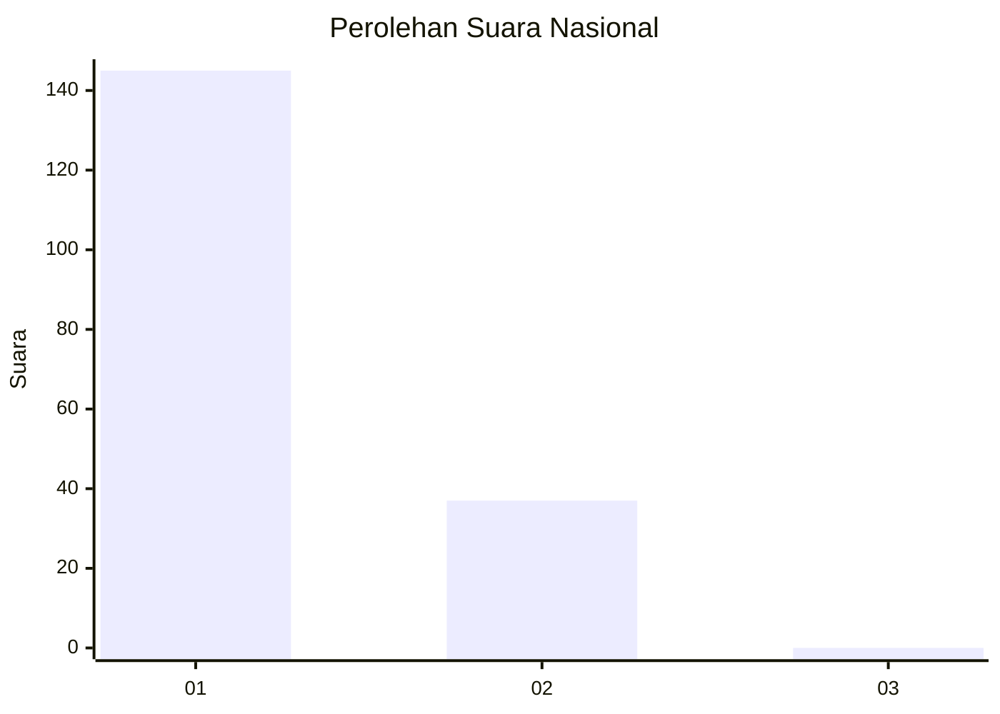
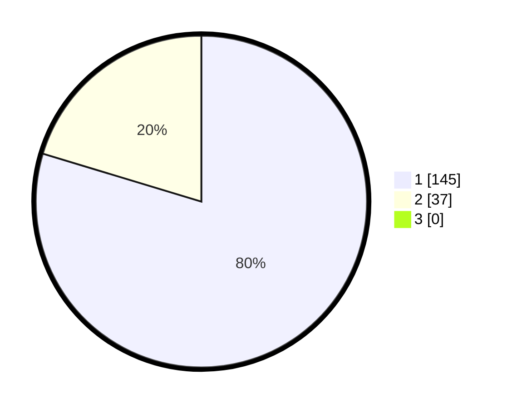

# Hasil

## Grafik

## Tabel

| No. | Nama Paslon    | Suara | Suara (raw) | Persentase |
|:--- |:-------------- | -----:| -----------:| ----------:|
| 1   | ANIES MUHAIMIN | 145   | [145][p-1]  | 79,67      |
| 2   | PRABOWO GIBRAN | 37    | [37][p-2]   | 20,33      |
| 3   | GANJAR MAHFUD  | 0     | [0][p-3]    | 0,00       |

[p-1]: https://github.com/gigit-pemilu/pemilu-2024/blob/main/pilpres/hitung-suara/sub/11-aceh/sub/18-pidie-jaya/sub/02-ulim/sub/2003-sambongan-baro/sub/001-tps/sub/paslon-1.txt
[p-2]: https://github.com/gigit-pemilu/pemilu-2024/blob/main/pilpres/hitung-suara/sub/11-aceh/sub/18-pidie-jaya/sub/02-ulim/sub/2003-sambongan-baro/sub/001-tps/sub/paslon-2.txt
[p-3]: https://github.com/gigit-pemilu/pemilu-2024/blob/main/pilpres/hitung-suara/sub/11-aceh/sub/18-pidie-jaya/sub/02-ulim/sub/2003-sambongan-baro/sub/001-tps/sub/paslon-3.txt

## Foto C Plano

https://sirekap-obj-formc.kpu.go.id/8069/pemilu/ppwp/11/18/02/20/03/1118022003001-20240215-110247--eaed64b3-ac4a-41e7-92e0-e866747648a1.jpg

https://sirekap-obj-formc.kpu.go.id/8069/pemilu/ppwp/11/18/02/20/03/1118022003001-20240215-110730--a7a377e9-0dd7-4ebe-a87b-e1adf2b54775.jpg

https://sirekap-obj-formc.kpu.go.id/8069/pemilu/ppwp/11/18/02/20/03/1118022003001-20240215-110937--0e34678e-1e46-4943-a338-7ec1a6b0f8b2.jpg

## Metadata

| Key        | Value               |
| ---------- | ------------------- |
| Time Stamp | 2024-02-15 23:29:50 |

