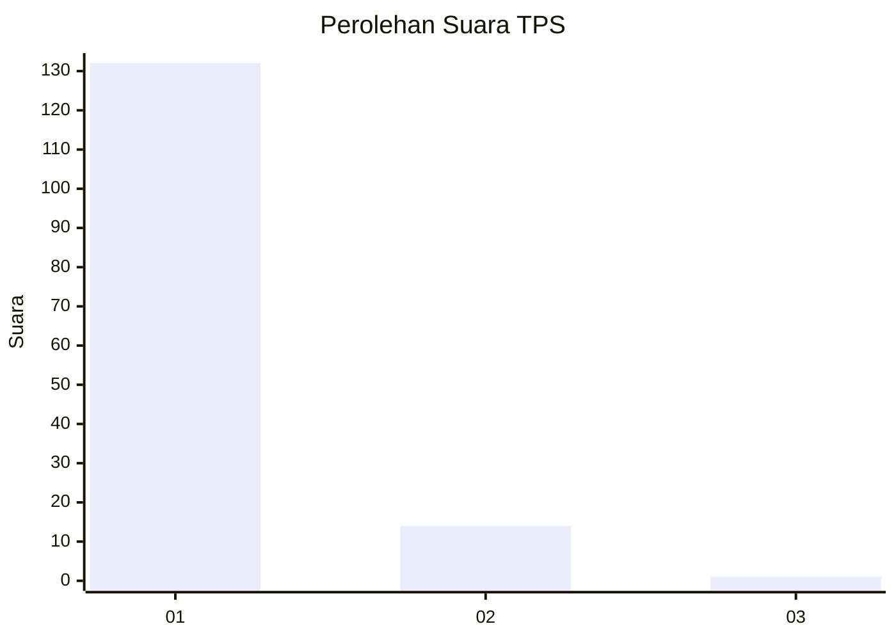
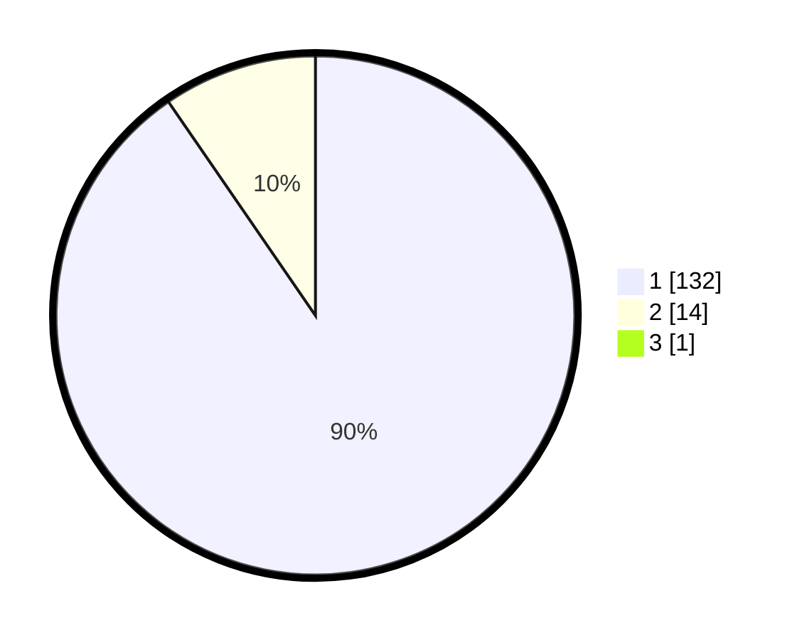

# Hasil

## Grafik

## Tabel

| No. | Nama Paslon    | Suara | Suara (raw) | Persentase |
|:--- |:-------------- | -----:| -----------:| ----------:|
| 1   | ANIES MUHAIMIN | 132   | [132][p-1]  | 89,80      |
| 2   | PRABOWO GIBRAN | 14    | [14][p-2]   | 9,52       |
| 3   | GANJAR MAHFUD  | 1     | [1][p-3]    | 0,68       |

[p-1]: https://github.com/gigit-pemilu/pemilu-2024-11-aceh/blob/main/pilpres/hitung-suara/sub/11-aceh/sub/18-pidie-jaya/sub/02-ulim/sub/2004-tijien-husen/sub/001-tps/sub/paslon-1.txt
[p-2]: https://github.com/gigit-pemilu/pemilu-2024-11-aceh/blob/main/pilpres/hitung-suara/sub/11-aceh/sub/18-pidie-jaya/sub/02-ulim/sub/2004-tijien-husen/sub/001-tps/sub/paslon-2.txt
[p-3]: https://github.com/gigit-pemilu/pemilu-2024-11-aceh/blob/main/pilpres/hitung-suara/sub/11-aceh/sub/18-pidie-jaya/sub/02-ulim/sub/2004-tijien-husen/sub/001-tps/sub/paslon-3.txt

## Foto C Plano

https://sirekap-obj-formc.kpu.go.id/29a0/pemilu/ppwp/11/18/02/20/04/1118022004001-20240215-093423--d0cb2a0d-4f30-44ef-b86d-3518a32392b1.jpg

https://sirekap-obj-formc.kpu.go.id/29a0/pemilu/ppwp/11/18/02/20/04/1118022004001-20240215-093542--7c846586-5bb8-40c5-94b4-3fbe4914bbc0.jpg

https://sirekap-obj-formc.kpu.go.id/29a0/pemilu/ppwp/11/18/02/20/04/1118022004001-20240215-093727--3aa95999-2610-4490-b6fb-1ff1f99a9227.jpg

## Metadata

| Key        | Value               |
| ---------- | ------------------- |
| Time Stamp | 2024-02-15 17:30:25 |

