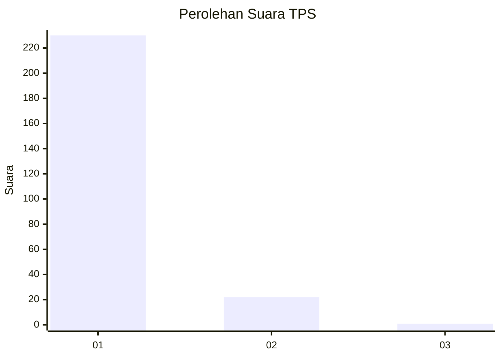
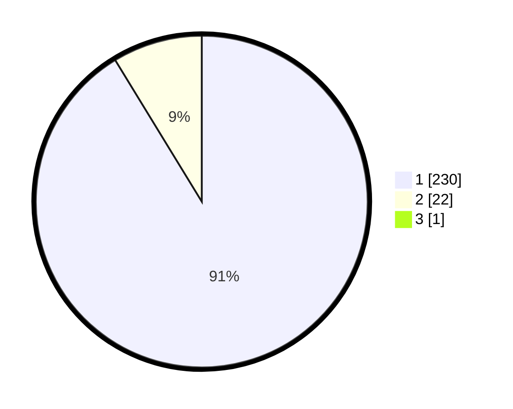

# Hasil

## Grafik

## Tabel

| No. | Nama Paslon    | Suara | Suara (raw) | Persentase |
|:--- |:-------------- | -----:| -----------:| ----------:|
| 1   | ANIES MUHAIMIN | 230   | [230][p-1]  | 90,91      |
| 2   | PRABOWO GIBRAN | 22    | [22][p-2]   | 8,70       |
| 3   | GANJAR MAHFUD  | 1     | [1][p-3]    | 0,40       |

[p-1]: https://github.com/gigit-pemilu/pemilu-2024-11-aceh/blob/main/pilpres/hitung-suara/sub/11-aceh/sub/18-pidie-jaya/sub/02-ulim/sub/2005-meunasah-krueng/sub/001-tps/sub/paslon-1.txt
[p-2]: https://github.com/gigit-pemilu/pemilu-2024-11-aceh/blob/main/pilpres/hitung-suara/sub/11-aceh/sub/18-pidie-jaya/sub/02-ulim/sub/2005-meunasah-krueng/sub/001-tps/sub/paslon-2.txt
[p-3]: https://github.com/gigit-pemilu/pemilu-2024-11-aceh/blob/main/pilpres/hitung-suara/sub/11-aceh/sub/18-pidie-jaya/sub/02-ulim/sub/2005-meunasah-krueng/sub/001-tps/sub/paslon-3.txt

## Foto C Plano

https://sirekap-obj-formc.kpu.go.id/f31c/pemilu/ppwp/11/18/02/20/05/1118022005001-20240215-030827--ba18c9ca-fc26-4d4c-9853-0d9d49325946.jpg

https://sirekap-obj-formc.kpu.go.id/f31c/pemilu/ppwp/11/18/02/20/05/1118022005001-20240215-031057--45a6f1a6-9624-46cd-b5fc-4a998eea0a0f.jpg

https://sirekap-obj-formc.kpu.go.id/f31c/pemilu/ppwp/11/18/02/20/05/1118022005001-20240215-031244--863df5c9-cf5c-4183-8590-b30e62c8df54.jpg

## Metadata

| Key        | Value               |
| ---------- | ------------------- |
| Time Stamp | 2024-02-15 23:29:50 |

