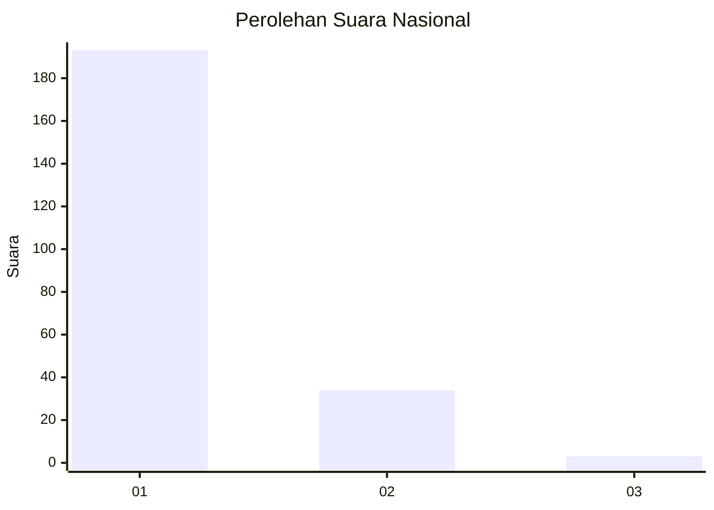
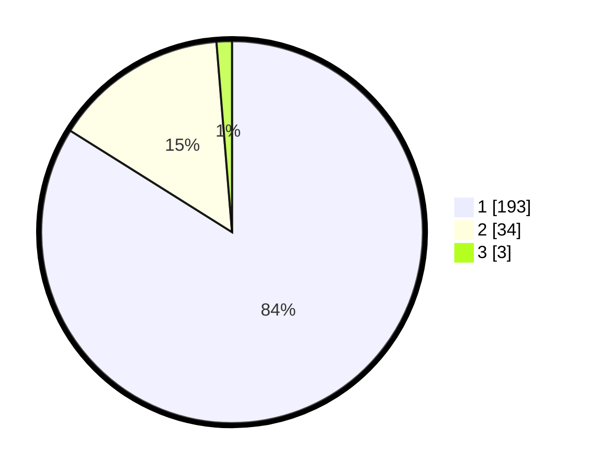

# Hasil

## Grafik

## Tabel

| No. | Nama Paslon    | Suara | Suara (raw) | Persentase |
|:--- |:-------------- | -----:| -----------:| ----------:|
| 1   | ANIES MUHAIMIN | 193   | [193][p-1]  | 83,91      |
| 2   | PRABOWO GIBRAN | 34    | [34][p-2]   | 14,78      |
| 3   | GANJAR MAHFUD  | 3     | [3][p-3]    | 1,30       |

[p-1]: https://github.com/gigit-pemilu/pemilu-2024/blob/main/pilpres/hitung-suara/sub/11-aceh/sub/18-pidie-jaya/sub/02-ulim/sub/2006-geulanggang/sub/001-tps/sub/paslon-1.txt
[p-2]: https://github.com/gigit-pemilu/pemilu-2024/blob/main/pilpres/hitung-suara/sub/11-aceh/sub/18-pidie-jaya/sub/02-ulim/sub/2006-geulanggang/sub/001-tps/sub/paslon-2.txt
[p-3]: https://github.com/gigit-pemilu/pemilu-2024/blob/main/pilpres/hitung-suara/sub/11-aceh/sub/18-pidie-jaya/sub/02-ulim/sub/2006-geulanggang/sub/001-tps/sub/paslon-3.txt

## Foto C Plano

https://sirekap-obj-formc.kpu.go.id/db76/pemilu/ppwp/11/18/02/20/06/1118022006001-20240215-092731--d962f623-b1ff-4940-8134-39efe1c6d1a9.jpg

https://sirekap-obj-formc.kpu.go.id/db76/pemilu/ppwp/11/18/02/20/06/1118022006001-20240215-092931--ca771108-a70f-43c1-bc4a-af6ba56bb992.jpg

https://sirekap-obj-formc.kpu.go.id/db76/pemilu/ppwp/11/18/02/20/06/1118022006001-20240215-093044--5150d932-f43c-48c9-b34d-aa2418276199.jpg

## Metadata

| Key        | Value               |
| ---------- | ------------------- |
| Time Stamp | 2024-02-15 23:29:50 |

