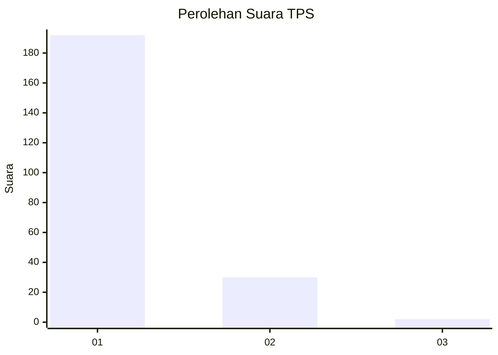
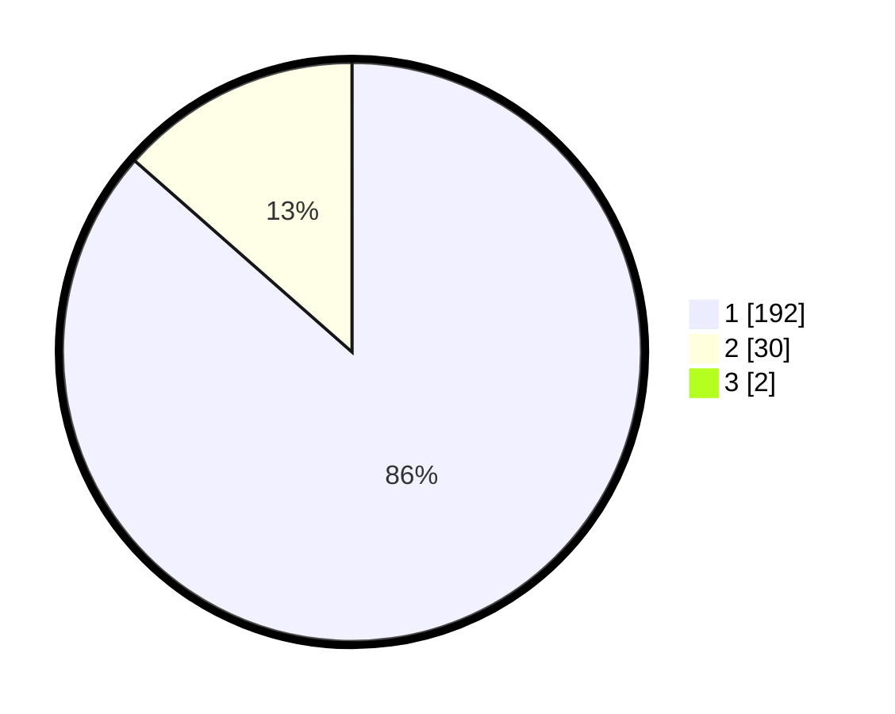

# Hasil

## Grafik

## Tabel

| No. | Nama Paslon    | Suara | Suara (raw) | Persentase |
|:--- |:-------------- | -----:| -----------:| ----------:|
| 1   | ANIES MUHAIMIN | 192   | [192][p-1]  | 85,71      |
| 2   | PRABOWO GIBRAN | 30    | [30][p-2]   | 13,39      |
| 3   | GANJAR MAHFUD  | 2     | [2][p-3]    | 0,89       |

[p-1]: https://github.com/gigit-pemilu/pemilu-2024-11-aceh/blob/main/pilpres/hitung-suara/sub/11-aceh/sub/18-pidie-jaya/sub/02-ulim/sub/2006-geulanggang/sub/002-tps/sub/paslon-1.txt
[p-2]: https://github.com/gigit-pemilu/pemilu-2024-11-aceh/blob/main/pilpres/hitung-suara/sub/11-aceh/sub/18-pidie-jaya/sub/02-ulim/sub/2006-geulanggang/sub/002-tps/sub/paslon-2.txt
[p-3]: https://github.com/gigit-pemilu/pemilu-2024-11-aceh/blob/main/pilpres/hitung-suara/sub/11-aceh/sub/18-pidie-jaya/sub/02-ulim/sub/2006-geulanggang/sub/002-tps/sub/paslon-3.txt

## Foto C Plano

https://sirekap-obj-formc.kpu.go.id/641e/pemilu/ppwp/11/18/02/20/06/1118022006002-20240215-090301--f0830ef7-b90f-4803-82da-9b5994bdb5e2.jpg

https://sirekap-obj-formc.kpu.go.id/641e/pemilu/ppwp/11/18/02/20/06/1118022006002-20240215-090449--d5ebe3be-f68b-4b26-955f-6cf1c2e7241b.jpg

https://sirekap-obj-formc.kpu.go.id/641e/pemilu/ppwp/11/18/02/20/06/1118022006002-20240215-090641--387ff33d-9ef0-4988-9708-eb332225d005.jpg

## Metadata

| Key        | Value               |
| ---------- | ------------------- |
| Time Stamp | 2024-02-15 23:29:50 |

