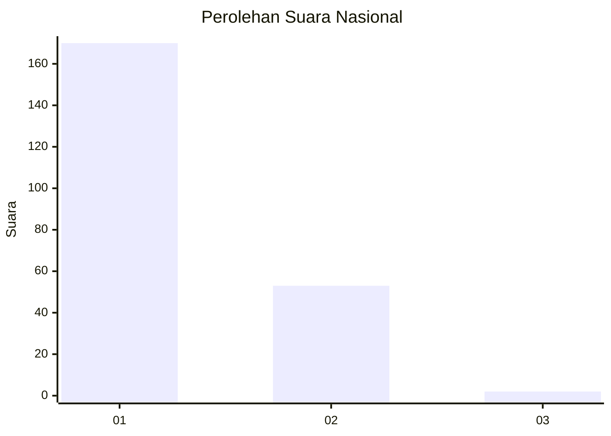
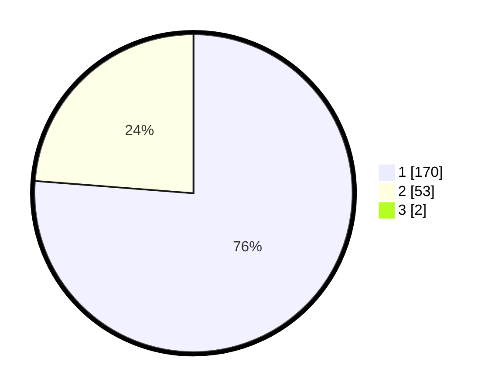

# Hasil

## Grafik

## Tabel

| No. | Nama Paslon    | Suara | Suara (raw) | Persentase |
|:--- |:-------------- | -----:| -----------:| ----------:|
| 1   | ANIES MUHAIMIN | 170   | [170][p-1]  | 75,56      |
| 2   | PRABOWO GIBRAN | 53    | [53][p-2]   | 23,56      |
| 3   | GANJAR MAHFUD  | 2     | [2][p-3]    | 0,89       |

[p-1]: https://github.com/gigit-pemilu/pemilu-2024/blob/main/pilpres/hitung-suara/sub/11-aceh/sub/18-pidie-jaya/sub/02-ulim/sub/2006-geulanggang/sub/003-tps/sub/paslon-1.txt
[p-2]: https://github.com/gigit-pemilu/pemilu-2024/blob/main/pilpres/hitung-suara/sub/11-aceh/sub/18-pidie-jaya/sub/02-ulim/sub/2006-geulanggang/sub/003-tps/sub/paslon-2.txt
[p-3]: https://github.com/gigit-pemilu/pemilu-2024/blob/main/pilpres/hitung-suara/sub/11-aceh/sub/18-pidie-jaya/sub/02-ulim/sub/2006-geulanggang/sub/003-tps/sub/paslon-3.txt

## Foto C Plano

https://sirekap-obj-formc.kpu.go.id/9dfc/pemilu/ppwp/11/18/02/20/06/1118022006003-20240215-092211--dee73e11-2436-4d18-9331-fe18e08de34b.jpg

https://sirekap-obj-formc.kpu.go.id/9dfc/pemilu/ppwp/11/18/02/20/06/1118022006003-20240215-092351--0316abb8-3c6e-4d86-afca-2fb6b3b816be.jpg

https://sirekap-obj-formc.kpu.go.id/9dfc/pemilu/ppwp/11/18/02/20/06/1118022006003-20240215-092632--3f16de9b-0714-499e-bc14-b256a4bd6078.jpg

## Metadata

| Key        | Value               |
| ---------- | ------------------- |
| Time Stamp | 2024-02-15 23:29:50 |

