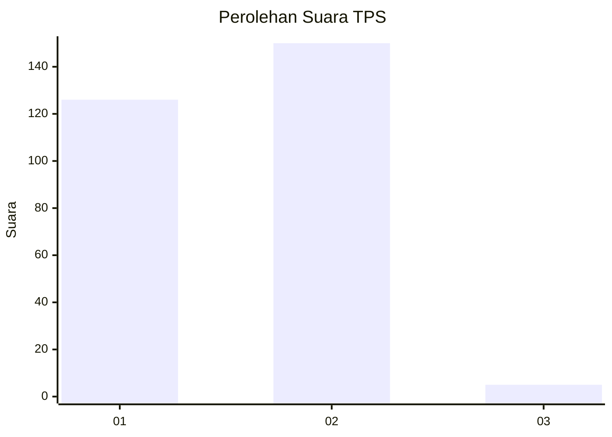
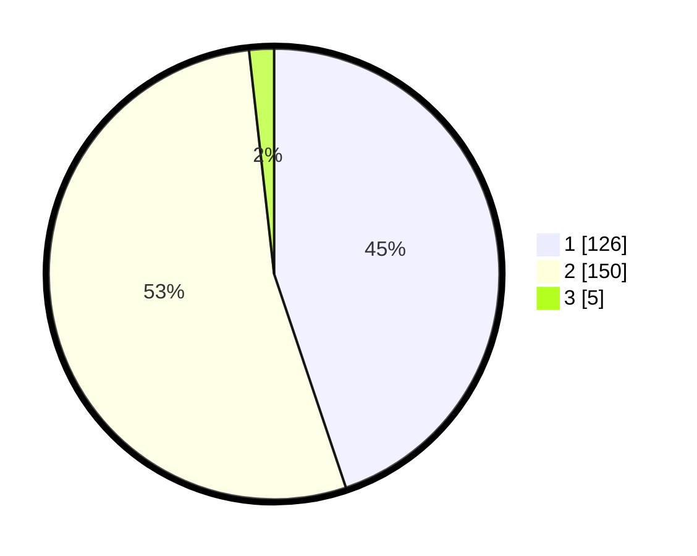

# Hasil

## Grafik

## Tabel

| No. | Nama Paslon    | Suara | Suara (raw) | Persentase |
|:--- |:-------------- | -----:| -----------:| ----------:|
| 1   | ANIES MUHAIMIN | 126   | [126][p-1]  | 44,84      |
| 2   | PRABOWO GIBRAN | 150   | [150][p-2]  | 53,38      |
| 3   | GANJAR MAHFUD  | 5     | [5][p-3]    | 1,78       |

[p-1]: https://github.com/gigit-pemilu/pemilu-2024-11-aceh/blob/main/pilpres/hitung-suara/sub/11-aceh/sub/18-pidie-jaya/sub/02-ulim/sub/2007-mesjid-ulim-baroh/sub/001-tps/sub/paslon-1.txt
[p-2]: https://github.com/gigit-pemilu/pemilu-2024-11-aceh/blob/main/pilpres/hitung-suara/sub/11-aceh/sub/18-pidie-jaya/sub/02-ulim/sub/2007-mesjid-ulim-baroh/sub/001-tps/sub/paslon-2.txt
[p-3]: https://github.com/gigit-pemilu/pemilu-2024-11-aceh/blob/main/pilpres/hitung-suara/sub/11-aceh/sub/18-pidie-jaya/sub/02-ulim/sub/2007-mesjid-ulim-baroh/sub/001-tps/sub/paslon-3.txt

## Foto C Plano

https://sirekap-obj-formc.kpu.go.id/bf4d/pemilu/ppwp/11/18/02/20/07/1118022007001-20240215-162416--f16bc5c0-96c5-4d68-9f29-f382e5e3d0f4.jpg

https://sirekap-obj-formc.kpu.go.id/bf4d/pemilu/ppwp/11/18/02/20/07/1118022007001-20240215-084153--f63e259f-3c85-4f38-bade-a4af2687f28f.jpg

https://sirekap-obj-formc.kpu.go.id/bf4d/pemilu/ppwp/11/18/02/20/07/1118022007001-20240215-084249--5f52a476-66dd-426b-8fe7-61cf93b20afc.jpg

## Metadata

| Key        | Value               |
| ---------- | ------------------- |
| Time Stamp | 2024-02-15 19:30:26 |

