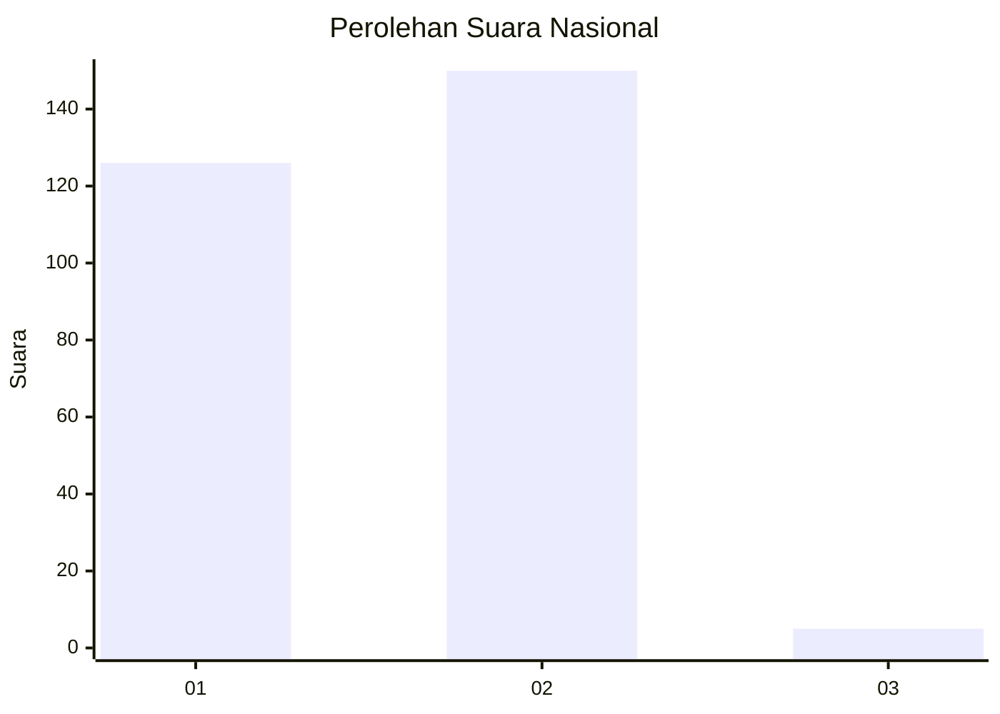
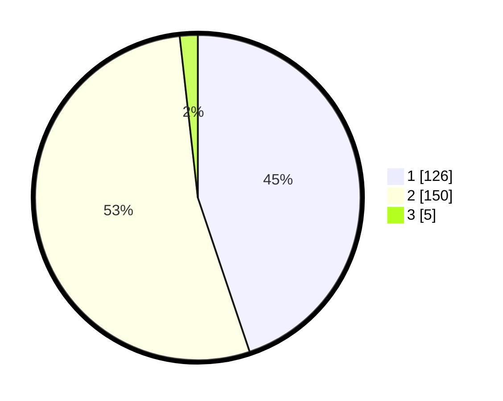

# Hasil

## Grafik

## Tabel

| No. | Nama Paslon    | Suara | Suara (raw) | Persentase |
|:--- |:-------------- | -----:| -----------:| ----------:|
| 1   | ANIES MUHAIMIN | 126   | [126][p-1]  | 44,84      |
| 2   | PRABOWO GIBRAN | 150   | [150][p-2]  | 53,38      |
| 3   | GANJAR MAHFUD  | 5     | [5][p-3]    | 1,78       |

[p-1]: https://github.com/gigit-pemilu/pemilu-2024/blob/main/pilpres/hitung-suara/sub/11-aceh/sub/18-pidie-jaya/sub/02-ulim/sub/2007-mesjid-ulim-baroh/sub/002-tps/sub/paslon-1.txt
[p-2]: https://github.com/gigit-pemilu/pemilu-2024/blob/main/pilpres/hitung-suara/sub/11-aceh/sub/18-pidie-jaya/sub/02-ulim/sub/2007-mesjid-ulim-baroh/sub/002-tps/sub/paslon-2.txt
[p-3]: https://github.com/gigit-pemilu/pemilu-2024/blob/main/pilpres/hitung-suara/sub/11-aceh/sub/18-pidie-jaya/sub/02-ulim/sub/2007-mesjid-ulim-baroh/sub/002-tps/sub/paslon-3.txt

## Foto C Plano

https://sirekap-obj-formc.kpu.go.id/02e1/pemilu/ppwp/11/18/02/20/07/1118022007002-20240222-124218--a72f58d7-6a4e-4d6a-b7fd-6689d3466dc8.jpg

https://sirekap-obj-formc.kpu.go.id/02e1/pemilu/ppwp/11/18/02/20/07/1118022007002-20240222-124545--72ec7a93-5452-45f3-8c89-940c21b85d94.jpg

https://sirekap-obj-formc.kpu.go.id/02e1/pemilu/ppwp/11/18/02/20/07/1118022007002-20240222-124641--d80f53c8-db76-4fa4-b234-aa04ba8d769b.jpg

## Metadata

| Key        | Value               |
| ---------- | ------------------- |
| Time Stamp | 2024-02-22 13:00:00 |

## DATA PEMILIH TETAP

Jumlah pemilih dalam DPT: **283**.
 * L: **136**.
 * P: **147**.

## DATA PENGGUNA HAK PILIH

Jumlah pengguna hak pilih dalam DPT: **281**.
 * L: **135**.
 * P: **146**.

Jumlah pengguna hak pilih dalam DPTb: **0**.
 * L: **0**.
 * P: **0**.

Jumlah pengguna hak pilih dalam DPK: **1**.
 * L: **7**.
 * P: **0**.

Jumlah pengguna hak pilih: **282**.
 * L: **136**.
 * P: **146**.

## JUMLAH SUARA SAH DAN TIDAK SAH

JUMLAH SELURUH SUARA SAH: **281**.

JUMLAH SUARA TIDAK SAH: **2**.

JUMLAH SELURUH SUARA SAH DAN SUARA TIDAK SAH: **282**.

