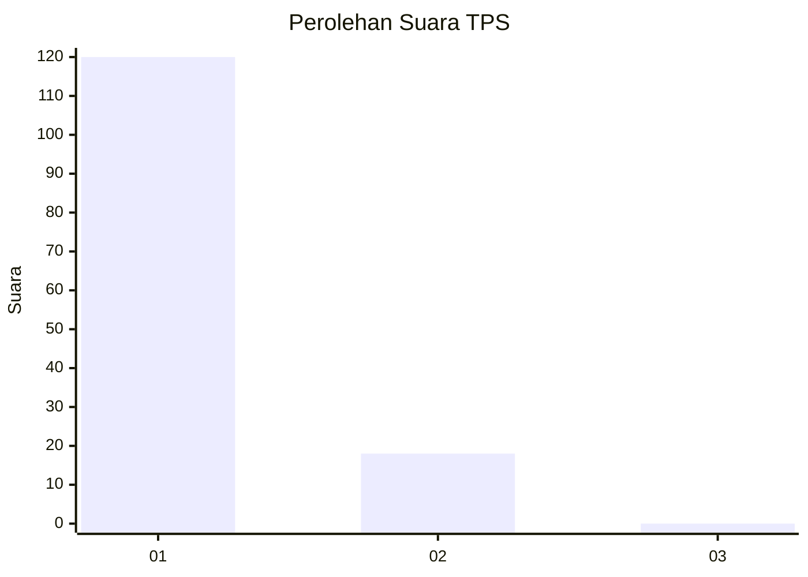
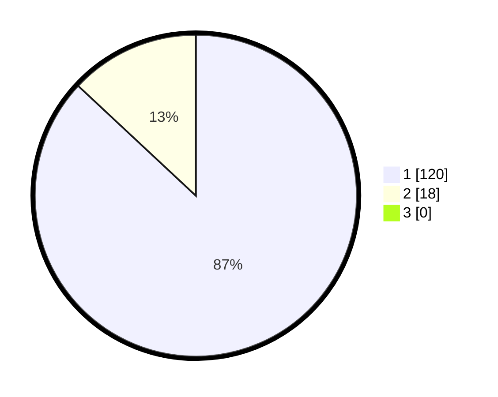

# Hasil

## Grafik

## Tabel

| No. | Nama Paslon    | Suara | Suara (raw) | Persentase |
|:--- |:-------------- | -----:| -----------:| ----------:|
| 1   | ANIES MUHAIMIN | 120   | [120][p-1]  | 86,96      |
| 2   | PRABOWO GIBRAN | 18    | [18][p-2]   | 13,04      |
| 3   | GANJAR MAHFUD  | 0     | [0][p-3]    | 0,00       |

[p-1]: https://github.com/gigit-pemilu/pemilu-2024-11-aceh/blob/main/pilpres/hitung-suara/sub/11-aceh/sub/18-pidie-jaya/sub/02-ulim/sub/2008-pulo-lhok/sub/001-tps/sub/paslon-1.txt
[p-2]: https://github.com/gigit-pemilu/pemilu-2024-11-aceh/blob/main/pilpres/hitung-suara/sub/11-aceh/sub/18-pidie-jaya/sub/02-ulim/sub/2008-pulo-lhok/sub/001-tps/sub/paslon-2.txt
[p-3]: https://github.com/gigit-pemilu/pemilu-2024-11-aceh/blob/main/pilpres/hitung-suara/sub/11-aceh/sub/18-pidie-jaya/sub/02-ulim/sub/2008-pulo-lhok/sub/001-tps/sub/paslon-3.txt

## Foto C Plano

https://sirekap-obj-formc.kpu.go.id/e835/pemilu/ppwp/11/18/02/20/08/1118022008001-20240215-131135--6fb26f63-d017-4efb-aa00-65e06b7b62fb.jpg

https://sirekap-obj-formc.kpu.go.id/e835/pemilu/ppwp/11/18/02/20/08/1118022008001-20240215-131407--ee2438e5-a3b6-4814-be93-d30c2d557e8c.jpg

https://sirekap-obj-formc.kpu.go.id/e835/pemilu/ppwp/11/18/02/20/08/1118022008001-20240215-131831--d7611223-5463-4c87-a211-545fb83a3c49.jpg

## Metadata

| Key        | Value               |
| ---------- | ------------------- |
| Time Stamp | 2024-02-15 21:30:27 |

