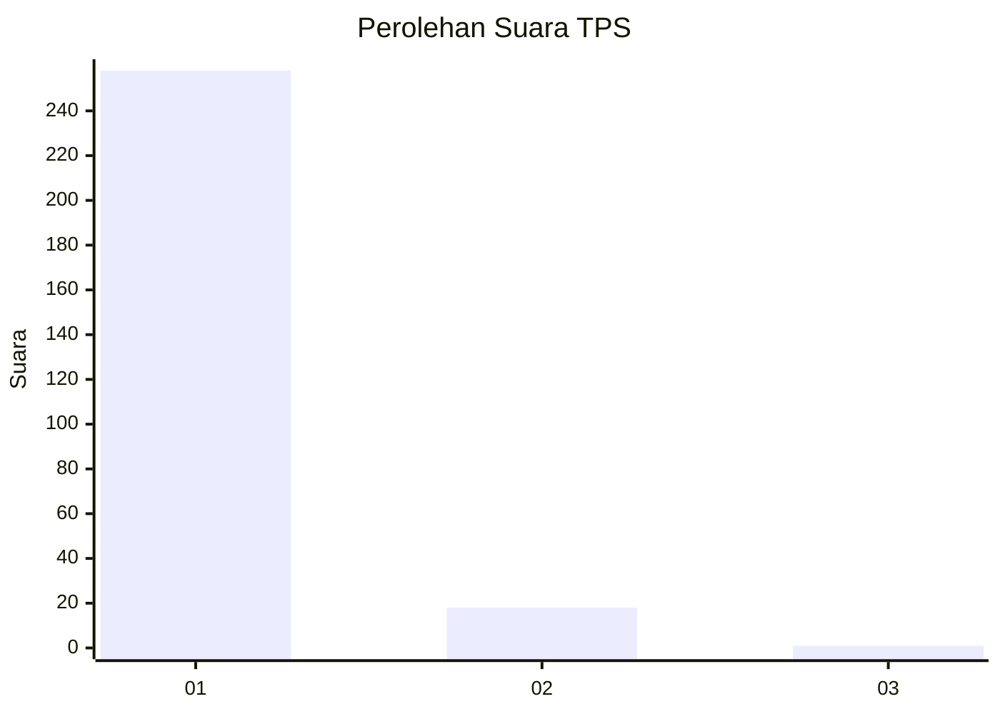
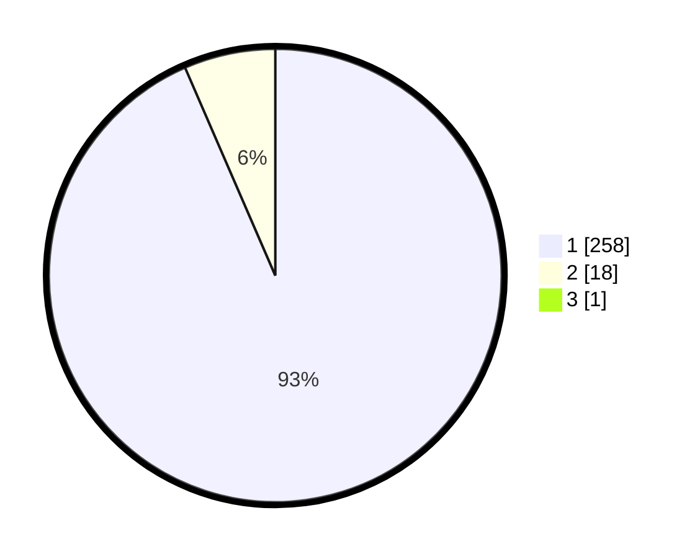

# Hasil

## Grafik

## Tabel

| No. | Nama Paslon    | Suara | Suara (raw) | Persentase |
|:--- |:-------------- | -----:| -----------:| ----------:|
| 1   | ANIES MUHAIMIN | 258   | [258][p-1]  | 93,14      |
| 2   | PRABOWO GIBRAN | 18    | [18][p-2]   | 6,50       |
| 3   | GANJAR MAHFUD  | 1     | [1][p-3]    | 0,36       |

[p-1]: https://github.com/gigit-pemilu/pemilu-2024-11-aceh/blob/main/pilpres/hitung-suara/sub/11-aceh/sub/18-pidie-jaya/sub/02-ulim/sub/2009-dayah-leubue/sub/002-tps/sub/paslon-1.txt
[p-2]: https://github.com/gigit-pemilu/pemilu-2024-11-aceh/blob/main/pilpres/hitung-suara/sub/11-aceh/sub/18-pidie-jaya/sub/02-ulim/sub/2009-dayah-leubue/sub/002-tps/sub/paslon-2.txt
[p-3]: https://github.com/gigit-pemilu/pemilu-2024-11-aceh/blob/main/pilpres/hitung-suara/sub/11-aceh/sub/18-pidie-jaya/sub/02-ulim/sub/2009-dayah-leubue/sub/002-tps/sub/paslon-3.txt

## Foto C Plano

https://sirekap-obj-formc.kpu.go.id/f3d8/pemilu/ppwp/11/18/02/20/09/1118022009002-20240215-062514--8466e70e-aaeb-47ab-a2f8-19c43bf8c8b0.jpg

https://sirekap-obj-formc.kpu.go.id/f3d8/pemilu/ppwp/11/18/02/20/09/1118022009002-20240215-062615--6ba52726-9b00-485b-9128-6fb80be4379d.jpg

https://sirekap-obj-formc.kpu.go.id/f3d8/pemilu/ppwp/11/18/02/20/09/1118022009002-20240215-062709--da996234-4e20-472a-a3ff-b257c5365a61.jpg

## Metadata

| Key        | Value               |
| ---------- | ------------------- |
| Time Stamp | 2024-02-15 23:29:50 |

