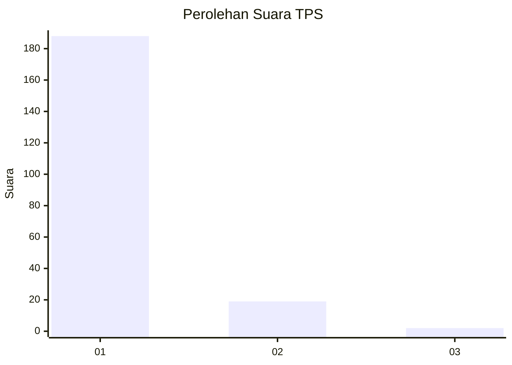
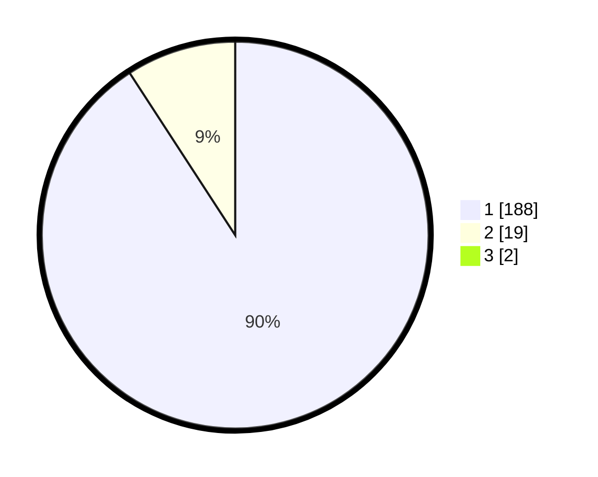

# Hasil

## Grafik

## Tabel

| No. | Nama Paslon    | Suara | Suara (raw) | Persentase |
|:--- |:-------------- | -----:| -----------:| ----------:|
| 1   | ANIES MUHAIMIN | 188   | [188][p-1]  | 89,95      |
| 2   | PRABOWO GIBRAN | 19    | [19][p-2]   | 9,09       |
| 3   | GANJAR MAHFUD  | 2     | [2][p-3]    | 0,96       |

[p-1]: https://github.com/gigit-pemilu/pemilu-2024-11-aceh/blob/main/pilpres/hitung-suara/sub/11-aceh/sub/18-pidie-jaya/sub/02-ulim/sub/2012-meunasah-bueng/sub/001-tps/sub/paslon-1.txt
[p-2]: https://github.com/gigit-pemilu/pemilu-2024-11-aceh/blob/main/pilpres/hitung-suara/sub/11-aceh/sub/18-pidie-jaya/sub/02-ulim/sub/2012-meunasah-bueng/sub/001-tps/sub/paslon-2.txt
[p-3]: https://github.com/gigit-pemilu/pemilu-2024-11-aceh/blob/main/pilpres/hitung-suara/sub/11-aceh/sub/18-pidie-jaya/sub/02-ulim/sub/2012-meunasah-bueng/sub/001-tps/sub/paslon-3.txt

## Foto C Plano

https://sirekap-obj-formc.kpu.go.id/82fc/pemilu/ppwp/11/18/02/20/12/1118022012001-20240215-080316--95849834-9a86-44bb-85b2-f5d6f80efa6d.jpg

https://sirekap-obj-formc.kpu.go.id/82fc/pemilu/ppwp/11/18/02/20/12/1118022012001-20240215-080506--83e72792-7919-40d4-9ef2-d58ddd709f05.jpg

https://sirekap-obj-formc.kpu.go.id/82fc/pemilu/ppwp/11/18/02/20/12/1118022012001-20240215-080629--fba9bec0-d3ef-4d6a-bb00-7b57f67e5597.jpg

## Metadata

| Key        | Value               |
| ---------- | ------------------- |
| Time Stamp | 2024-02-15 23:29:50 |

