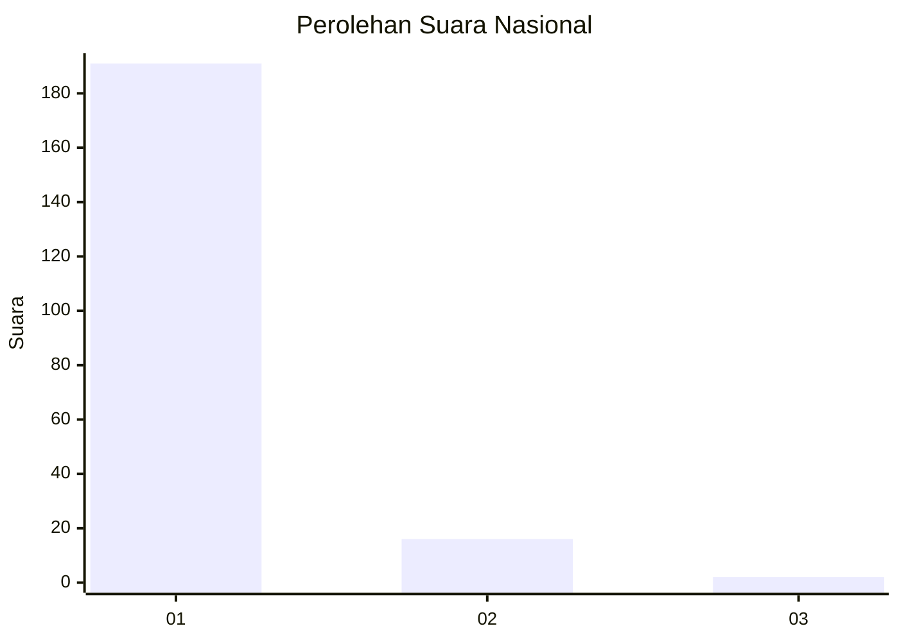
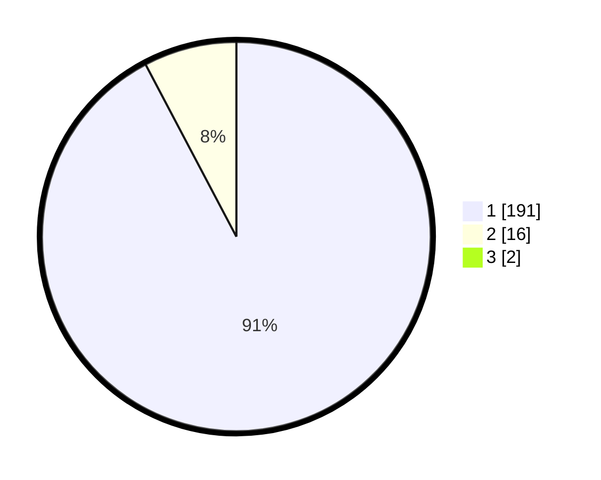

# Hasil

## Grafik

## Tabel

| No. | Nama Paslon    | Suara | Suara (raw) | Persentase |
|:--- |:-------------- | -----:| -----------:| ----------:|
| 1   | ANIES MUHAIMIN | 191   | [191][p-1]  | 91,39      |
| 2   | PRABOWO GIBRAN | 16    | [16][p-2]   | 7,66       |
| 3   | GANJAR MAHFUD  | 2     | [2][p-3]    | 0,96       |

[p-1]: https://github.com/gigit-pemilu/pemilu-2024/blob/main/pilpres/hitung-suara/sub/11-aceh/sub/18-pidie-jaya/sub/02-ulim/sub/2012-meunasah-bueng/sub/002-tps/sub/paslon-1.txt
[p-2]: https://github.com/gigit-pemilu/pemilu-2024/blob/main/pilpres/hitung-suara/sub/11-aceh/sub/18-pidie-jaya/sub/02-ulim/sub/2012-meunasah-bueng/sub/002-tps/sub/paslon-2.txt
[p-3]: https://github.com/gigit-pemilu/pemilu-2024/blob/main/pilpres/hitung-suara/sub/11-aceh/sub/18-pidie-jaya/sub/02-ulim/sub/2012-meunasah-bueng/sub/002-tps/sub/paslon-3.txt

## Foto C Plano

https://sirekap-obj-formc.kpu.go.id/b93f/pemilu/ppwp/11/18/02/20/12/1118022012002-20240215-084917--9121c334-84ea-43ae-811e-f6eb77977082.jpg

https://sirekap-obj-formc.kpu.go.id/b93f/pemilu/ppwp/11/18/02/20/12/1118022012002-20240215-084950--3c7f461c-99ef-4d89-870b-a70243ab52f1.jpg

https://sirekap-obj-formc.kpu.go.id/b93f/pemilu/ppwp/11/18/02/20/12/1118022012002-20240215-085010--e99bed1f-2c61-435d-b282-81c18e131f5e.jpg

## Metadata

| Key        | Value               |
| ---------- | ------------------- |
| Time Stamp | 2024-02-15 23:29:50 |

