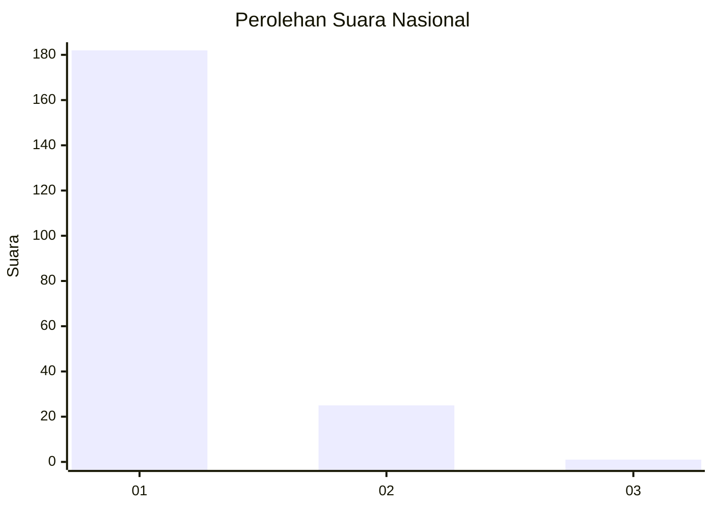
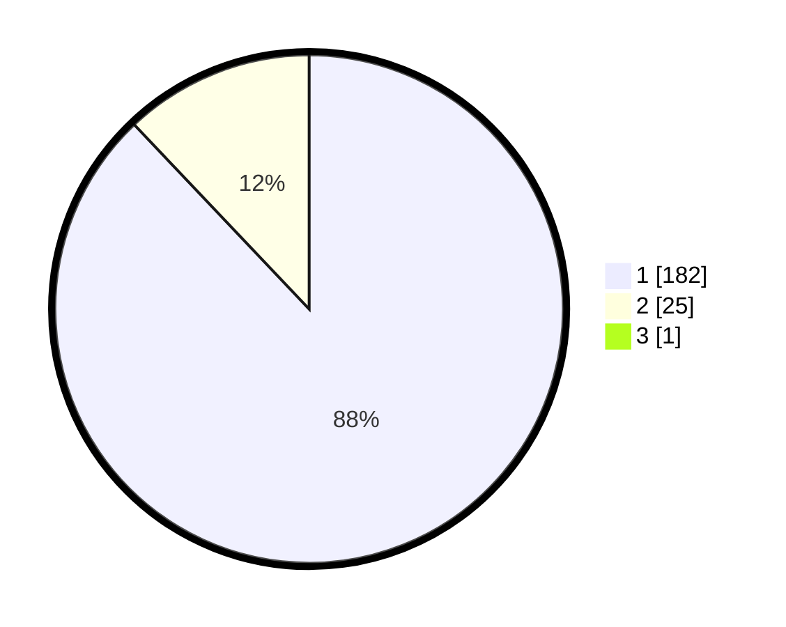

# Hasil

## Grafik

## Tabel

| No. | Nama Paslon    | Suara | Suara (raw) | Persentase |
|:--- |:-------------- | -----:| -----------:| ----------:|
| 1   | ANIES MUHAIMIN | 182   | [182][p-1]  | 87,50      |
| 2   | PRABOWO GIBRAN | 25    | [25][p-2]   | 12,02      |
| 3   | GANJAR MAHFUD  | 1     | [1][p-3]    | 0,48       |

[p-1]: https://github.com/gigit-pemilu/pemilu-2024/blob/main/pilpres/hitung-suara/sub/11-aceh/sub/18-pidie-jaya/sub/02-ulim/sub/2018-pulo-ulim/sub/001-tps/sub/paslon-1.txt
[p-2]: https://github.com/gigit-pemilu/pemilu-2024/blob/main/pilpres/hitung-suara/sub/11-aceh/sub/18-pidie-jaya/sub/02-ulim/sub/2018-pulo-ulim/sub/001-tps/sub/paslon-2.txt
[p-3]: https://github.com/gigit-pemilu/pemilu-2024/blob/main/pilpres/hitung-suara/sub/11-aceh/sub/18-pidie-jaya/sub/02-ulim/sub/2018-pulo-ulim/sub/001-tps/sub/paslon-3.txt

## Foto C Plano

https://sirekap-obj-formc.kpu.go.id/c3ae/pemilu/ppwp/11/18/02/20/18/1118022018001-20240215-144903--c1d57e5d-360a-4ae1-9198-db032c9f7fa7.jpg

https://sirekap-obj-formc.kpu.go.id/c3ae/pemilu/ppwp/11/18/02/20/18/1118022018001-20240215-144958--b38f0e38-1331-426c-9c3b-d648c202ec90.jpg

https://sirekap-obj-formc.kpu.go.id/c3ae/pemilu/ppwp/11/18/02/20/18/1118022018001-20240215-111859--8ed20e00-6bdb-4f53-92ca-32623b5294f5.jpg

## Metadata

| Key        | Value               |
| ---------- | ------------------- |
| Time Stamp | 2024-02-24 22:31:28 |

