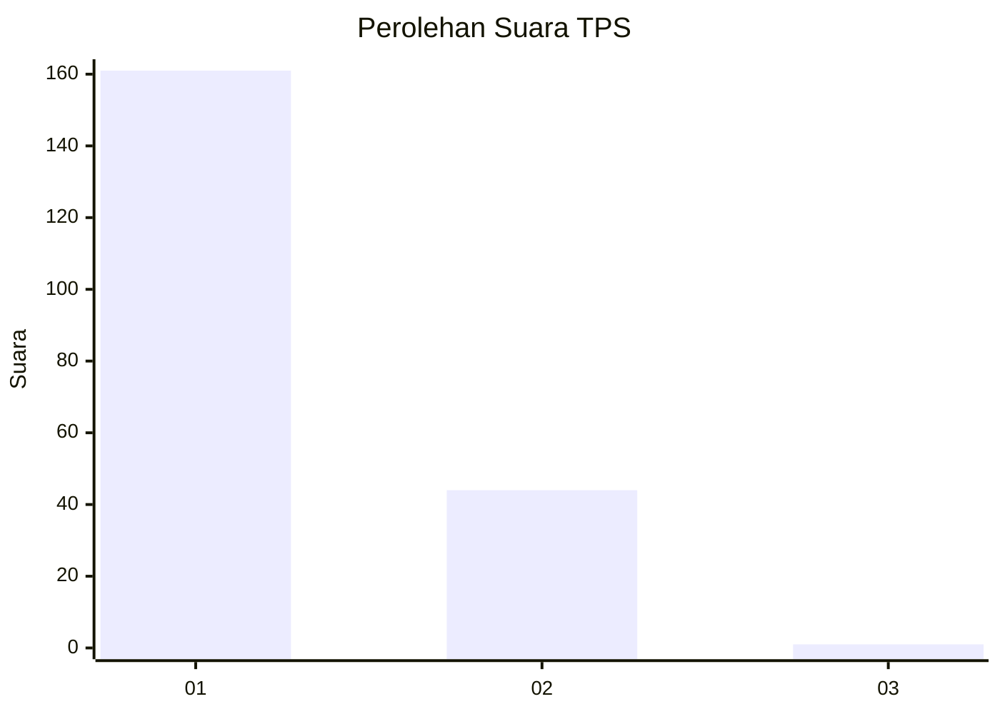
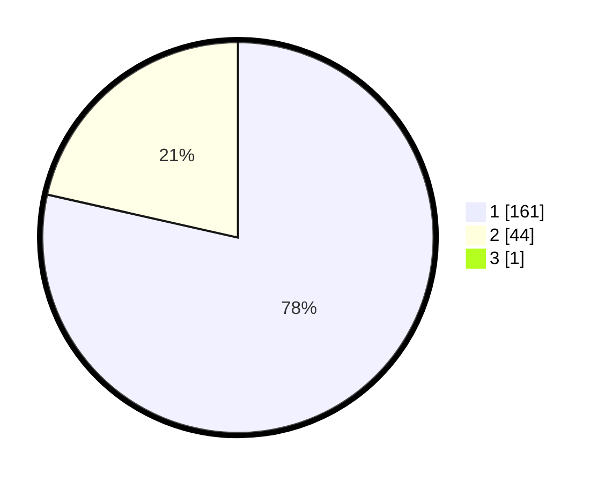

# Hasil

## Grafik

## Tabel

| No. | Nama Paslon    | Suara | Suara (raw) | Persentase |
|:--- |:-------------- | -----:| -----------:| ----------:|
| 1   | ANIES MUHAIMIN | 161   | [161][p-1]  | 78,16      |
| 2   | PRABOWO GIBRAN | 44    | [44][p-2]   | 21,36      |
| 3   | GANJAR MAHFUD  | 1     | [1][p-3]    | 0,49       |

[p-1]: https://github.com/gigit-pemilu/pemilu-2024-11-aceh/blob/main/pilpres/hitung-suara/sub/11-aceh/sub/18-pidie-jaya/sub/02-ulim/sub/2018-pulo-ulim/sub/002-tps/sub/paslon-1.txt
[p-2]: https://github.com/gigit-pemilu/pemilu-2024-11-aceh/blob/main/pilpres/hitung-suara/sub/11-aceh/sub/18-pidie-jaya/sub/02-ulim/sub/2018-pulo-ulim/sub/002-tps/sub/paslon-2.txt
[p-3]: https://github.com/gigit-pemilu/pemilu-2024-11-aceh/blob/main/pilpres/hitung-suara/sub/11-aceh/sub/18-pidie-jaya/sub/02-ulim/sub/2018-pulo-ulim/sub/002-tps/sub/paslon-3.txt

## Foto C Plano

https://sirekap-obj-formc.kpu.go.id/2e45/pemilu/ppwp/11/18/02/20/18/1118022018002-20240215-110725--fae6d4a5-9d1b-41dc-a436-0bb07a48813d.jpg

https://sirekap-obj-formc.kpu.go.id/2e45/pemilu/ppwp/11/18/02/20/18/1118022018002-20240215-110842--86dee8ae-1e11-4f7c-8d79-5b8bd7d8b07d.jpg

https://sirekap-obj-formc.kpu.go.id/2e45/pemilu/ppwp/11/18/02/20/18/1118022018002-20240215-111000--a4725df6-b39c-4643-b961-450205bf8492.jpg

## Metadata

| Key        | Value               |
| ---------- | ------------------- |
| Time Stamp | 2024-02-15 15:30:25 |

