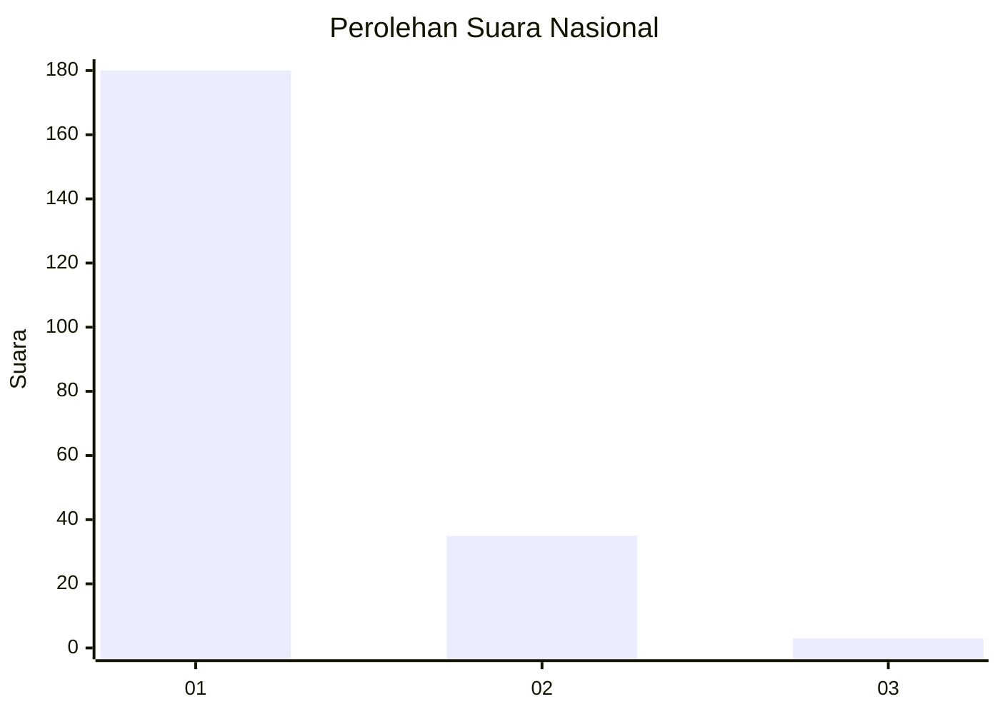
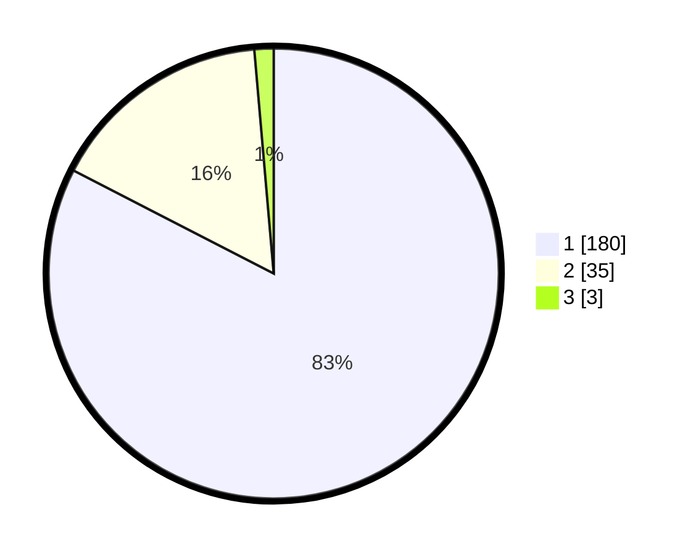

# Hasil

## Grafik

## Tabel

| No. | Nama Paslon    | Suara | Suara (raw) | Persentase |
|:--- |:-------------- | -----:| -----------:| ----------:|
| 1   | ANIES MUHAIMIN | 180   | [180][p-1]  | 82,57      |
| 2   | PRABOWO GIBRAN | 35    | [35][p-2]   | 16,06      |
| 3   | GANJAR MAHFUD  | 3     | [3][p-3]    | 1,38       |

[p-1]: https://github.com/gigit-pemilu/pemilu-2024/blob/main/pilpres/hitung-suara/sub/11-aceh/sub/18-pidie-jaya/sub/02-ulim/sub/2018-pulo-ulim/sub/003-tps/sub/paslon-1.txt
[p-2]: https://github.com/gigit-pemilu/pemilu-2024/blob/main/pilpres/hitung-suara/sub/11-aceh/sub/18-pidie-jaya/sub/02-ulim/sub/2018-pulo-ulim/sub/003-tps/sub/paslon-2.txt
[p-3]: https://github.com/gigit-pemilu/pemilu-2024/blob/main/pilpres/hitung-suara/sub/11-aceh/sub/18-pidie-jaya/sub/02-ulim/sub/2018-pulo-ulim/sub/003-tps/sub/paslon-3.txt

## Foto C Plano

https://sirekap-obj-formc.kpu.go.id/8409/pemilu/ppwp/11/18/02/20/18/1118022018003-20240215-105939--584bf208-790c-40b5-974c-95fce508f956.jpg

https://sirekap-obj-formc.kpu.go.id/8409/pemilu/ppwp/11/18/02/20/18/1118022018003-20240215-110420--55cd4d3a-a975-4ed6-ab31-eaeac6285d4c.jpg

https://sirekap-obj-formc.kpu.go.id/8409/pemilu/ppwp/11/18/02/20/18/1118022018003-20240215-110602--8692d16f-8d29-4787-b168-827c63a8dbc7.jpg

## Metadata

| Key        | Value               |
| ---------- | ------------------- |
| Time Stamp | 2024-02-15 21:30:27 |

