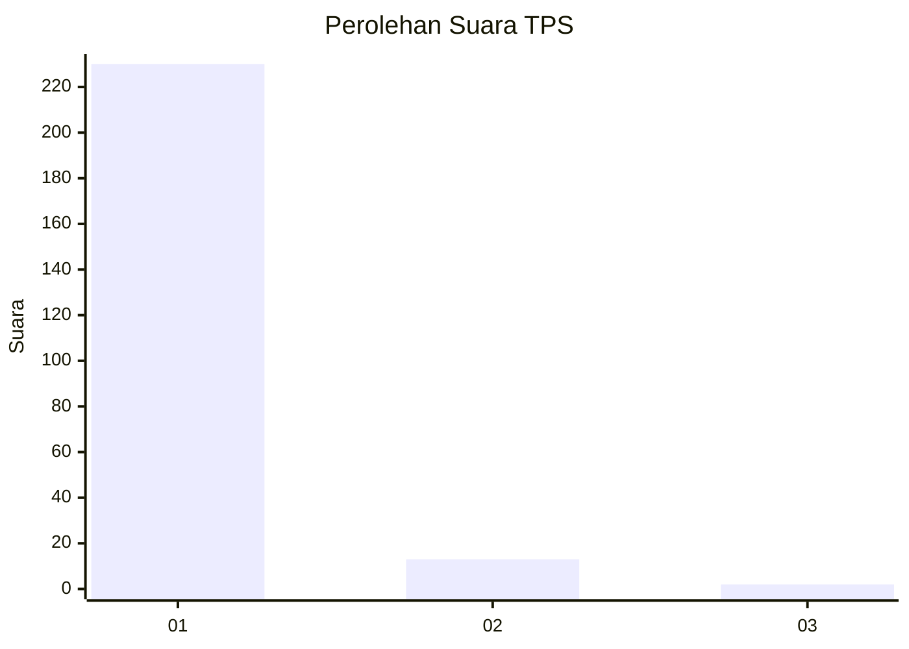
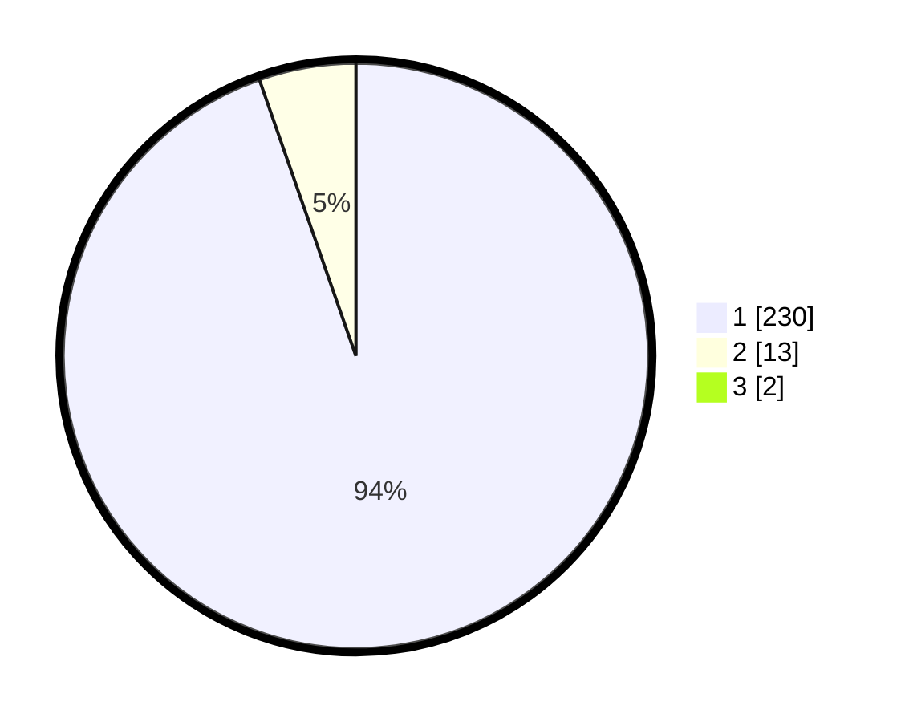

# Hasil

## Grafik

## Tabel

| No. | Nama Paslon    | Suara | Suara (raw) | Persentase |
|:--- |:-------------- | -----:| -----------:| ----------:|
| 1   | ANIES MUHAIMIN | 230   | [230][p-1]  | 93,88      |
| 2   | PRABOWO GIBRAN | 13    | [13][p-2]   | 5,31       |
| 3   | GANJAR MAHFUD  | 2     | [2][p-3]    | 0,82       |

[p-1]: https://github.com/gigit-pemilu/pemilu-2024-11-aceh/blob/main/pilpres/hitung-suara/sub/11-aceh/sub/18-pidie-jaya/sub/02-ulim/sub/2022-meunasah-pupu/sub/001-tps/sub/paslon-1.txt
[p-2]: https://github.com/gigit-pemilu/pemilu-2024-11-aceh/blob/main/pilpres/hitung-suara/sub/11-aceh/sub/18-pidie-jaya/sub/02-ulim/sub/2022-meunasah-pupu/sub/001-tps/sub/paslon-2.txt
[p-3]: https://github.com/gigit-pemilu/pemilu-2024-11-aceh/blob/main/pilpres/hitung-suara/sub/11-aceh/sub/18-pidie-jaya/sub/02-ulim/sub/2022-meunasah-pupu/sub/001-tps/sub/paslon-3.txt

## Foto C Plano

https://sirekap-obj-formc.kpu.go.id/ce96/pemilu/ppwp/11/18/02/20/22/1118022022001-20240215-091109--7cc95ce5-1d79-4fec-aec7-89a77ec2c7a4.jpg

https://sirekap-obj-formc.kpu.go.id/ce96/pemilu/ppwp/11/18/02/20/22/1118022022001-20240215-091244--659ee4db-a80a-4a9f-8c96-f9eb00bdc3b9.jpg

https://sirekap-obj-formc.kpu.go.id/ce96/pemilu/ppwp/11/18/02/20/22/1118022022001-20240215-091513--acae9305-ce00-4bb1-a80d-718a34e2b9df.jpg

## Metadata

| Key        | Value               |
| ---------- | ------------------- |
| Time Stamp | 2024-02-15 23:29:50 |

