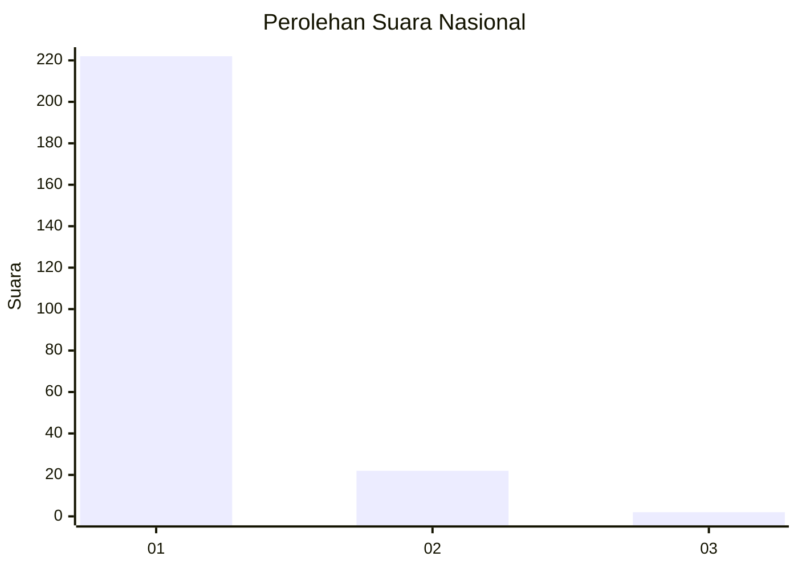
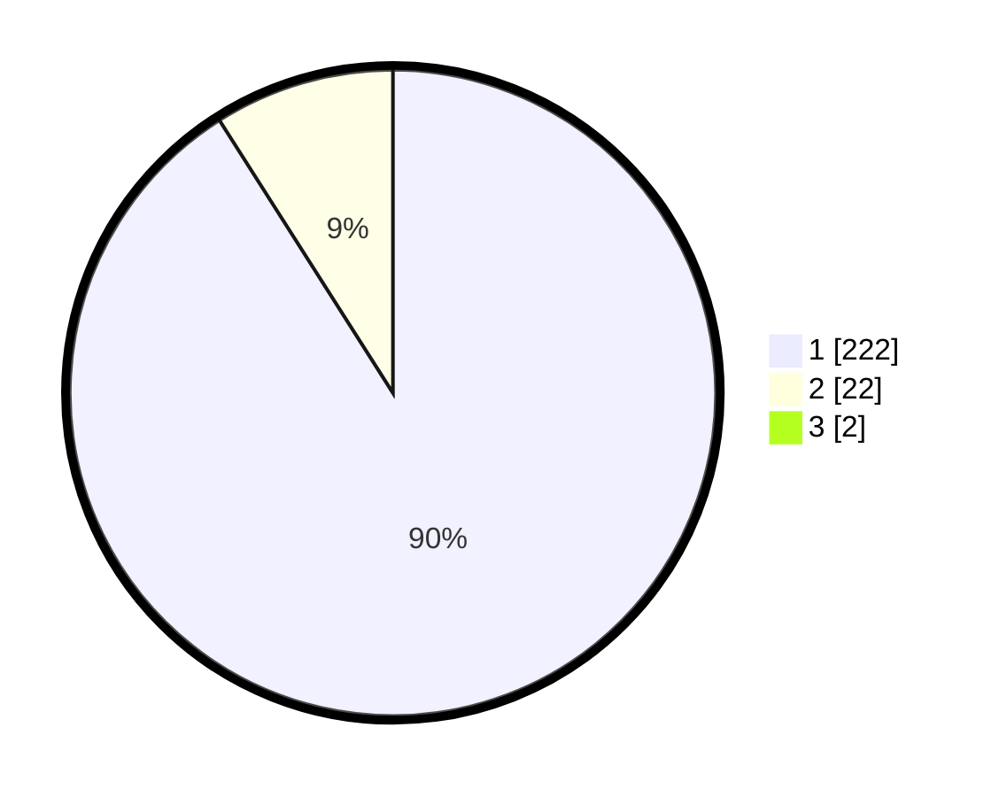

# Hasil

## Grafik

## Tabel

| No. | Nama Paslon    | Suara | Suara (raw) | Persentase |
|:--- |:-------------- | -----:| -----------:| ----------:|
| 1   | ANIES MUHAIMIN | 222   | [222][p-1]  | 90,24      |
| 2   | PRABOWO GIBRAN | 22    | [22][p-2]   | 8,94       |
| 3   | GANJAR MAHFUD  | 2     | [2][p-3]    | 0,81       |

[p-1]: https://github.com/gigit-pemilu/pemilu-2024/blob/main/pilpres/hitung-suara/sub/11-aceh/sub/18-pidie-jaya/sub/02-ulim/sub/2023-nangrhoe-barat/sub/001-tps/sub/paslon-1.txt
[p-2]: https://github.com/gigit-pemilu/pemilu-2024/blob/main/pilpres/hitung-suara/sub/11-aceh/sub/18-pidie-jaya/sub/02-ulim/sub/2023-nangrhoe-barat/sub/001-tps/sub/paslon-2.txt
[p-3]: https://github.com/gigit-pemilu/pemilu-2024/blob/main/pilpres/hitung-suara/sub/11-aceh/sub/18-pidie-jaya/sub/02-ulim/sub/2023-nangrhoe-barat/sub/001-tps/sub/paslon-3.txt

## Foto C Plano

https://sirekap-obj-formc.kpu.go.id/afc0/pemilu/ppwp/11/18/02/20/23/1118022023001-20240214-185059--28aec0db-454f-45bd-85c0-82322d001865.jpg

https://sirekap-obj-formc.kpu.go.id/afc0/pemilu/ppwp/11/18/02/20/23/1118022023001-20240214-185113--ca47a056-16e9-452c-9602-c8ee9e5f02d3.jpg

https://sirekap-obj-formc.kpu.go.id/afc0/pemilu/ppwp/11/18/02/20/23/1118022023001-20240214-185540--ca7858e6-f7a3-4127-a8a5-dbfd8abe3575.jpg

## Metadata

| Key        | Value               |
| ---------- | ------------------- |
| Time Stamp | 2024-02-15 23:29:50 |

