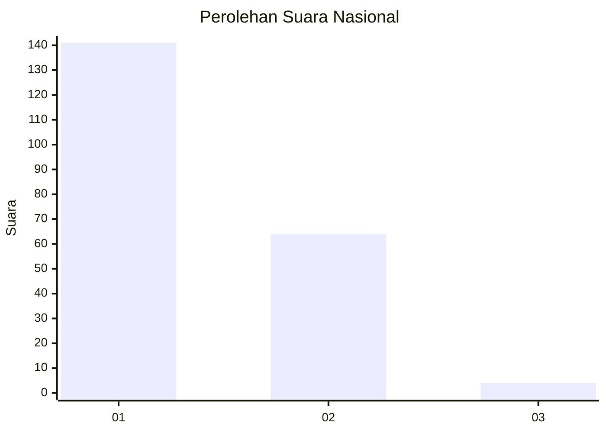
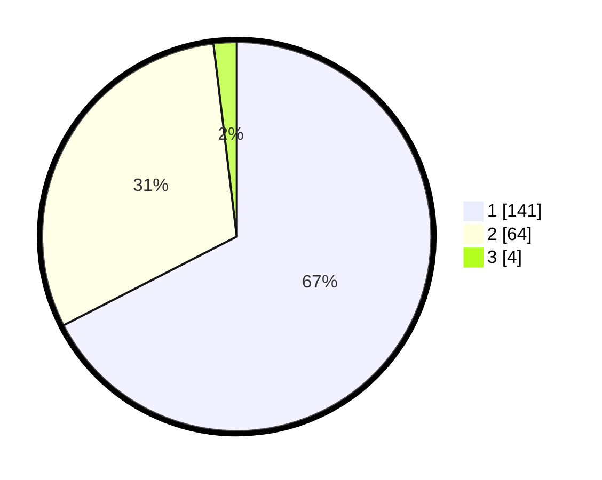

# Hasil

## Grafik

## Tabel

| No. | Nama Paslon    | Suara | Suara (raw) | Persentase |
|:--- |:-------------- | -----:| -----------:| ----------:|
| 1   | ANIES MUHAIMIN | 141   | [141][p-1]  | 67,46      |
| 2   | PRABOWO GIBRAN | 64    | [64][p-2]   | 30,62      |
| 3   | GANJAR MAHFUD  | 4     | [4][p-3]    | 1,91       |

[p-1]: https://github.com/gigit-pemilu/pemilu-2024/blob/main/pilpres/hitung-suara/sub/11-aceh/sub/18-pidie-jaya/sub/02-ulim/sub/2024-nangrhoe-timu/sub/001-tps/sub/paslon-1.txt
[p-2]: https://github.com/gigit-pemilu/pemilu-2024/blob/main/pilpres/hitung-suara/sub/11-aceh/sub/18-pidie-jaya/sub/02-ulim/sub/2024-nangrhoe-timu/sub/001-tps/sub/paslon-2.txt
[p-3]: https://github.com/gigit-pemilu/pemilu-2024/blob/main/pilpres/hitung-suara/sub/11-aceh/sub/18-pidie-jaya/sub/02-ulim/sub/2024-nangrhoe-timu/sub/001-tps/sub/paslon-3.txt

## Foto C Plano

https://sirekap-obj-formc.kpu.go.id/10ac/pemilu/ppwp/11/18/02/20/24/1118022024001-20240215-044001--a594fa24-54b1-4527-8027-f8be16270bc8.jpg

https://sirekap-obj-formc.kpu.go.id/10ac/pemilu/ppwp/11/18/02/20/24/1118022024001-20240215-044221--830aef16-e27b-4a08-935e-07aa9da478e1.jpg

https://sirekap-obj-formc.kpu.go.id/10ac/pemilu/ppwp/11/18/02/20/24/1118022024001-20240215-044322--f706a95d-c68a-4a2c-93c6-242ab5155e9c.jpg

## Metadata

| Key        | Value               |
| ---------- | ------------------- |
| Time Stamp | 2024-02-15 23:29:50 |

