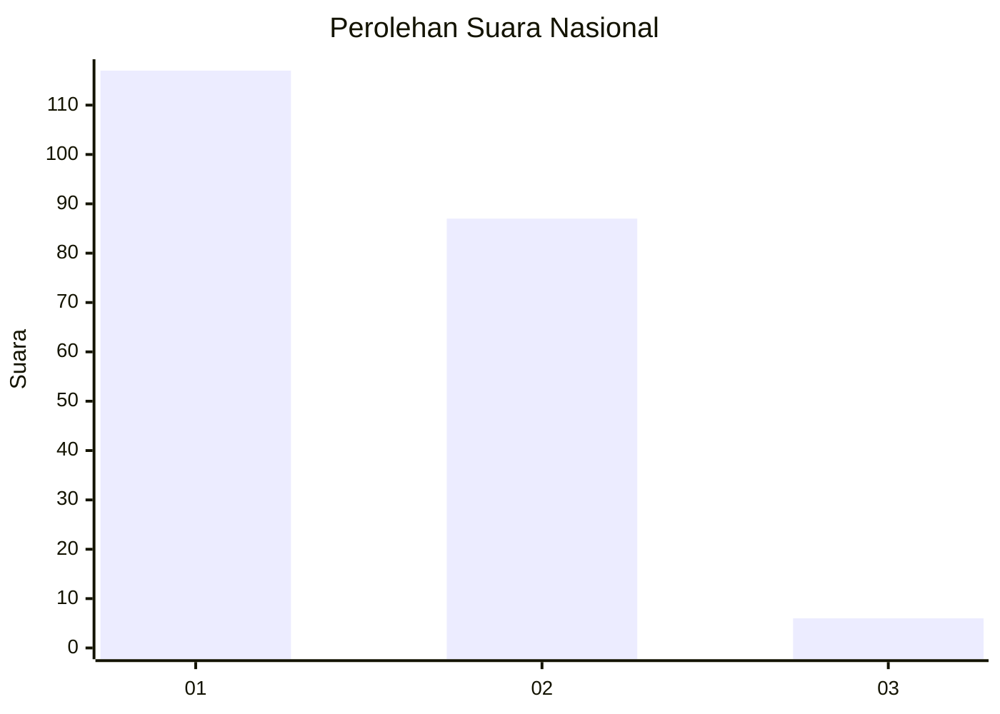
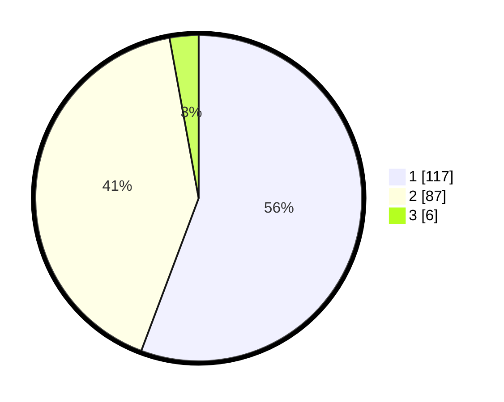

# Hasil

## Grafik

## Tabel

| No. | Nama Paslon    | Suara | Suara (raw) | Persentase |
|:--- |:-------------- | -----:| -----------:| ----------:|
| 1   | ANIES MUHAIMIN | 117   | [117][p-1]  | 55,71      |
| 2   | PRABOWO GIBRAN | 87    | [87][p-2]   | 41,43      |
| 3   | GANJAR MAHFUD  | 6     | [6][p-3]    | 2,86       |

[p-1]: https://github.com/gigit-pemilu/pemilu-2024/blob/main/pilpres/hitung-suara/sub/11-aceh/sub/18-pidie-jaya/sub/02-ulim/sub/2024-nangrhoe-timu/sub/002-tps/sub/paslon-1.txt
[p-2]: https://github.com/gigit-pemilu/pemilu-2024/blob/main/pilpres/hitung-suara/sub/11-aceh/sub/18-pidie-jaya/sub/02-ulim/sub/2024-nangrhoe-timu/sub/002-tps/sub/paslon-2.txt
[p-3]: https://github.com/gigit-pemilu/pemilu-2024/blob/main/pilpres/hitung-suara/sub/11-aceh/sub/18-pidie-jaya/sub/02-ulim/sub/2024-nangrhoe-timu/sub/002-tps/sub/paslon-3.txt

## Foto C Plano

https://sirekap-obj-formc.kpu.go.id/f7cc/pemilu/ppwp/11/18/02/20/24/1118022024002-20240215-070829--58fc318e-830f-47f8-9079-2323593099fe.jpg

https://sirekap-obj-formc.kpu.go.id/f7cc/pemilu/ppwp/11/18/02/20/24/1118022024002-20240215-070140--58e278ff-4365-4230-b4eb-e901c8c2b6c6.jpg

https://sirekap-obj-formc.kpu.go.id/f7cc/pemilu/ppwp/11/18/02/20/24/1118022024002-20240215-070418--40563bc8-b6cf-4d18-a077-280fd39cb6a6.jpg

## Metadata

| Key        | Value               |
| ---------- | ------------------- |
| Time Stamp | 2024-02-15 23:29:50 |

