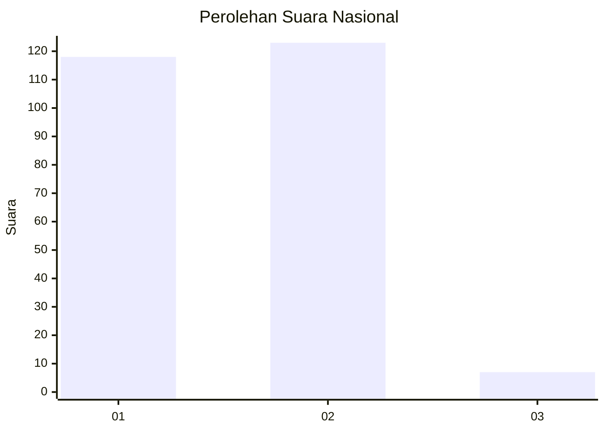
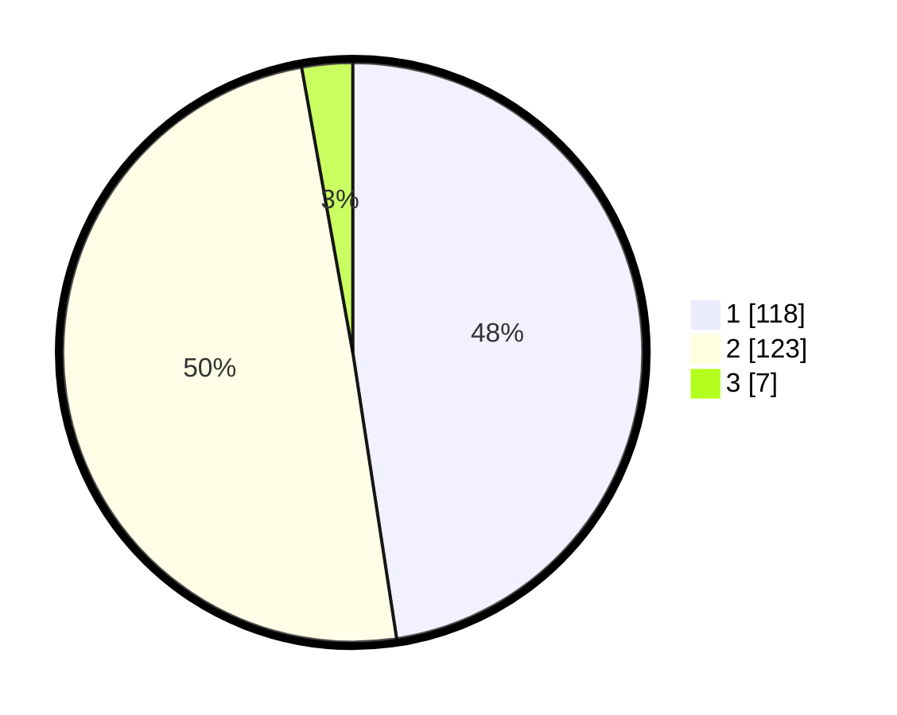

# Hasil

## Grafik

## Tabel

| No. | Nama Paslon    | Suara | Suara (raw) | Persentase |
|:--- |:-------------- | -----:| -----------:| ----------:|
| 1   | ANIES MUHAIMIN | 118   | [118][p-1]  | 47,58      |
| 2   | PRABOWO GIBRAN | 123   | [123][p-2]  | 49,60      |
| 3   | GANJAR MAHFUD  | 7     | [7][p-3]    | 2,82       |

[p-1]: https://github.com/gigit-pemilu/pemilu-2024/blob/main/pilpres/hitung-suara/sub/11-aceh/sub/18-pidie-jaya/sub/02-ulim/sub/2025-meunasah-mesjid/sub/001-tps/sub/paslon-1.txt
[p-2]: https://github.com/gigit-pemilu/pemilu-2024/blob/main/pilpres/hitung-suara/sub/11-aceh/sub/18-pidie-jaya/sub/02-ulim/sub/2025-meunasah-mesjid/sub/001-tps/sub/paslon-2.txt
[p-3]: https://github.com/gigit-pemilu/pemilu-2024/blob/main/pilpres/hitung-suara/sub/11-aceh/sub/18-pidie-jaya/sub/02-ulim/sub/2025-meunasah-mesjid/sub/001-tps/sub/paslon-3.txt

## Foto C Plano

https://sirekap-obj-formc.kpu.go.id/8a05/pemilu/ppwp/11/18/02/20/25/1118022025001-20240215-113418--1feb8ac9-8c02-40f6-bd5f-4447138894cd.jpg

https://sirekap-obj-formc.kpu.go.id/8a05/pemilu/ppwp/11/18/02/20/25/1118022025001-20240215-113522--2567f3e0-72f6-4238-b121-fefff1d82b52.jpg

https://sirekap-obj-formc.kpu.go.id/8a05/pemilu/ppwp/11/18/02/20/25/1118022025001-20240215-113653--68731243-f930-43d8-991b-7f3ac115f3df.jpg

## Metadata

| Key        | Value               |
| ---------- | ------------------- |
| Time Stamp | 2024-02-15 23:29:50 |

