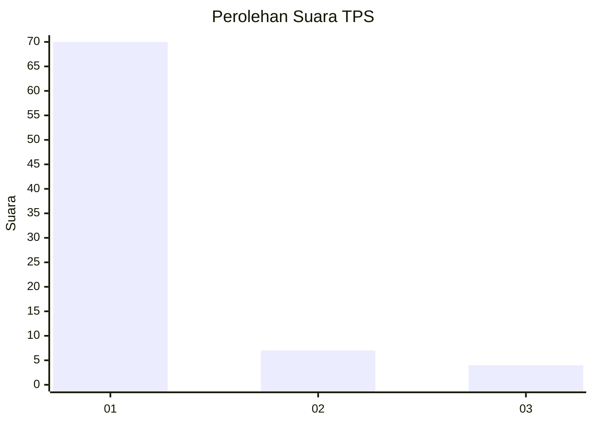
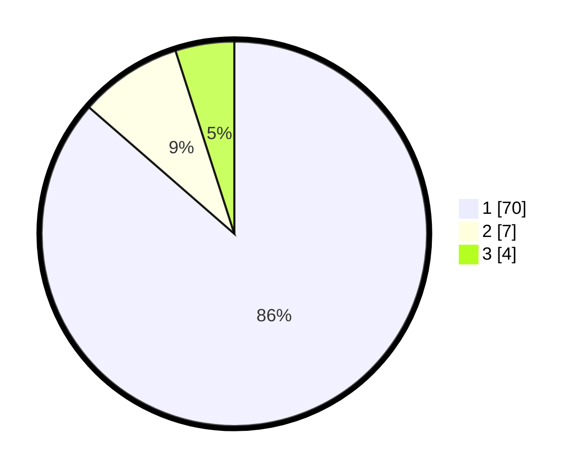

# Hasil

## Grafik

## Tabel

| No. | Nama Paslon    | Suara | Suara (raw) | Persentase |
|:--- |:-------------- | -----:| -----------:| ----------:|
| 1   | ANIES MUHAIMIN | 70    | [70][p-1]   | 86,42      |
| 2   | PRABOWO GIBRAN | 7     | [7][p-2]    | 8,64       |
| 3   | GANJAR MAHFUD  | 4     | [4][p-3]    | 4,94       |

[p-1]: https://github.com/gigit-pemilu/pemilu-2024-11-aceh/blob/main/pilpres/hitung-suara/sub/11-aceh/sub/18-pidie-jaya/sub/02-ulim/sub/2029-alue-keumiki/sub/001-tps/sub/paslon-1.txt
[p-2]: https://github.com/gigit-pemilu/pemilu-2024-11-aceh/blob/main/pilpres/hitung-suara/sub/11-aceh/sub/18-pidie-jaya/sub/02-ulim/sub/2029-alue-keumiki/sub/001-tps/sub/paslon-2.txt
[p-3]: https://github.com/gigit-pemilu/pemilu-2024-11-aceh/blob/main/pilpres/hitung-suara/sub/11-aceh/sub/18-pidie-jaya/sub/02-ulim/sub/2029-alue-keumiki/sub/001-tps/sub/paslon-3.txt

## Foto C Plano

https://sirekap-obj-formc.kpu.go.id/edd3/pemilu/ppwp/11/18/02/20/29/1118022029001-20240214-193545--42d8facd-8801-4236-a6cf-70e06cfa7eb2.jpg

https://sirekap-obj-formc.kpu.go.id/edd3/pemilu/ppwp/11/18/02/20/29/1118022029001-20240214-215939--df3956c6-158b-4b4b-8421-0e76337aa97c.jpg

https://sirekap-obj-formc.kpu.go.id/edd3/pemilu/ppwp/11/18/02/20/29/1118022029001-20240214-193133--68886946-3ea0-43c2-b615-c87505fd3afc.jpg

## Metadata

| Key        | Value               |
| ---------- | ------------------- |
| Time Stamp | 2024-02-15 21:01:18 |

## DATA PEMILIH TETAP

Jumlah pemilih dalam DPT: **95**.
 * L: **52**.
 * P: **43**.

## DATA PENGGUNA HAK PILIH

Jumlah pengguna hak pilih dalam DPT: **84**.
 * L: **46**.
 * P: **38**.

Jumlah pengguna hak pilih dalam DPTb: **1**.
 * L: **1**.
 * P: **0**.

Jumlah pengguna hak pilih dalam DPK: **0**.
 * L: **0**.
 * P: **0**.

Jumlah pengguna hak pilih: **85**.
 * L: **47**.
 * P: **38**.

## JUMLAH SUARA SAH DAN TIDAK SAH

JUMLAH SELURUH SUARA SAH: **81**.

JUMLAH SUARA TIDAK SAH: **4**.

JUMLAH SELURUH SUARA SAH DAN SUARA TIDAK SAH: **85**.

