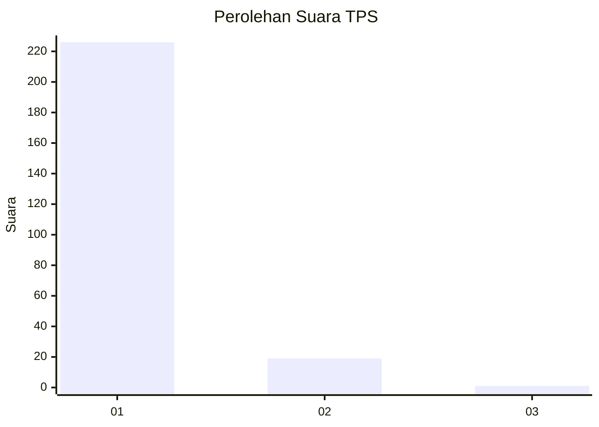
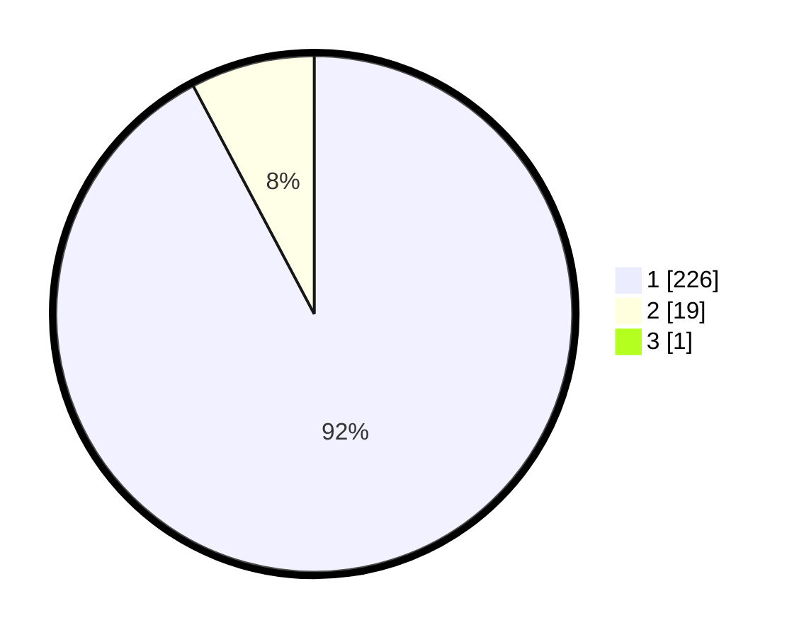

# Hasil

## Grafik

## Tabel

| No. | Nama Paslon    | Suara | Suara (raw) | Persentase |
|:--- |:-------------- | -----:| -----------:| ----------:|
| 1   | ANIES MUHAIMIN | 226   | [226][p-1]  | 91,87      |
| 2   | PRABOWO GIBRAN | 19    | [19][p-2]   | 7,72       |
| 3   | GANJAR MAHFUD  | 1     | [1][p-3]    | 0,41       |

[p-1]: https://github.com/gigit-pemilu/pemilu-2024-11-aceh/blob/main/pilpres/hitung-suara/sub/11-aceh/sub/18-pidie-jaya/sub/03-jangka-buya/sub/2002-kuta-baroh/sub/001-tps/sub/paslon-1.txt
[p-2]: https://github.com/gigit-pemilu/pemilu-2024-11-aceh/blob/main/pilpres/hitung-suara/sub/11-aceh/sub/18-pidie-jaya/sub/03-jangka-buya/sub/2002-kuta-baroh/sub/001-tps/sub/paslon-2.txt
[p-3]: https://github.com/gigit-pemilu/pemilu-2024-11-aceh/blob/main/pilpres/hitung-suara/sub/11-aceh/sub/18-pidie-jaya/sub/03-jangka-buya/sub/2002-kuta-baroh/sub/001-tps/sub/paslon-3.txt

## Foto C Plano

https://sirekap-obj-formc.kpu.go.id/7c99/pemilu/ppwp/11/18/03/20/02/1118032002001-20240215-192117--614528c6-02bd-4cb1-8ec0-bbe526db58c6.jpg

https://sirekap-obj-formc.kpu.go.id/7c99/pemilu/ppwp/11/18/03/20/02/1118032002001-20240215-192136--5ba312ad-0702-4d5b-9faa-862352c662fe.jpg

https://sirekap-obj-formc.kpu.go.id/7c99/pemilu/ppwp/11/18/03/20/02/1118032002001-20240215-192154--48dd9322-35ba-4186-9fec-264196bd2118.jpg

## Metadata

| Key        | Value               |
| ---------- | ------------------- |
| Time Stamp | 2024-02-24 22:31:28 |

