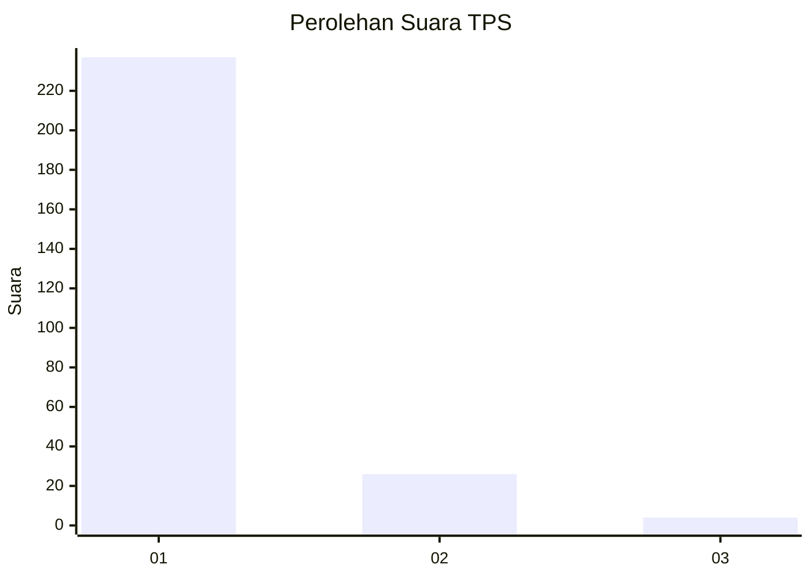
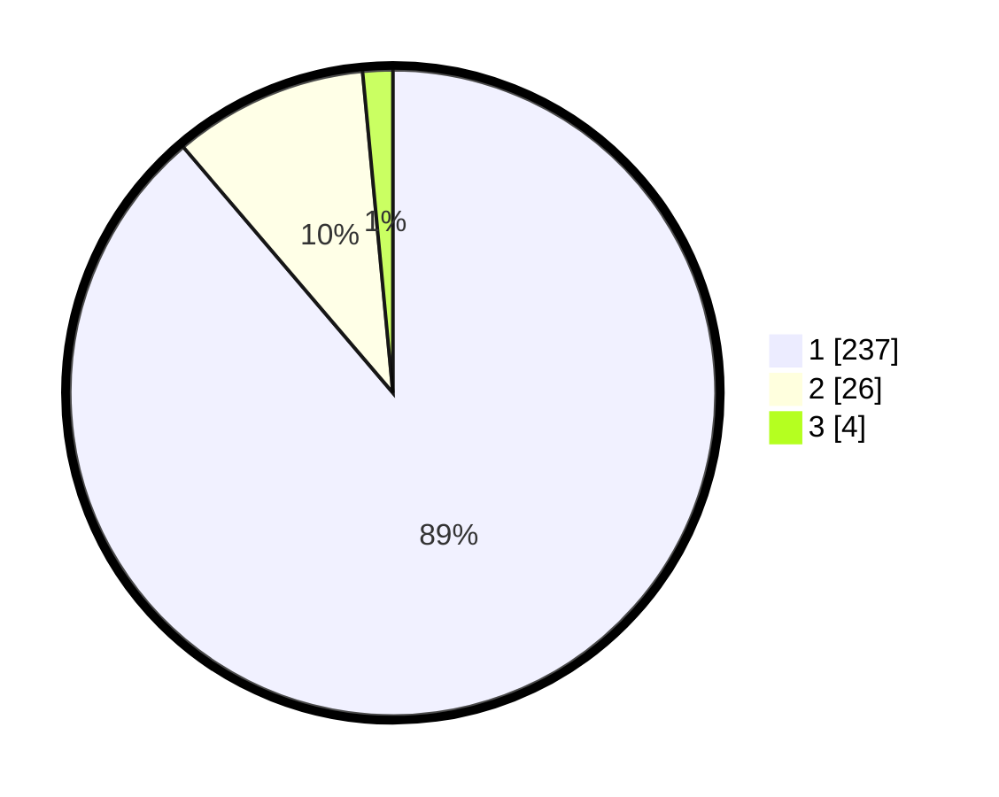

# Hasil

## Grafik

## Tabel

| No. | Nama Paslon    | Suara | Suara (raw) | Persentase |
|:--- |:-------------- | -----:| -----------:| ----------:|
| 1   | ANIES MUHAIMIN | 237   | [237][p-1]  | 88,76      |
| 2   | PRABOWO GIBRAN | 26    | [26][p-2]   | 9,74       |
| 3   | GANJAR MAHFUD  | 4     | [4][p-3]    | 1,50       |

[p-1]: https://github.com/gigit-pemilu/pemilu-2024-11-aceh/blob/main/pilpres/hitung-suara/sub/11-aceh/sub/18-pidie-jaya/sub/03-jangka-buya/sub/2004-kiran-dayah/sub/001-tps/sub/paslon-1.txt
[p-2]: https://github.com/gigit-pemilu/pemilu-2024-11-aceh/blob/main/pilpres/hitung-suara/sub/11-aceh/sub/18-pidie-jaya/sub/03-jangka-buya/sub/2004-kiran-dayah/sub/001-tps/sub/paslon-2.txt
[p-3]: https://github.com/gigit-pemilu/pemilu-2024-11-aceh/blob/main/pilpres/hitung-suara/sub/11-aceh/sub/18-pidie-jaya/sub/03-jangka-buya/sub/2004-kiran-dayah/sub/001-tps/sub/paslon-3.txt

## Foto C Plano

https://sirekap-obj-formc.kpu.go.id/2683/pemilu/ppwp/11/18/03/20/04/1118032004001-20240215-031425--1dd0c7ec-f7de-4fbf-bed1-ff175da3cff8.jpg

https://sirekap-obj-formc.kpu.go.id/2683/pemilu/ppwp/11/18/03/20/04/1118032004001-20240215-031550--dbc1bf27-d9da-4354-9562-626b77dbdafd.jpg

https://sirekap-obj-formc.kpu.go.id/2683/pemilu/ppwp/11/18/03/20/04/1118032004001-20240215-031643--6b3def30-9366-42f9-b1a5-c6edd5b8a16f.jpg

## Metadata

| Key        | Value               |
| ---------- | ------------------- |
| Time Stamp | 2024-02-15 23:29:50 |

