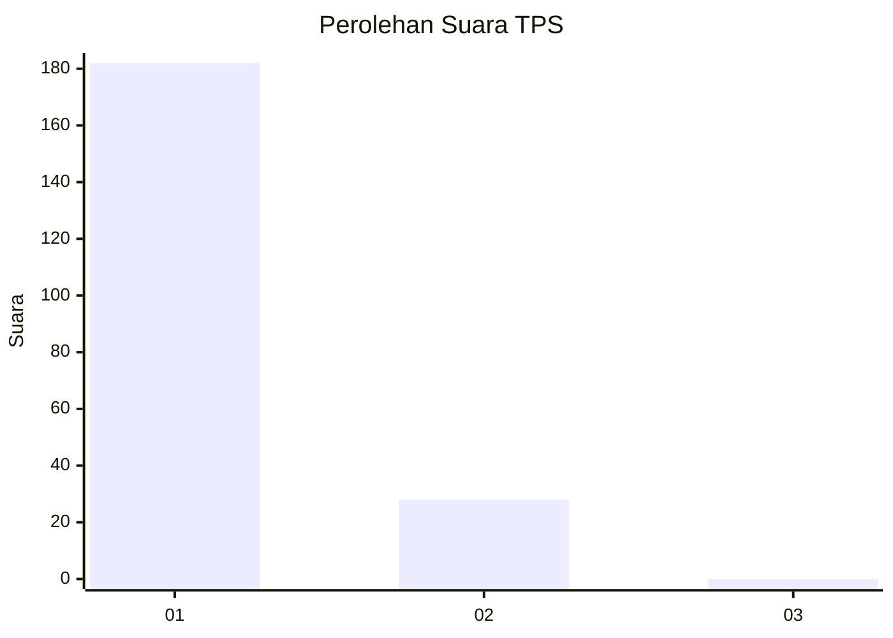
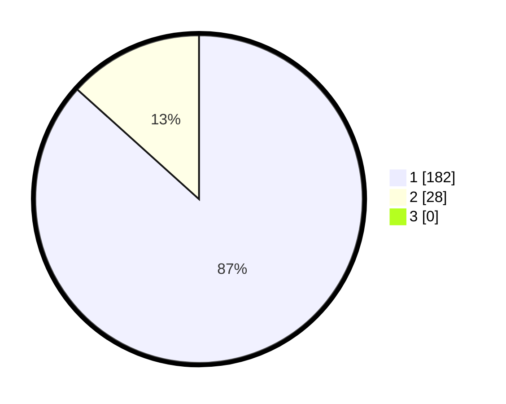

# Hasil

## Grafik

## Tabel

| No. | Nama Paslon    | Suara | Suara (raw) | Persentase |
|:--- |:-------------- | -----:| -----------:| ----------:|
| 1   | ANIES MUHAIMIN | 182   | [182][p-1]  | 86,67      |
| 2   | PRABOWO GIBRAN | 28    | [28][p-2]   | 13,33      |
| 3   | GANJAR MAHFUD  | 0     | [0][p-3]    | 0,00       |

[p-1]: https://github.com/gigit-pemilu/pemilu-2024-11-aceh/blob/main/pilpres/hitung-suara/sub/11-aceh/sub/18-pidie-jaya/sub/03-jangka-buya/sub/2005-kiran-baroh/sub/002-tps/sub/paslon-1.txt
[p-2]: https://github.com/gigit-pemilu/pemilu-2024-11-aceh/blob/main/pilpres/hitung-suara/sub/11-aceh/sub/18-pidie-jaya/sub/03-jangka-buya/sub/2005-kiran-baroh/sub/002-tps/sub/paslon-2.txt
[p-3]: https://github.com/gigit-pemilu/pemilu-2024-11-aceh/blob/main/pilpres/hitung-suara/sub/11-aceh/sub/18-pidie-jaya/sub/03-jangka-buya/sub/2005-kiran-baroh/sub/002-tps/sub/paslon-3.txt

## Foto C Plano

https://sirekap-obj-formc.kpu.go.id/7be9/pemilu/ppwp/11/18/03/20/05/1118032005002-20240215-065951--8030ee7f-1c51-4769-bde6-6534e1ed7fcd.jpg

https://sirekap-obj-formc.kpu.go.id/7be9/pemilu/ppwp/11/18/03/20/05/1118032005002-20240215-070117--6d355652-04a2-456d-8071-f5cb6772632b.jpg

https://sirekap-obj-formc.kpu.go.id/7be9/pemilu/ppwp/11/18/03/20/05/1118032005002-20240215-070231--6f0e021b-efaf-4f76-84d9-fec5c85c7a89.jpg

## Metadata

| Key        | Value               |
| ---------- | ------------------- |
| Time Stamp | 2024-02-15 23:29:50 |

