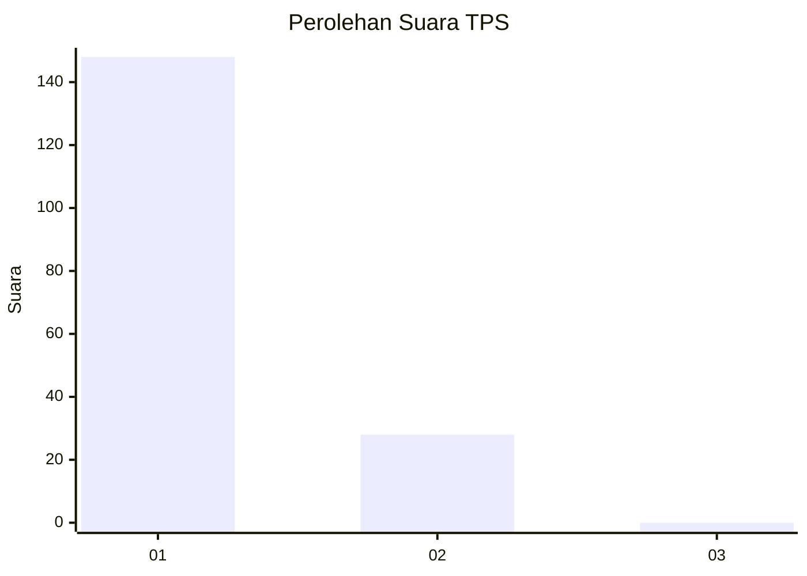
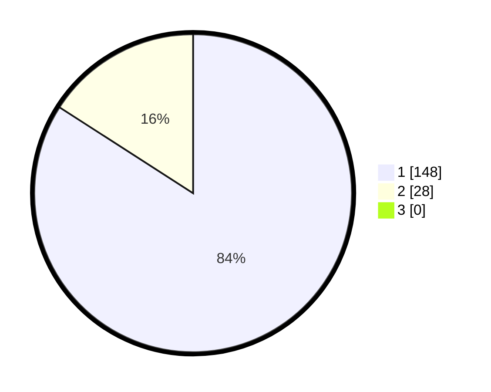

# Hasil

## Grafik

## Tabel

| No. | Nama Paslon    | Suara | Suara (raw) | Persentase |
|:--- |:-------------- | -----:| -----------:| ----------:|
| 1   | ANIES MUHAIMIN | 148   | [148][p-1]  | 84,09      |
| 2   | PRABOWO GIBRAN | 28    | [28][p-2]   | 15,91      |
| 3   | GANJAR MAHFUD  | 0     | [0][p-3]    | 0,00       |

[p-1]: https://github.com/gigit-pemilu/pemilu-2024-11-aceh/blob/main/pilpres/hitung-suara/sub/11-aceh/sub/18-pidie-jaya/sub/03-jangka-buya/sub/2006-keurisi-meunasah-raya/sub/001-tps/sub/paslon-1.txt
[p-2]: https://github.com/gigit-pemilu/pemilu-2024-11-aceh/blob/main/pilpres/hitung-suara/sub/11-aceh/sub/18-pidie-jaya/sub/03-jangka-buya/sub/2006-keurisi-meunasah-raya/sub/001-tps/sub/paslon-2.txt
[p-3]: https://github.com/gigit-pemilu/pemilu-2024-11-aceh/blob/main/pilpres/hitung-suara/sub/11-aceh/sub/18-pidie-jaya/sub/03-jangka-buya/sub/2006-keurisi-meunasah-raya/sub/001-tps/sub/paslon-3.txt

## Foto C Plano

https://sirekap-obj-formc.kpu.go.id/e05b/pemilu/ppwp/11/18/03/20/06/1118032006001-20240222-101823--a664cfb0-50f1-4f36-9ad9-bc21e5c20a6b.jpg

https://sirekap-obj-formc.kpu.go.id/e05b/pemilu/ppwp/11/18/03/20/06/1118032006001-20240214-203805--38e5664e-bc5f-4cf7-85d9-a64204ea75b5.jpg

https://sirekap-obj-formc.kpu.go.id/e05b/pemilu/ppwp/11/18/03/20/06/1118032006001-20240214-203849--ac604791-6a91-4337-92c4-a3429959cf35.jpg

## Metadata

| Key        | Value               |
| ---------- | ------------------- |
| Time Stamp | 2024-02-22 11:00:00 |

