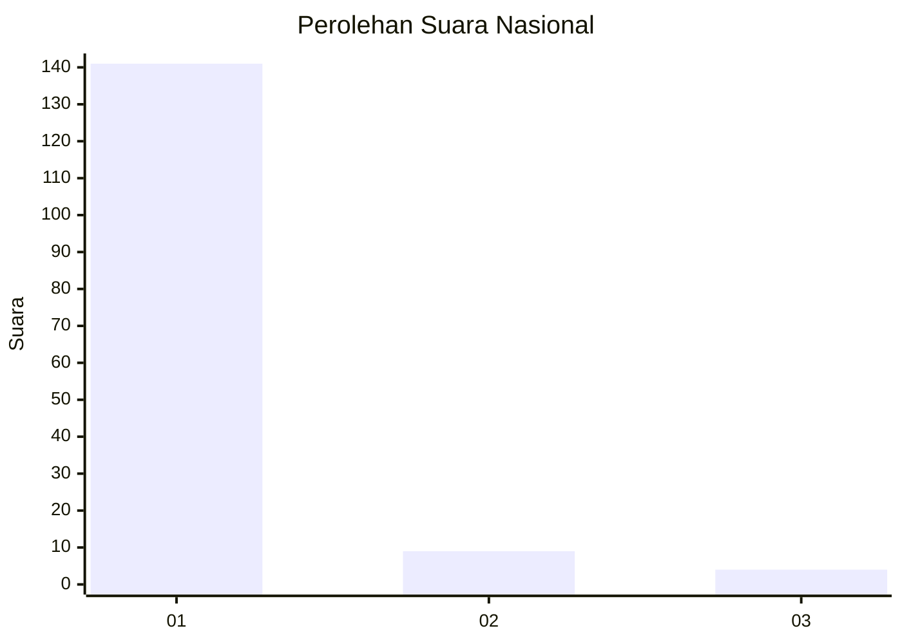
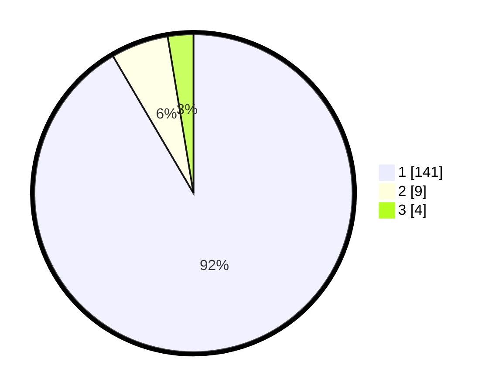

# Hasil

## Grafik

## Tabel

| No. | Nama Paslon    | Suara | Suara (raw) | Persentase |
|:--- |:-------------- | -----:| -----------:| ----------:|
| 1   | ANIES MUHAIMIN | 141   | [141][p-1]  | 91,56      |
| 2   | PRABOWO GIBRAN | 9     | [9][p-2]    | 5,84       |
| 3   | GANJAR MAHFUD  | 4     | [4][p-3]    | 2,60       |

[p-1]: https://github.com/gigit-pemilu/pemilu-2024/blob/main/pilpres/hitung-suara/sub/11-aceh/sub/18-pidie-jaya/sub/03-jangka-buya/sub/2009-meunasah-mee/sub/002-tps/sub/paslon-1.txt
[p-2]: https://github.com/gigit-pemilu/pemilu-2024/blob/main/pilpres/hitung-suara/sub/11-aceh/sub/18-pidie-jaya/sub/03-jangka-buya/sub/2009-meunasah-mee/sub/002-tps/sub/paslon-2.txt
[p-3]: https://github.com/gigit-pemilu/pemilu-2024/blob/main/pilpres/hitung-suara/sub/11-aceh/sub/18-pidie-jaya/sub/03-jangka-buya/sub/2009-meunasah-mee/sub/002-tps/sub/paslon-3.txt

## Foto C Plano

https://sirekap-obj-formc.kpu.go.id/4f4c/pemilu/ppwp/11/18/03/20/09/1118032009002-20240215-164037--e9037ca8-981a-4cdd-a9e2-1b99b1a040ae.jpg

https://sirekap-obj-formc.kpu.go.id/4f4c/pemilu/ppwp/11/18/03/20/09/1118032009002-20240215-101016--305c015f-c88e-4f17-925e-706aed6c056d.jpg

https://sirekap-obj-formc.kpu.go.id/4f4c/pemilu/ppwp/11/18/03/20/09/1118032009002-20240215-101500--84a4cece-a0a1-4cdf-a435-19df0757c1e5.jpg

## Metadata

| Key        | Value               |
| ---------- | ------------------- |
| Time Stamp | 2024-02-15 17:00:25 |

