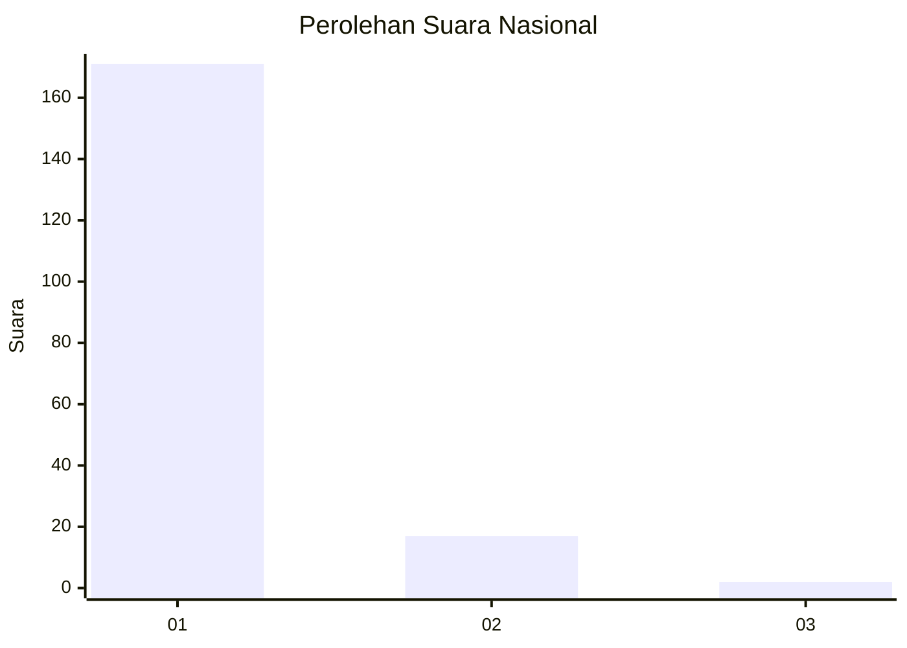
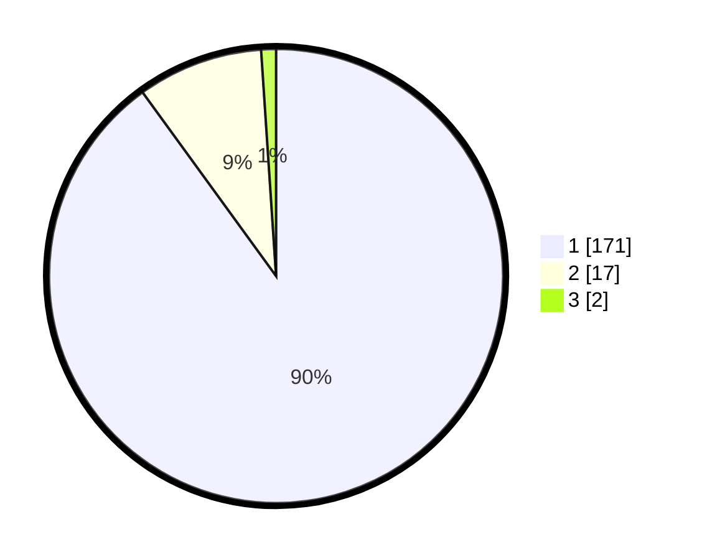

# Hasil

## Grafik

## Tabel

| No. | Nama Paslon    | Suara | Suara (raw) | Persentase |
|:--- |:-------------- | -----:| -----------:| ----------:|
| 1   | ANIES MUHAIMIN | 171   | [171][p-1]  | 90,00      |
| 2   | PRABOWO GIBRAN | 17    | [17][p-2]   | 8,95       |
| 3   | GANJAR MAHFUD  | 2     | [2][p-3]    | 1,05       |

[p-1]: https://github.com/gigit-pemilu/pemilu-2024/blob/main/pilpres/hitung-suara/sub/11-aceh/sub/18-pidie-jaya/sub/03-jangka-buya/sub/2011-kiran-krueng/sub/001-tps/sub/paslon-1.txt
[p-2]: https://github.com/gigit-pemilu/pemilu-2024/blob/main/pilpres/hitung-suara/sub/11-aceh/sub/18-pidie-jaya/sub/03-jangka-buya/sub/2011-kiran-krueng/sub/001-tps/sub/paslon-2.txt
[p-3]: https://github.com/gigit-pemilu/pemilu-2024/blob/main/pilpres/hitung-suara/sub/11-aceh/sub/18-pidie-jaya/sub/03-jangka-buya/sub/2011-kiran-krueng/sub/001-tps/sub/paslon-3.txt

## Foto C Plano

https://sirekap-obj-formc.kpu.go.id/4e7d/pemilu/ppwp/11/18/03/20/11/1118032011001-20240215-025459--d546287d-0d10-49ea-bf6b-5460bc44d102.jpg

https://sirekap-obj-formc.kpu.go.id/4e7d/pemilu/ppwp/11/18/03/20/11/1118032011001-20240215-012700--ebf29d17-5ce2-46a4-a0e6-44cd2fb90c1f.jpg

https://sirekap-obj-formc.kpu.go.id/4e7d/pemilu/ppwp/11/18/03/20/11/1118032011001-20240215-013053--48eef168-35da-4e15-9339-98a9ec78c0e9.jpg

## Metadata

| Key        | Value               |
| ---------- | ------------------- |
| Time Stamp | 2024-02-15 15:00:29 |

