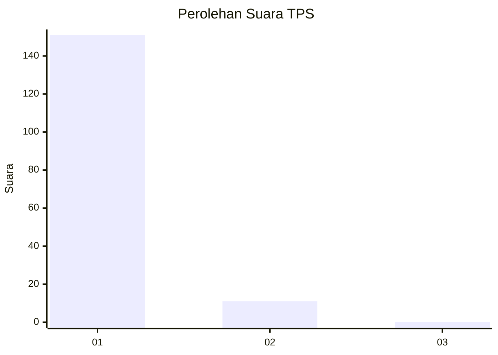
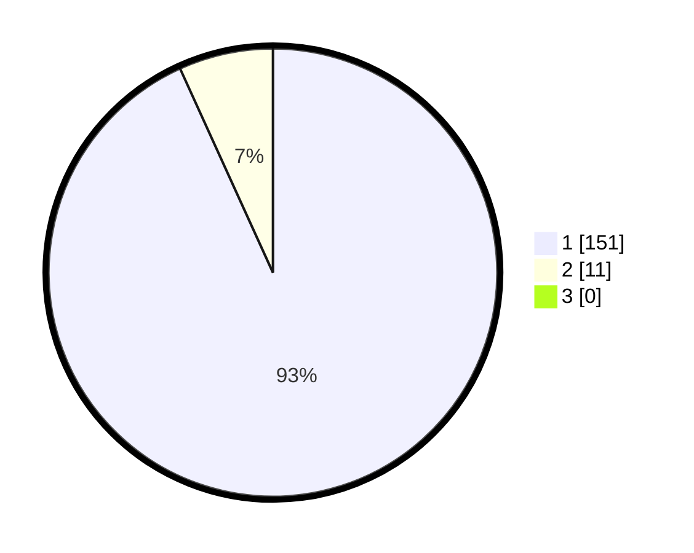

# Hasil

## Grafik

## Tabel

| No. | Nama Paslon    | Suara | Suara (raw) | Persentase |
|:--- |:-------------- | -----:| -----------:| ----------:|
| 1   | ANIES MUHAIMIN | 151   | [151][p-1]  | 93,21      |
| 2   | PRABOWO GIBRAN | 11    | [11][p-2]   | 6,79       |
| 3   | GANJAR MAHFUD  | 0     | [0][p-3]    | 0,00       |

[p-1]: https://github.com/gigit-pemilu/pemilu-2024-11-aceh/blob/main/pilpres/hitung-suara/sub/11-aceh/sub/18-pidie-jaya/sub/03-jangka-buya/sub/2011-kiran-krueng/sub/002-tps/sub/paslon-1.txt
[p-2]: https://github.com/gigit-pemilu/pemilu-2024-11-aceh/blob/main/pilpres/hitung-suara/sub/11-aceh/sub/18-pidie-jaya/sub/03-jangka-buya/sub/2011-kiran-krueng/sub/002-tps/sub/paslon-2.txt
[p-3]: https://github.com/gigit-pemilu/pemilu-2024-11-aceh/blob/main/pilpres/hitung-suara/sub/11-aceh/sub/18-pidie-jaya/sub/03-jangka-buya/sub/2011-kiran-krueng/sub/002-tps/sub/paslon-3.txt

## Foto C Plano

https://sirekap-obj-formc.kpu.go.id/f8f6/pemilu/ppwp/11/18/03/20/11/1118032011002-20240215-091148--54083ccc-3a38-4852-a49f-ad050187114a.jpg

https://sirekap-obj-formc.kpu.go.id/f8f6/pemilu/ppwp/11/18/03/20/11/1118032011002-20240215-091934--20e80164-1c75-4805-a74e-a047b491f09d.jpg

https://sirekap-obj-formc.kpu.go.id/f8f6/pemilu/ppwp/11/18/03/20/11/1118032011002-20240215-092229--f9b3ef0f-dfb5-48ca-ad94-f954529f39b9.jpg

## Metadata

| Key        | Value               |
| ---------- | ------------------- |
| Time Stamp | 2024-02-15 21:30:27 |

