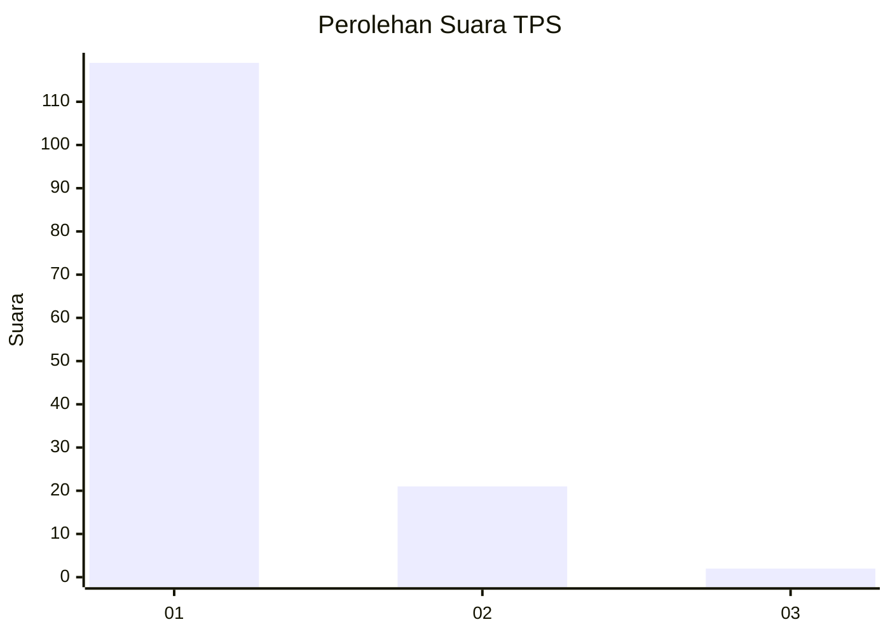
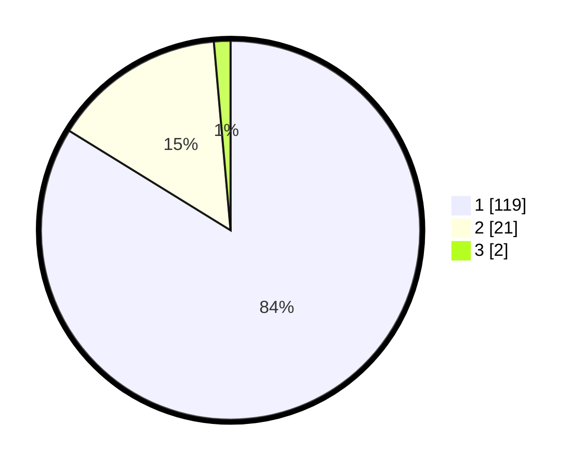

# Hasil

## Grafik

## Tabel

| No. | Nama Paslon    | Suara | Suara (raw) | Persentase |
|:--- |:-------------- | -----:| -----------:| ----------:|
| 1   | ANIES MUHAIMIN | 119   | [119][p-1]  | 83,80      |
| 2   | PRABOWO GIBRAN | 21    | [21][p-2]   | 14,79      |
| 3   | GANJAR MAHFUD  | 2     | [2][p-3]    | 1,41       |

[p-1]: https://github.com/gigit-pemilu/pemilu-2024-11-aceh/blob/main/pilpres/hitung-suara/sub/11-aceh/sub/18-pidie-jaya/sub/03-jangka-buya/sub/2012-buket-teungoh/sub/001-tps/sub/paslon-1.txt
[p-2]: https://github.com/gigit-pemilu/pemilu-2024-11-aceh/blob/main/pilpres/hitung-suara/sub/11-aceh/sub/18-pidie-jaya/sub/03-jangka-buya/sub/2012-buket-teungoh/sub/001-tps/sub/paslon-2.txt
[p-3]: https://github.com/gigit-pemilu/pemilu-2024-11-aceh/blob/main/pilpres/hitung-suara/sub/11-aceh/sub/18-pidie-jaya/sub/03-jangka-buya/sub/2012-buket-teungoh/sub/001-tps/sub/paslon-3.txt

## Foto C Plano

https://sirekap-obj-formc.kpu.go.id/9dd1/pemilu/ppwp/11/18/03/20/12/1118032012001-20240214-194014--ee4ce933-c0f3-4175-839b-ed7ecae12df5.jpg

https://sirekap-obj-formc.kpu.go.id/9dd1/pemilu/ppwp/11/18/03/20/12/1118032012001-20240214-193205--5e4b6b42-2e95-4bbb-b0cd-be0428d6b3cc.jpg

https://sirekap-obj-formc.kpu.go.id/9dd1/pemilu/ppwp/11/18/03/20/12/1118032012001-20240214-193517--96eaaa8b-d69e-427a-af41-efb75c0299da.jpg

## Metadata

| Key        | Value               |
| ---------- | ------------------- |
| Time Stamp | 2024-02-15 21:30:27 |

