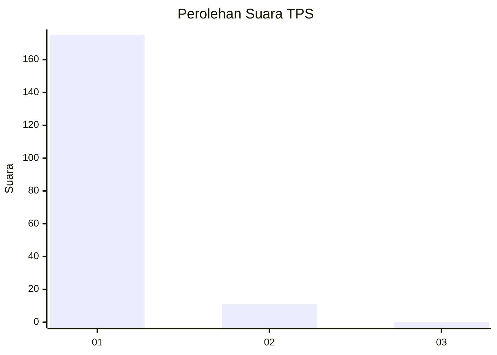
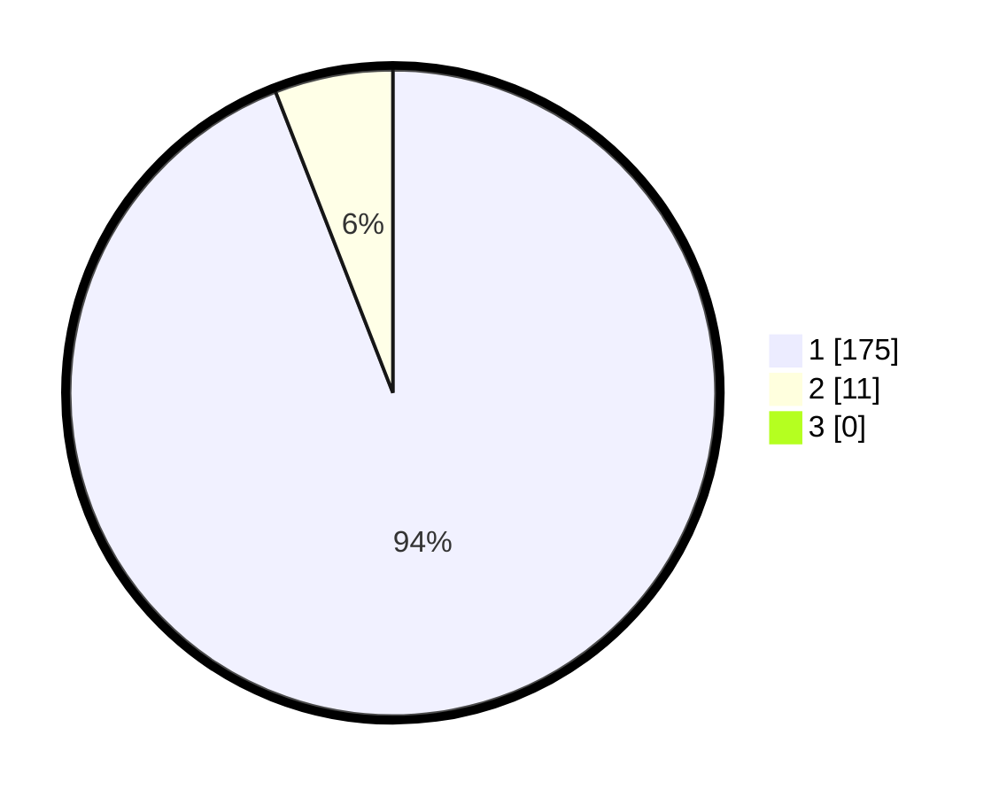

# Hasil

## Grafik

## Tabel

| No. | Nama Paslon    | Suara | Suara (raw) | Persentase |
|:--- |:-------------- | -----:| -----------:| ----------:|
| 1   | ANIES MUHAIMIN | 175   | [175][p-1]  | 94,09      |
| 2   | PRABOWO GIBRAN | 11    | [11][p-2]   | 5,91       |
| 3   | GANJAR MAHFUD  | 0     | [0][p-3]    | 0,00       |

[p-1]: https://github.com/gigit-pemilu/pemilu-2024-11-aceh/blob/main/pilpres/hitung-suara/sub/11-aceh/sub/18-pidie-jaya/sub/03-jangka-buya/sub/2013-reului-mangat/sub/001-tps/sub/paslon-1.txt
[p-2]: https://github.com/gigit-pemilu/pemilu-2024-11-aceh/blob/main/pilpres/hitung-suara/sub/11-aceh/sub/18-pidie-jaya/sub/03-jangka-buya/sub/2013-reului-mangat/sub/001-tps/sub/paslon-2.txt
[p-3]: https://github.com/gigit-pemilu/pemilu-2024-11-aceh/blob/main/pilpres/hitung-suara/sub/11-aceh/sub/18-pidie-jaya/sub/03-jangka-buya/sub/2013-reului-mangat/sub/001-tps/sub/paslon-3.txt

## Foto C Plano

https://sirekap-obj-formc.kpu.go.id/94b7/pemilu/ppwp/11/18/03/20/13/1118032013001-20240214-211336--07861c1a-6149-4ac8-9005-cd814e37a1fa.jpg

https://sirekap-obj-formc.kpu.go.id/94b7/pemilu/ppwp/11/18/03/20/13/1118032013001-20240214-211423--1855cb20-9406-400e-bded-043262c65615.jpg

https://sirekap-obj-formc.kpu.go.id/94b7/pemilu/ppwp/11/18/03/20/13/1118032013001-20240214-211449--51c53820-ee5f-457e-b42f-e430c76529ec.jpg

## Metadata

| Key        | Value               |
| ---------- | ------------------- |
| Time Stamp | 2024-02-15 23:29:50 |

