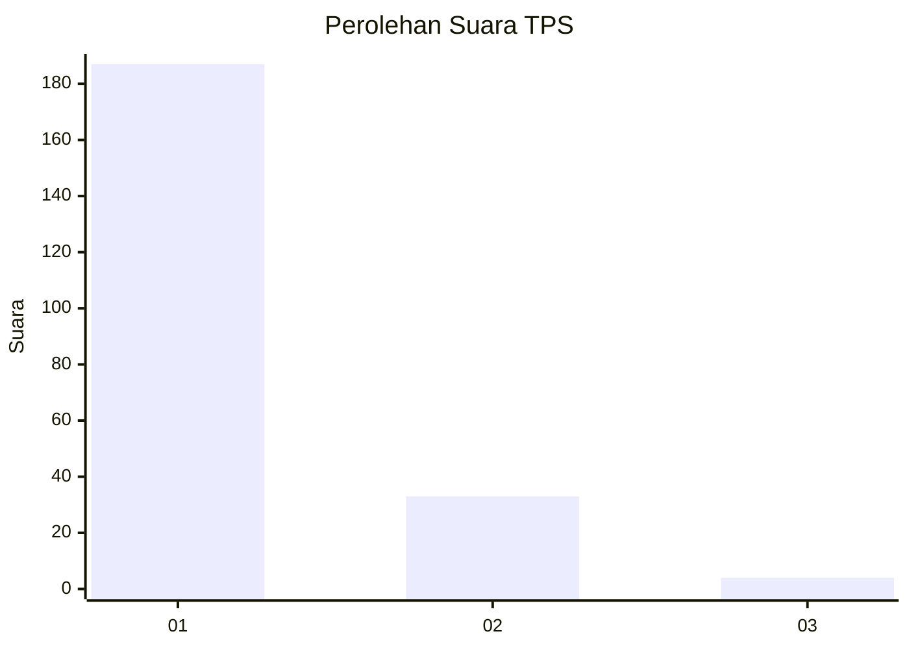
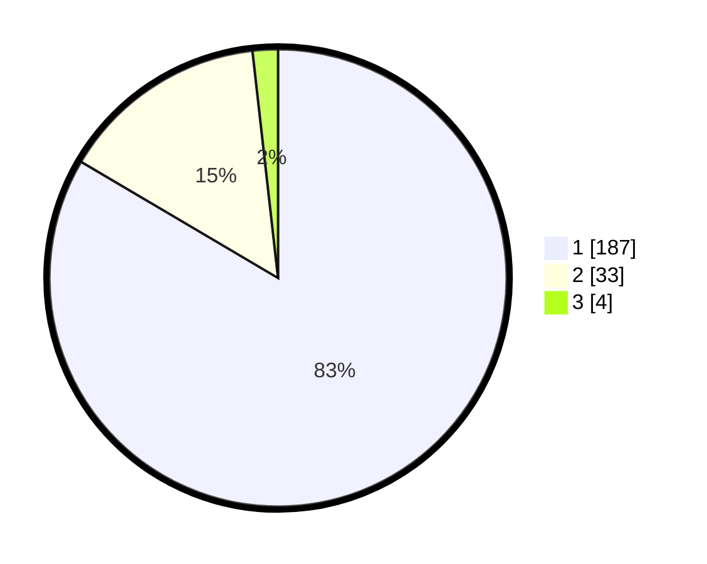

# Hasil

## Grafik

## Tabel

| No. | Nama Paslon    | Suara | Suara (raw) | Persentase |
|:--- |:-------------- | -----:| -----------:| ----------:|
| 1   | ANIES MUHAIMIN | 187   | [187][p-1]  | 83,48      |
| 2   | PRABOWO GIBRAN | 33    | [33][p-2]   | 14,73      |
| 3   | GANJAR MAHFUD  | 4     | [4][p-3]    | 1,79       |

[p-1]: https://github.com/gigit-pemilu/pemilu-2024-11-aceh/blob/main/pilpres/hitung-suara/sub/11-aceh/sub/18-pidie-jaya/sub/03-jangka-buya/sub/2017-jurong-ara/sub/002-tps/sub/paslon-1.txt
[p-2]: https://github.com/gigit-pemilu/pemilu-2024-11-aceh/blob/main/pilpres/hitung-suara/sub/11-aceh/sub/18-pidie-jaya/sub/03-jangka-buya/sub/2017-jurong-ara/sub/002-tps/sub/paslon-2.txt
[p-3]: https://github.com/gigit-pemilu/pemilu-2024-11-aceh/blob/main/pilpres/hitung-suara/sub/11-aceh/sub/18-pidie-jaya/sub/03-jangka-buya/sub/2017-jurong-ara/sub/002-tps/sub/paslon-3.txt

## Foto C Plano

https://sirekap-obj-formc.kpu.go.id/459a/pemilu/ppwp/11/18/03/20/17/1118032017002-20240214-201031--0bc06cbc-0708-4f69-a4a9-9ad5b4815a18.jpg

https://sirekap-obj-formc.kpu.go.id/459a/pemilu/ppwp/11/18/03/20/17/1118032017002-20240214-201225--6e08c0f3-dfaa-41a7-8f70-8e0da0a5cf22.jpg

https://sirekap-obj-formc.kpu.go.id/459a/pemilu/ppwp/11/18/03/20/17/1118032017002-20240214-201348--e4ca31a2-b358-4603-ae4b-acf457e6f371.jpg

## Metadata

| Key        | Value               |
| ---------- | ------------------- |
| Time Stamp | 2024-02-15 21:30:27 |

