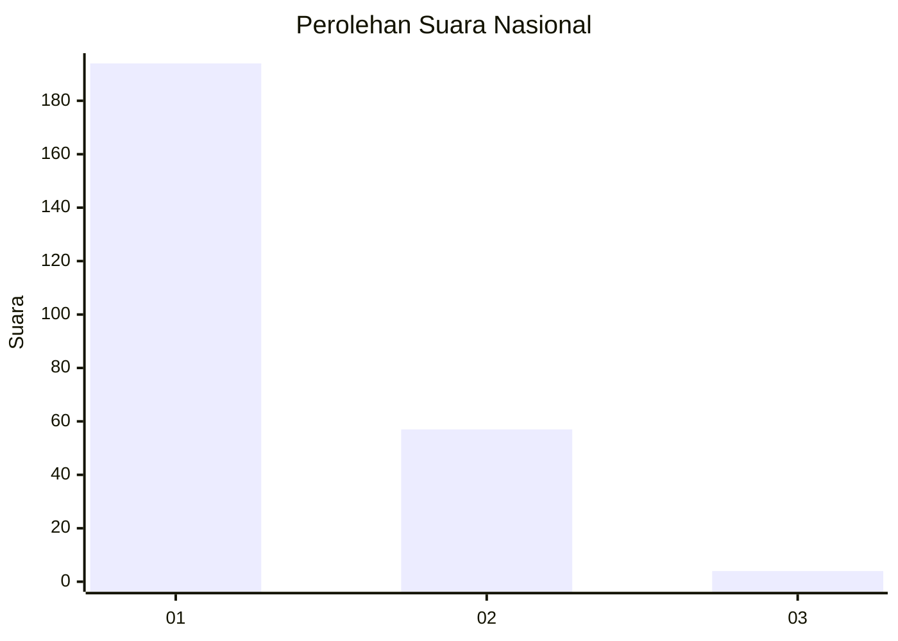
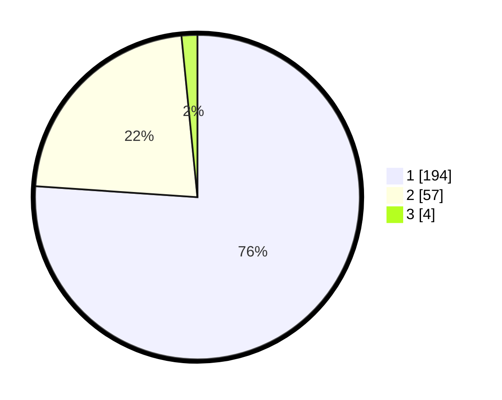

# Hasil

## Grafik

## Tabel

| No. | Nama Paslon    | Suara | Suara (raw) | Persentase |
|:--- |:-------------- | -----:| -----------:| ----------:|
| 1   | ANIES MUHAIMIN | 194   | [194][p-1]  | 76,08      |
| 2   | PRABOWO GIBRAN | 57    | [57][p-2]   | 22,35      |
| 3   | GANJAR MAHFUD  | 4     | [4][p-3]    | 1,57       |

[p-1]: https://github.com/gigit-pemilu/pemilu-2024/blob/main/pilpres/hitung-suara/sub/11-aceh/sub/18-pidie-jaya/sub/04-bandar-dua/sub/2002-ulee-gle/sub/001-tps/sub/paslon-1.txt
[p-2]: https://github.com/gigit-pemilu/pemilu-2024/blob/main/pilpres/hitung-suara/sub/11-aceh/sub/18-pidie-jaya/sub/04-bandar-dua/sub/2002-ulee-gle/sub/001-tps/sub/paslon-2.txt
[p-3]: https://github.com/gigit-pemilu/pemilu-2024/blob/main/pilpres/hitung-suara/sub/11-aceh/sub/18-pidie-jaya/sub/04-bandar-dua/sub/2002-ulee-gle/sub/001-tps/sub/paslon-3.txt

## Foto C Plano

https://sirekap-obj-formc.kpu.go.id/5531/pemilu/ppwp/11/18/04/20/02/1118042002001-20240215-102949--cce518a6-086d-404a-9158-778eaa8edb07.jpg

https://sirekap-obj-formc.kpu.go.id/5531/pemilu/ppwp/11/18/04/20/02/1118042002001-20240215-103150--169efd32-2434-4c72-9f35-29f189d4e9cf.jpg

https://sirekap-obj-formc.kpu.go.id/5531/pemilu/ppwp/11/18/04/20/02/1118042002001-20240215-103711--a0725b34-6bb5-43c3-a693-2724e54ba06d.jpg

## Metadata

| Key        | Value               |
| ---------- | ------------------- |
| Time Stamp | 2024-02-15 21:30:27 |

