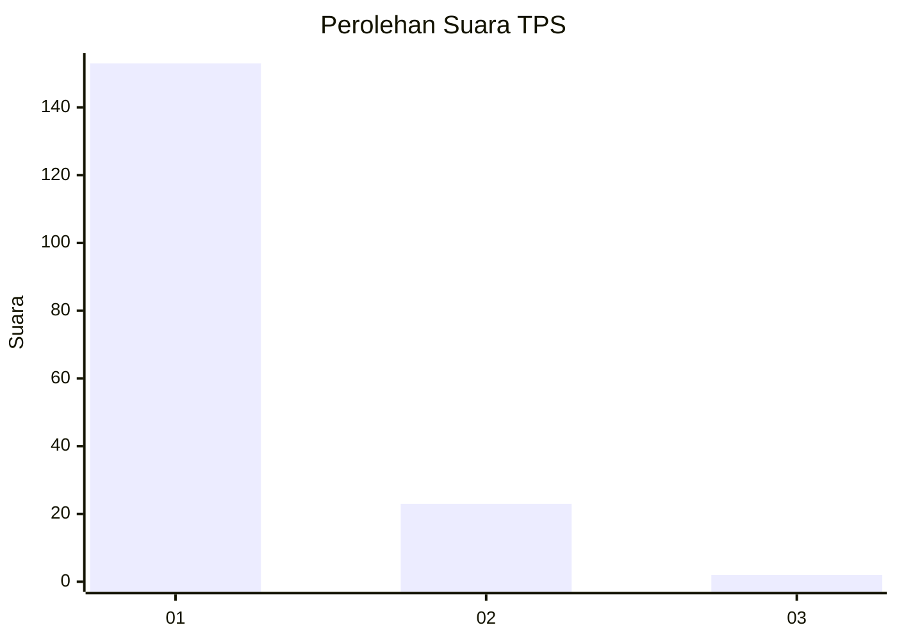
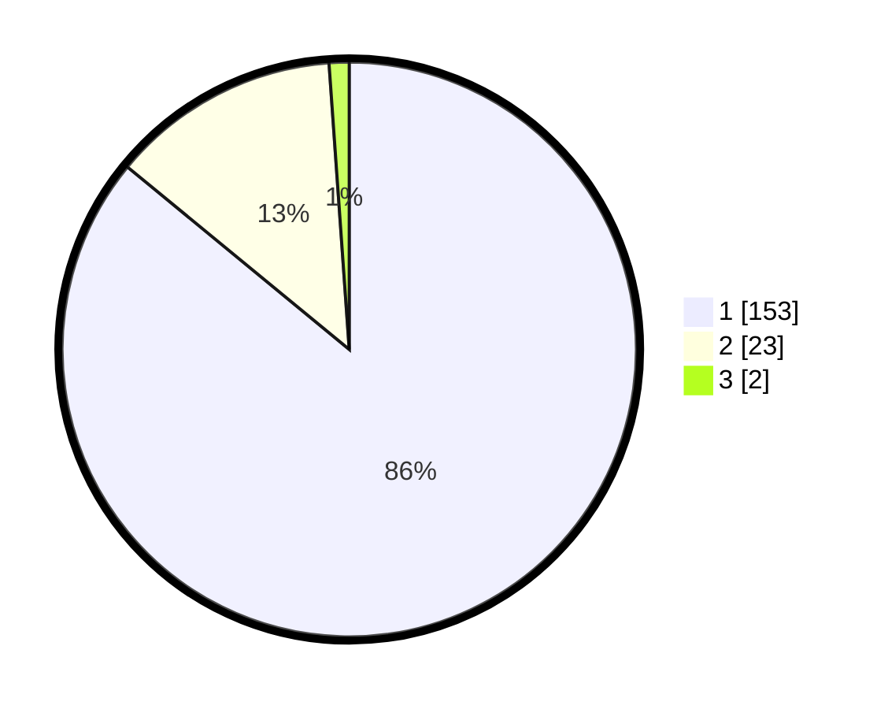

# Hasil

## Grafik

## Tabel

| No. | Nama Paslon    | Suara | Suara (raw) | Persentase |
|:--- |:-------------- | -----:| -----------:| ----------:|
| 1   | ANIES MUHAIMIN | 153   | [153][p-1]  | 85,96      |
| 2   | PRABOWO GIBRAN | 23    | [23][p-2]   | 12,92      |
| 3   | GANJAR MAHFUD  | 2     | [2][p-3]    | 1,12       |

[p-1]: https://github.com/gigit-pemilu/pemilu-2024-11-aceh/blob/main/pilpres/hitung-suara/sub/11-aceh/sub/18-pidie-jaya/sub/04-bandar-dua/sub/2003-blang-dalam/sub/001-tps/sub/paslon-1.txt
[p-2]: https://github.com/gigit-pemilu/pemilu-2024-11-aceh/blob/main/pilpres/hitung-suara/sub/11-aceh/sub/18-pidie-jaya/sub/04-bandar-dua/sub/2003-blang-dalam/sub/001-tps/sub/paslon-2.txt
[p-3]: https://github.com/gigit-pemilu/pemilu-2024-11-aceh/blob/main/pilpres/hitung-suara/sub/11-aceh/sub/18-pidie-jaya/sub/04-bandar-dua/sub/2003-blang-dalam/sub/001-tps/sub/paslon-3.txt

## Foto C Plano

https://sirekap-obj-formc.kpu.go.id/43ef/pemilu/ppwp/11/18/04/20/03/1118042003001-20240215-061916--24c7938a-9bd2-48f1-99e8-5fb2116947bb.jpg

https://sirekap-obj-formc.kpu.go.id/43ef/pemilu/ppwp/11/18/04/20/03/1118042003001-20240215-061949--75db7f19-b512-4dff-8f41-610fe0e362f6.jpg

https://sirekap-obj-formc.kpu.go.id/43ef/pemilu/ppwp/11/18/04/20/03/1118042003001-20240215-062035--08165159-b2aa-48c8-a699-58fd1269c126.jpg

## Metadata

| Key        | Value               |
| ---------- | ------------------- |
| Time Stamp | 2024-02-15 21:30:27 |

