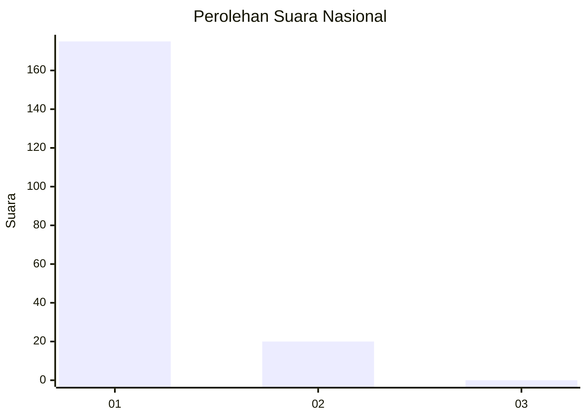
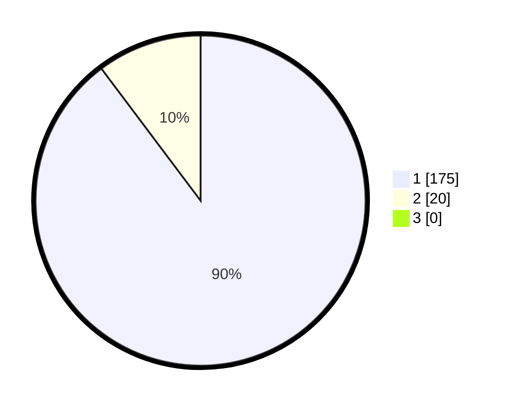

# Hasil

## Grafik

## Tabel

| No. | Nama Paslon    | Suara | Suara (raw) | Persentase |
|:--- |:-------------- | -----:| -----------:| ----------:|
| 1   | ANIES MUHAIMIN | 175   | [175][p-1]  | 89,74      |
| 2   | PRABOWO GIBRAN | 20    | [20][p-2]   | 10,26      |
| 3   | GANJAR MAHFUD  | 0     | [0][p-3]    | 0,00       |

[p-1]: https://github.com/gigit-pemilu/pemilu-2024/blob/main/pilpres/hitung-suara/sub/11-aceh/sub/18-pidie-jaya/sub/04-bandar-dua/sub/2003-blang-dalam/sub/002-tps/sub/paslon-1.txt
[p-2]: https://github.com/gigit-pemilu/pemilu-2024/blob/main/pilpres/hitung-suara/sub/11-aceh/sub/18-pidie-jaya/sub/04-bandar-dua/sub/2003-blang-dalam/sub/002-tps/sub/paslon-2.txt
[p-3]: https://github.com/gigit-pemilu/pemilu-2024/blob/main/pilpres/hitung-suara/sub/11-aceh/sub/18-pidie-jaya/sub/04-bandar-dua/sub/2003-blang-dalam/sub/002-tps/sub/paslon-3.txt

## Foto C Plano

https://sirekap-obj-formc.kpu.go.id/e822/pemilu/ppwp/11/18/04/20/03/1118042003002-20240215-055544--2a5de8a4-0746-46d4-b712-1ddc433b9eb6.jpg

https://sirekap-obj-formc.kpu.go.id/e822/pemilu/ppwp/11/18/04/20/03/1118042003002-20240215-055810--1204432f-ec7d-4c66-83d9-f9c309a2bc0c.jpg

https://sirekap-obj-formc.kpu.go.id/e822/pemilu/ppwp/11/18/04/20/03/1118042003002-20240215-055941--3ac4d6fa-fe72-47fe-9589-c91cae5e33df.jpg

## Metadata

| Key        | Value               |
| ---------- | ------------------- |
| Time Stamp | 2024-02-15 22:40:13 |

