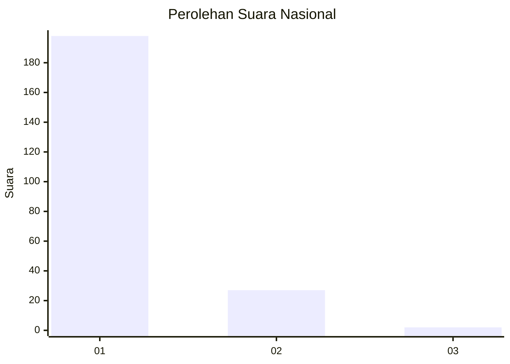

# Hasil

## Grafik

## Tabel

| No. | Nama Paslon    | Suara | Suara (raw) | Persentase |
|:--- |:-------------- | -----:| -----------:| ----------:|
| 1   | ANIES MUHAIMIN | 198   | [198][p-1]  | 87,22      |
| 2   | PRABOWO GIBRAN | 27    | [27][p-2]   | 11,89      |
| 3   | GANJAR MAHFUD  | 2     | [2][p-3]    | 0,88       |

[p-1]: https://github.com/gigit-pemilu/pemilu-2024/blob/main/pilpres/hitung-suara/sub/11-aceh/sub/18-pidie-jaya/sub/04-bandar-dua/sub/2003-blang-dalam/sub/003-tps/sub/paslon-1.txt
[p-2]: https://github.com/gigit-pemilu/pemilu-2024/blob/main/pilpres/hitung-suara/sub/11-aceh/sub/18-pidie-jaya/sub/04-bandar-dua/sub/2003-blang-dalam/sub/003-tps/sub/paslon-2.txt
[p-3]: https://github.com/gigit-pemilu/pemilu-2024/blob/main/pilpres/hitung-suara/sub/11-aceh/sub/18-pidie-jaya/sub/04-bandar-dua/sub/2003-blang-dalam/sub/003-tps/sub/paslon-3.txt

## Foto C Plano

https://sirekap-obj-formc.kpu.go.id/98ea/pemilu/ppwp/11/18/04/20/03/1118042003003-20240214-210204--1b3d95b1-b09e-492e-880e-fa3b8d990f0f.jpg

https://sirekap-obj-formc.kpu.go.id/98ea/pemilu/ppwp/11/18/04/20/03/1118042003003-20240214-210357--9591d3dc-32be-40d5-b898-62532419dd13.jpg

## Metadata

| Key        | Value               |
| ---------- | ------------------- |
| Time Stamp | 2024-02-15 23:29:50 |

