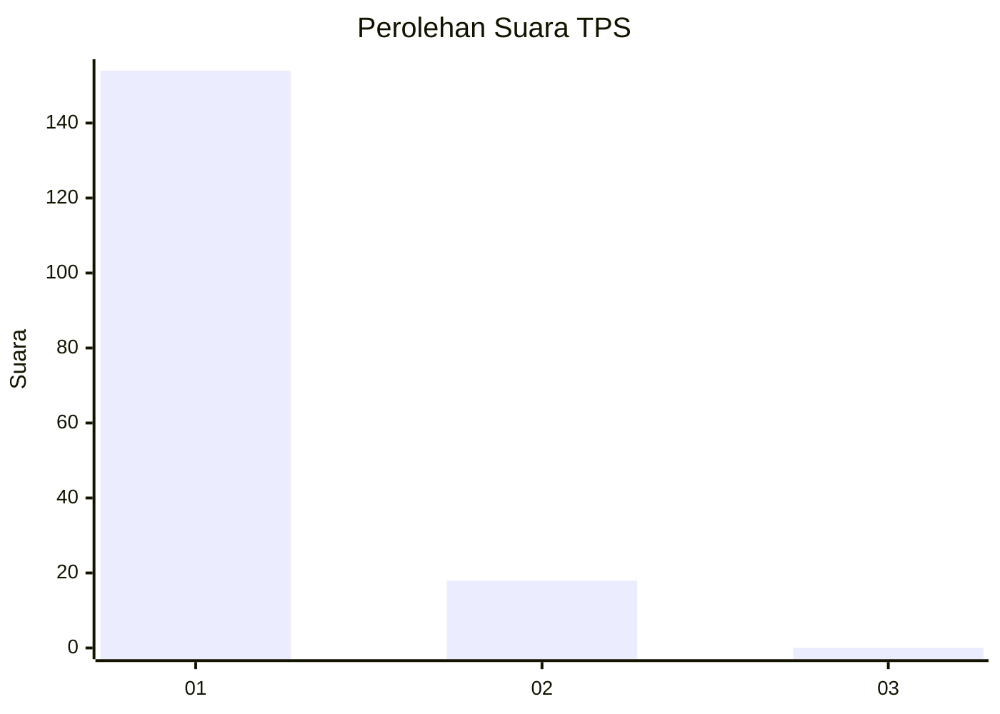
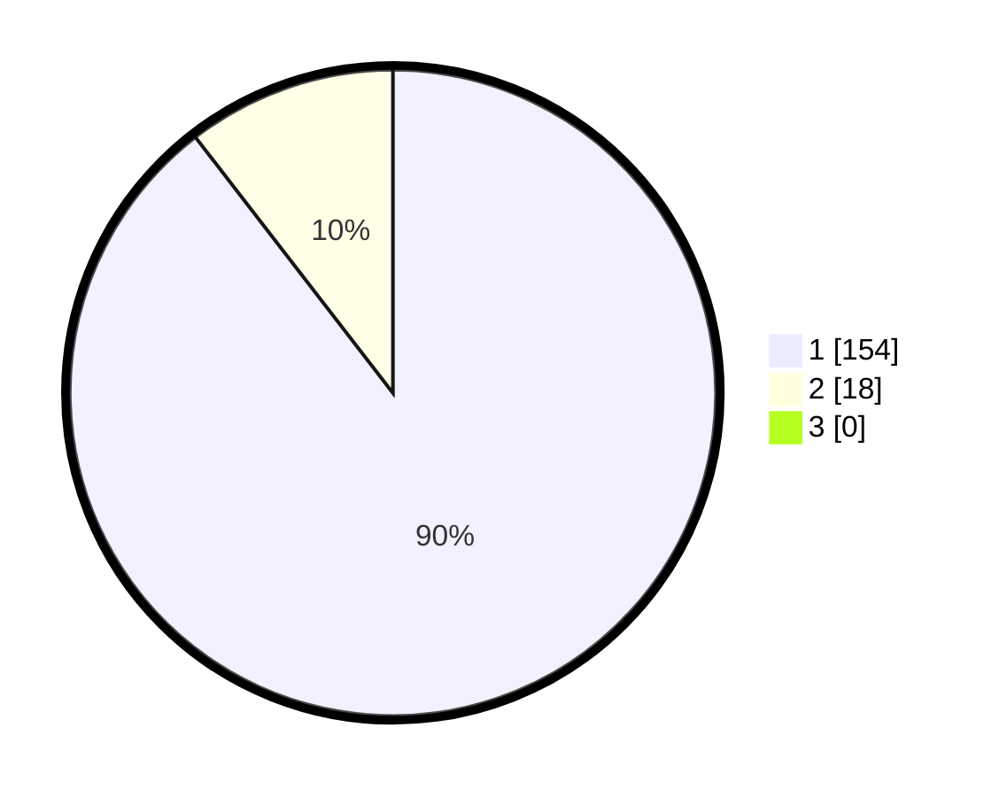

# Hasil

## Grafik

## Tabel

| No. | Nama Paslon    | Suara | Suara (raw) | Persentase |
|:--- |:-------------- | -----:| -----------:| ----------:|
| 1   | ANIES MUHAIMIN | 154   | [154][p-1]  | 89,53      |
| 2   | PRABOWO GIBRAN | 18    | [18][p-2]   | 10,47      |
| 3   | GANJAR MAHFUD  | 0     | [0][p-3]    | 0,00       |

[p-1]: https://github.com/gigit-pemilu/pemilu-2024-11-aceh/blob/main/pilpres/hitung-suara/sub/11-aceh/sub/18-pidie-jaya/sub/04-bandar-dua/sub/2004-pulo/sub/001-tps/sub/paslon-1.txt
[p-2]: https://github.com/gigit-pemilu/pemilu-2024-11-aceh/blob/main/pilpres/hitung-suara/sub/11-aceh/sub/18-pidie-jaya/sub/04-bandar-dua/sub/2004-pulo/sub/001-tps/sub/paslon-2.txt
[p-3]: https://github.com/gigit-pemilu/pemilu-2024-11-aceh/blob/main/pilpres/hitung-suara/sub/11-aceh/sub/18-pidie-jaya/sub/04-bandar-dua/sub/2004-pulo/sub/001-tps/sub/paslon-3.txt

## Foto C Plano

https://sirekap-obj-formc.kpu.go.id/f8a9/pemilu/ppwp/11/18/04/20/04/1118042004001-20240215-060003--1b8885c1-74f3-4b5d-bc4b-6a361f10192b.jpg

https://sirekap-obj-formc.kpu.go.id/f8a9/pemilu/ppwp/11/18/04/20/04/1118042004001-20240215-060556--e0a6fa54-3bd8-4345-b7b2-bf2468beb312.jpg

https://sirekap-obj-formc.kpu.go.id/f8a9/pemilu/ppwp/11/18/04/20/04/1118042004001-20240215-091419--4147f221-7839-48a4-b256-8ca3c89fed0f.jpg

## Metadata

| Key        | Value               |
| ---------- | ------------------- |
| Time Stamp | 2024-02-15 23:29:50 |

