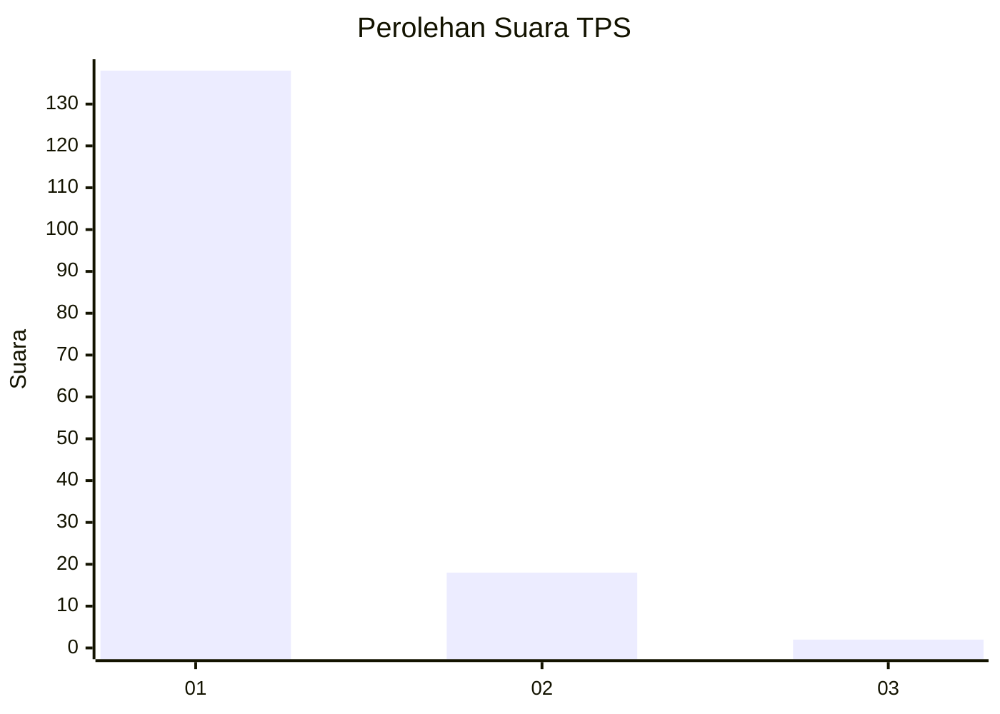
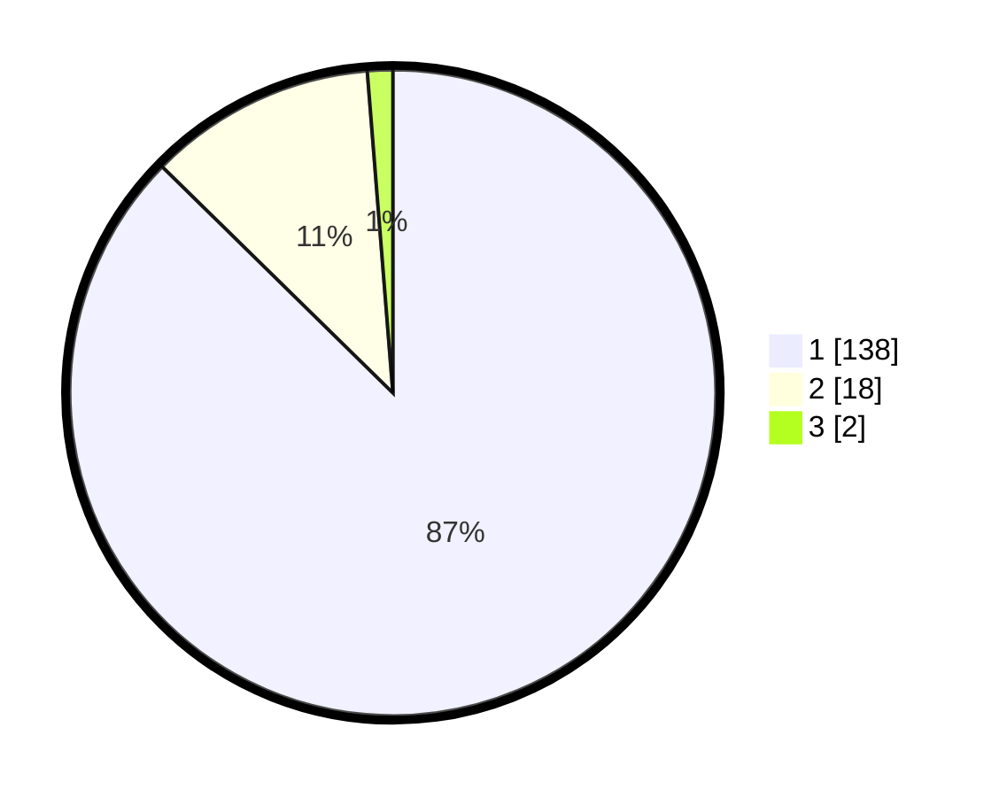

# Hasil

## Grafik

## Tabel

| No. | Nama Paslon    | Suara | Suara (raw) | Persentase |
|:--- |:-------------- | -----:| -----------:| ----------:|
| 1   | ANIES MUHAIMIN | 138   | [138][p-1]  | 87,34      |
| 2   | PRABOWO GIBRAN | 18    | [18][p-2]   | 11,39      |
| 3   | GANJAR MAHFUD  | 2     | [2][p-3]    | 1,27       |

[p-1]: https://github.com/gigit-pemilu/pemilu-2024-11-aceh/blob/main/pilpres/hitung-suara/sub/11-aceh/sub/18-pidie-jaya/sub/04-bandar-dua/sub/2004-pulo/sub/002-tps/sub/paslon-1.txt
[p-2]: https://github.com/gigit-pemilu/pemilu-2024-11-aceh/blob/main/pilpres/hitung-suara/sub/11-aceh/sub/18-pidie-jaya/sub/04-bandar-dua/sub/2004-pulo/sub/002-tps/sub/paslon-2.txt
[p-3]: https://github.com/gigit-pemilu/pemilu-2024-11-aceh/blob/main/pilpres/hitung-suara/sub/11-aceh/sub/18-pidie-jaya/sub/04-bandar-dua/sub/2004-pulo/sub/002-tps/sub/paslon-3.txt

## Foto C Plano

https://sirekap-obj-formc.kpu.go.id/389d/pemilu/ppwp/11/18/04/20/04/1118042004002-20240215-174243--fefe22cf-065b-42e5-86a9-ffb2db9414b8.jpg

https://sirekap-obj-formc.kpu.go.id/389d/pemilu/ppwp/11/18/04/20/04/1118042004002-20240215-072243--25265e9c-a763-422a-a467-7a2740b1f7c7.jpg

https://sirekap-obj-formc.kpu.go.id/389d/pemilu/ppwp/11/18/04/20/04/1118042004002-20240215-075011--d70d4da4-920b-4c8e-9a37-4b11df6e011c.jpg

## Metadata

| Key        | Value               |
| ---------- | ------------------- |
| Time Stamp | 2024-02-15 23:29:50 |

